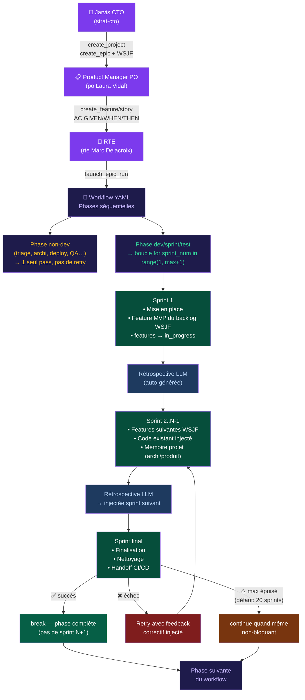

# Software Factory — Context

## STRUCTURE

```
_SOFTWARE_FACTORY/     # Agent Platform + Dashboard
  cli/sf.py            # CLI: sf <command> (platform client, SSE streaming)
  cli/_api.py          # httpx REST + SSE streaming client
  cli/_db.py           # SQLite direct (offline mode)
  cli/_output.py       # ANSI tables, colors, JSON output
  cli/_stream.py       # SSE consumer, agent colorizer
  dashboard/           # Lightweight monitoring dashboard (port 8080)
  platform/            # Agent Platform — FastAPI web app
    server.py          # Port 8090 (prod) / 8099 (dev)
    web/routes/        # 10 sub-modules (helpers.py: _parse_body dual JSON/form)
    a2a/               # Agent-to-Agent: bus, negotiation, veto
    agents/            # Loop, executor, store (156 agents)
    patterns/          # 15 orchestration patterns (12 DB + 3 engine-only)
    missions/          # SAFe lifecycle + ProductBacklog
    workflows/         # 36 builtin workflows
    llm/               # Multi-provider client + observability
    tools/             # code, git, deploy, memory, security, browser, MCP bridge
    ops/               # Auto-heal, chaos, endurance, backup/restore
    services/          # Notification (Slack/Email/Webhook)
    mcps/              # MCP server manager (fetch, memory, playwright)
    deploy/            # Dockerfile + docker-compose (Azure VM)
  mcp_lrm/             # MCP LRM server (port 9500)
  skills/              # Agent YAML definitions
  projects/            # Per-project configs
  data/                # SQLite DBs (platform.db)
  tests/               # pytest + Playwright E2E
  deploy/              # Helm charts
```

Legacy: `_SOFTWARE_FACTORY-old/` (core/, factory CLI, brain, TDD workers — archived)

## REPOSITORIES (2 dépôts séparés)

```
~/_MACARON-SOFTWARE/                         ← GitHub (macaron-software/software-factory)
  .git/ → origin = github.com/macaron-software/software-factory (AGPL-3.0)
  platform/  cli/  dashboard/  ...           ← CODE TRACKÉ par git
  _SOFTWARE_FACTORY/                         ← ⚠️ NON TRACKÉ (.gitignore) = runtime local
    platform/  dashboard/  data/  logs/      ←   instance de dev en cours (DB, logs, etc.)

~/_LAPOSTE/_SOFTWARE_FACTORY/                ← GitLab La Poste (GITLAB_LAPOSTE_REMOTE dans .env)
  .git/ → origin = <gitlab-laposte>          ← URL SSH chargée depuis .env (non commitée)
  platform/  cli/  dashboard/  ...           ← squelette : agents/workflows/projets VIDES
  Auth: SSH ~/.ssh/gitlab_laposte_ed25519
  README: FR uniquement, branding "Plateforme Agents La Poste", usage interne La Poste
```

**Workflow** : développer dans `~/_MACARON-SOFTWARE/` → `git push origin main` (GitHub).
**Sync La Poste** (one-way) : `cd ~/_MACARON-SOFTWARE && ./sync-to-laposte.sh`
⚠️ Ne jamais éditer `~/_LAPOSTE/_SOFTWARE_FACTORY/` directement — écrasé à chaque sync.

## ENVIRONMENTS (3 deployments)

```
┌────────────────┬─────────────────────────┬──────────────────────────────────┐
│ Environment    │ URL / Access            │ Details                          │
├────────────────┼─────────────────────────┼──────────────────────────────────┤
│ Azure Prod     │ http://<AZURE_VM_IP>    │ D4as_v5 4CPU/16GB, francecentral │
│                │ SSH: macaron@<VM>       │ LLM: azure-openai (opanai-flamme)│
│                │ nginx basic auth        │ Container: deploy-platform-1     │
│                │                         │ Compose: deploy/docker-compose-  │
│                │                         │   vm.yml (context: /opt/macaron) │
│                │                         │ Module: macaron_platform         │
│                │                         │ Patches: /opt/macaron/patches/   │
│                │                         │ OTEL → Jaeger :16686             │
├────────────────┼─────────────────────────┼──────────────────────────────────┤
│ OVH Demo       │ http://<OVH_IP>         │ VPS OVH, Debian                  │
│                │ SSH: debian@<OVH_IP>    │ LLM: demo (mock, no key)        │
│                │                         │ Container: software-factory-     │
│                │                         │   platform-1                     │
│                │                         │ Code: /opt/software-factory/     │
│                │                         │ Image: software-factory-         │
│                │                         │   platform:v2                    │
├────────────────┼─────────────────────────┼──────────────────────────────────┤
│ Local Dev      │ http://localhost:8099    │ macOS, Python 3.12               │
│                │ Dashboard: :8080        │ LLM: minimax / MiniMax-M2.5     │
│                │                         │ Module: platform                 │
│                │                         │ DB: data/platform.db (SQLite)    │
│                │                         │ No Docker, direct uvicorn        │
└────────────────┴─────────────────────────┴──────────────────────────────────┘
```

## DEPLOY

```
Docker: git clone → make setup → make run → http://localhost:8090
Demo:   PLATFORM_LLM_PROVIDER=demo (mock, no key)
```

## RUN

```bash
# Platform CLI
sf status | sf ideation "prompt" | sf missions list | sf projects chat ID "msg"

# Platform dev (NEVER --reload, ALWAYS --ws none)
python3 -m uvicorn platform.server:app --host 0.0.0.0 --port 8099 --ws none --log-level warning

# Dashboard (local monitoring)
python3 -m dashboard.server  # → http://localhost:8080

# Tests
python3 -m pytest tests/ -v                    # 52 tests
cd platform/tests/e2e && npx playwright test   # 82 tests (9 specs)
```

## LLM

**0 FALLBACK — chaque env a UN seul provider, aucune chaîne.**

```
Azure Prod (node-1 + node-2) : PLATFORM_LLM_PROVIDER=azure-openai  AZURE_DEPLOY=1
  Resource : opanai-flamme (swedencentral) — https://opanai-flamme.openai.azure.com
  gpt-5-mini    → AZURE_DEPLOY_GPT5_MINI=gpt-5-mini    (default / small talk)
  gpt-5.2       → AZURE_DEPLOY_GPT52=gpt-5.2            (reasoning / strategy)
  gpt-5.2-codex → AZURE_DEPLOY_CODEX2=gpt-5.2-codex    (code)
  Routing : routing.py _select_model_for_agent() — reasoning→gpt-5.2, code→gpt-5.2-codex, default→gpt-5-mini
  Node-1 env : /home/sfadmin/.env  (macaron-platform-blue, port 8090, master)
  Node-2 env : /etc/sf-platform/secrets  (sf-platform, port 8090, slave)

OVH Demo        : PLATFORM_LLM_PROVIDER=minimax  PLATFORM_LLM_MODEL=MiniMax-M2.5
Local Dev       : PLATFORM_LLM_PROVIDER=ollama   PLATFORM_LLM_MODEL=qwen3:14b
```

GPT-5.x : NO `max_tokens` → use `max_completion_tokens`. NO `temperature`. Min 8K tokens.
MiniMax : strip `<think>` blocks, json fences. Min 16K tokens.
Keys: `~/.config/factory/*.key` — NEVER `*_API_KEY=dummy`

## AZURE

```
VM:  <AZURE_VM_IP> (D4as_v5 4CPU/16GB, francecentral) — SSH macaron@<VM>, nginx basic auth
     Container: deploy-platform-1, path /app/macaron_platform/, volume deploy_platform-data at /app/data
     Active compose: /opt/macaron/platform/deploy/docker-compose-vm.yml (context: /opt/macaron)
     Patches: /opt/macaron/patches/ → copied at container start via start-with-patches.sh
     ⚠️ Module name = macaron_platform (NOT platform). Package maps platform/ → macaron_platform/.
PG:  macaron-platform-pg.postgres.database.azure.com — B1ms PG17 32GB, pgvector, pg_trgm
     DB: macaron_platform, user: macaron, SSL required, dual adapter (adapter.py)
LLM: opanai-flamme (swedencentral) — gpt-5-mini/gpt-5.2/gpt-5.2-codex, 100req/min
DR:  L3 full 14/14 — blob GRS (macaronbackups), snapshots, PG PITR 7d
     RPO: PG 24h+PITR 7d, SQLite 24h, VM 7d, secrets 24h, code 0 (git)
     RTO: PG 15min, SQLite 5min, VM 30min
     Cron: daily 3h, weekly dimanche 2h. Runbook: ops/RUNBOOK.md
```

## DEPLOY WORKFLOW

```
rsync /tmp → sudo cp (perms). Ou: docker exec -i CID tee /app/macaron_platform/PATH
After: clear __pycache__ → docker restart → wait 15s → health check
⚠️ Package = macaron_platform (NOT platform). Templates: no restart (Jinja2 re-reads).
Auto-resume: lifespan restarts running missions on container restart.
```

## SECURITY

```
Auth: AuthMiddleware bearer (MACARON_API_KEY), GET public, mutations require token
Headers: HSTS, X-Frame DENY, CSP, X-XSS, Referrer strict
XSS: Jinja2 autoescaping, CSP connect-src 'self'
SQL: parameterized queries (? placeholders, zero f-strings)
Prompt injection: L0+L1 adversarial guards
Docker: non-root 'macaron', minimal image
Secrets: externalized ~/.config/factory/*.key, chmod 600
Rate limit: PG-backed per-IP+token, survives restart
```

## PLATFORM ARCHITECTURE

```
FastAPI + HTMX + Jinja2 + SSE | Dark purple | SQLite/PostgreSQL dual
AgentLoop ←→ MessageBus (per-agent queues) → SSE → Frontend
AgentExecutor → LLM → tool calls → route via bus
Dual SSE: _push_sse() → _sse_queues (runner) + bus._sse_listeners (broadcast)
```

### 156 AGENTS (store.py + skills/definitions/\*.yaml)

```
Dev (35+):     brain, lead_dev, dev_backend/frontend, workers, mobile_ios/android
QA (18+):      testeur, test_automation, perf-tester, fixture-gen, mobile_qa
Security (14+): securite, devsecops, pentester-lead, exploit-dev, license-scanner
Product (10+): product_owner, metier, business_owner, ao-compliance
Architecture (7+): architecte, enterprise_architect, adr-writer, iac-engineer
DevOps (8+):   devops, sre, pipeline_engineer, backup-ops, monitoring-ops, canary-deployer, data-migrator
Doc (3):       doc-writer (tech writer lead), changelog-gen, tech_writer
RSE (8+):      rse-dpo, rse-ethique-ia, rse-eco, rse-a11y, rse-audit-social
SAFe (6):      rte, epic_owner, lean_portfolio_manager, solution_train_engineer
```

### 36 WORKFLOWS (builtins.py)

```
Lifecycle:     product-lifecycle (11 phases), feature-sprint (5), feature-request (6)
DSI:           dsi-platform-features (9), dsi-platform-tma (6)
Security:      security-hacking (8), sast-continuous (4)
TMA:           tma-maintenance (4), tma-autoheal (4)
SAFe:          pi-planning (5), epic-decompose (5)
Mobile:        mobile-ios-epic (5), mobile-android-epic (5)
Quality:       documentation-pipeline (6), performance-testing (5), license-compliance (4)
Compliance:    rse-compliance (7), ao-compliance (5)
Ops:           cicd-pipeline (4), monitoring-setup (5), chaos-scheduled (5),
               canary-deployment (5), backup-restore (4)
Data:          data-migration (7), test-data-pipeline (4), i18n-validation (4)
Infra:         iac-pipeline (5)
Other:         tech-debt-reduction (5), review-cycle (2), sf-pipeline (3),
               migration-sharelook (8)
```

### 15 PATTERNS (12 in DB + 3 engine-only)

DB: solo-chat, sequential, parallel, hierarchical, router, aggregator,
human-in-the-loop, adversarial-pair, adversarial-cascade, debate, sf-tdd, wave
Engine-only: solo, loop, network

### ADVERSARIAL (Team of Rivals — arXiv:2601.14351)

```
L0: deterministic (test.skip, @ts-ignore, empty catch) → VETO ABSOLU
L1: LLM semantic (SLOP, hallucination, logic) → VETO ABSOLU
L2: architecture (RBAC, validation, API design) → VETO + ESCALATION
Multi-vendor: Brain=Opus, Worker=MiniMax, Security=GLM, Arch=Opus
Rule: "Code writers cannot declare their own success"
Retry: 5 attempts max → NodeStatus.FAILED
CoVe (arXiv:2309.11495): 4-stage anti-hallucination (Draft→Verify→Answer→Final)
```

### MISSION CONTROL (11 phases)

```
1.Idéation(network) 2.Comité(HITL) 3.Constitution(seq) 4.Archi(aggregator)
5.Sprints(hierarchical) 6.CI/CD(seq) 7.QA(loop) 8.Tests(parallel)
9.Deploy(HITL) 10.TMA Routage(router) 11.Correctif(loop)
Semaphore: 2 concurrent missions. Phase timeout: 600s. Reloop max 2x.
```

### SAFe (~7/10)

WSJF real calc, sprint auto-creation, feature pull PO, velocity tracking.
Gates GO/NOGO/PIVOT. Learning loop + I&A retrospective. Error reloop max 2x.

### PRODUCT MANAGEMENT

```
Hierarchy: Epic(mission) → Feature → UserStory
WSJF: 4 components → CoD/JD auto-compute. Slider UI.
Kanban: SortableJS drag-drop. Sprint planning: assign/unassign stories.
Dependencies: feature_deps table + visual 🔗 badges.
Charts: Chart.js velocity, burndown, cycle time histogram, Gantt.
```

### REST API (dual JSON + form via \_parse_body)

```
POST /api/projects, /api/missions, /api/missions/{id}/start, /api/missions/{id}/run
POST /api/missions/{id}/wsjf, /api/missions/{id}/sprints, /api/missions/{id}/validate
POST /api/epics/{id}/features, /api/features/{id}/stories, /api/features/{id}/deps
PATCH /api/features/{id}, /api/stories/{id}, /api/tasks/{id}/status, /api/backlog/reorder
GET /api/sprints/{id}/available-stories, /api/features/{id}/deps, /api/releases/{pid}
GET /api/metrics/cycle-time, /api/llm/stats, /api/llm/traces, /api/health
GET /api/agents, /api/sessions, /api/mcps, /api/monitoring/live
DELETE /api/features/{id}/deps/{dep}, /api/sprints/{id}/stories/{id}
Swagger: /docs (FastAPI auto-generated)
```

### MCP

```
MCP LRM (port 9500): lrm_locate/read/conventions/task_*/build, confluence, jira
MCP Platform (port 9501): agents/missions/phases/messages/memory/git/code/metrics
MCP Servers: fetch (pip), memory-kg (npx), playwright (npx, Chrome :9222)
Agent tools: mcp_fetch_fetch, mcp_memory_*, mcp_playwright_* in tool_schemas.py
Dispatch: tool_runner.py _tool_mcp_dynamic() → parse mcp_<server>_<tool> → JSON-RPC
```

### MEMORY

4-layer: session → pattern → project → global (FTS5/tsvector)
Wiki `/memory`, confidence bars. Retrospectives → LLM → lessons → global.

### MONITORING

DORA: deploy freq, lead time, CFR, MTTR + velocity + sparklines.
LLM: per-call tracing (provider, model, tokens, cost). Live: `/monitoring` SSE.
OpenTelemetry: opt-in via `OTEL_ENABLED=1`. Exports to Jaeger/OTEL collector via OTLP/HTTP.
  Env vars: `OTEL_ENABLED=1`, `OTEL_SERVICE_NAME=macaron-prod`, `OTEL_EXPORTER_OTLP_ENDPOINT=http://jaeger:4317`
  Jaeger UI: http://localhost:16686 (traces, spans, latency).
  Requires: `pip install opentelemetry-api opentelemetry-sdk opentelemetry-instrumentation-fastapi opentelemetry-exporter-otlp-proto-http`

### DASHBOARDS

DSI/CTO `/dsi`, Métier `/metier` (SAFe value stream), Portfolio `/`, Board `/projects/{id}/board`
Ideation `/ideation` → 5 agents network debate → "Créer Epic"
Analytics `/analytics` — Chart.js: skills, missions, agents leaderboard, system health

## KEY FILES (all under platform/)

```
server.py, models.py, config.py
llm/client.py, llm/observability.py
a2a/bus.py, a2a/negotiation.py, a2a/veto.py
agents/loop.py, agents/executor.py, agents/store.py, agents/tool_schemas.py
patterns/engine.py, patterns/store.py
missions/store.py, missions/product.py
sessions/store.py, sessions/runner.py
workflows/builtins.py, workflows/store.py
memory/manager.py, memory/vectors.py
db/adapter.py, db/migrations.py, db/schema_pg.sql
tools/tool_runner.py, tools/code_tools.py, tools/mcp_bridge.py
web/routes/{helpers,pages,missions,projects,agents,sessions,patterns,workflows,metrics,settings}.py
ops/auto_heal.py, ops/chaos_endurance.py, ops/run_backup.py
mcps/manager.py
cli/sf.py, cli/_api.py, cli/_db.py, cli/_output.py, cli/_stream.py
```

## DB

`data/platform.db` (racine \_SOFTWARE_FACTORY). Dual: `DATABASE_URL` → PG, absent → SQLite.
⚠️ NEVER `rm -f data/platform.db`. ⚠️ NEVER `*_API_KEY=dummy`.

## CONVENTIONS

- ⛔ ZERO SKIP: NEVER test.skip/@ts-ignore/#[ignore] — FIX > SKIP
- Adversarial 100% LLM (never regex)
- HTMX: readyState check (not DOMContentLoaded). Enum: `_s(val)` helper.
- Process cleanup: start_new_session=True + os.killpg() on timeout

## EXTERNAL TOOLS WATCHLIST

Outils tiers à suivre pour intégration future dans la SF :

| Outil | Repo | Pourquoi | Statut |
|-------|------|----------|--------|
| **rtk** (Rust Token Killer) | [rtk-ai/rtk](https://github.com/rtk-ai/rtk) | CLI proxy, réduit 60-90% tokens LLM — **intégré** dans `platform/tools/sandbox.py` | ✅ intégré |

### rtk — intégration SF (v0.22.2)

**Statut** : proxy actif dans `platform/tools/sandbox.py` — toutes les commandes des agents passent par `_rtk_wrap()`.

**Commandes auto-rewrites** (15 règles) :
- `git status/diff/log/push/pull` → `rtk git …`
- `grep / rg` → `rtk grep …`
- `ls` → `rtk ls …`
- `cat` → `rtk read …`
- `pytest` / `python3 -m pytest` → `rtk pytest …`
- `docker logs/ps/images` → `rtk docker …`
- `cargo test/check/build` → `rtk cargo …`
- `go test/build/vet` → `rtk go …`
- `npm run/test` → `rtk npm …`
- `npx playwright` → `rtk playwright …`
- `curl` → `rtk curl …`
- `gh pr/issue/run` → `rtk gh …`

**Config** : `RTK_ENABLED=auto` (auto-détecte si `rtk` est dans PATH), `RTK_PATH=/chemin/vers/rtk`.
**Désactiver** : `RTK_ENABLED=false` dans `.env`.
**Install** : `curl -fsSL https://raw.githubusercontent.com/rtk-ai/rtk/refs/heads/master/install.sh | sh`

## AUDIT COVERAGE (46/46 = 100%)

```
Stabilité:        chaos-scheduled, tma-autoheal, monitoring-setup, canary-deployment ✓
Maintenabilité:   tech-debt-reduction, review-cycle, adversarial cascade ✓
Lisibilité:       documentation-pipeline (API docs, ADR, changelog, onboarding) ✓
Légalité:         rse-compliance (RGPD, AI Act), license-compliance (SBOM), ao-compliance (CCTP/PV recette) ✓
Sécurité:         security-hacking (8 phases), sast-continuous, secrets scan, pentest ✓
Reproductibilité: cicd-pipeline, feature-sprint TDD, iac-pipeline, test-data-pipeline ✓
Déploiement:      canary-deployment (1%→10%→50%→100% + HITL), cicd-pipeline, mobile epics ✓
Documentation:    documentation-pipeline (6 phases: API→ADR→changelog→user→onboarding→review) ✓
Data:             backup-restore (RPO/RTO + DR runbook), data-migration (7 phases + HITL GO/NOGO) ✓
Performance:      performance-testing (k6 load→analysis→fix loop→report) ✓
i18n:             i18n-validation (hardcoded scan, translation check, RTL, format) ✓
Accessibilité:    rse-a11y agent + rse-compliance a11y-audit phase ✓
RSE/Green IT:     rse-compliance (eco + social + ethical AI audit) ✓
SAFe:             pi-planning + epic-decompose (ART, portfolio, WSJF) ✓
```

## MARATHON & PILOTAGE AUTONOME

### Architecture de pilotage (Jarvis chain)

```
[Nous] → brief à Jarvis (strat-cto Karim Benali)
  → Jarvis crée projet + epic en DB (create_project, create_epic)
  → délègue [product PO Laura Vidal] : create_feature/story + AC GIVEN/WHEN/THEN + WSJF
  → délègue [rte Marc Delacroix] : launch_epic_run → poll check_run_status → resume_run si paused
  → [rte] escalade Jarvis si stuck >3 attempts ou quality_score < 50
  → [scrum_master Inès] : create_sprint, velocity, retros
```

**On ne crée RIEN directement par script — tout passe par la chaîne agents.**

### Fixes critiques Innovation Azure (52.143.158.19)

```
ROLE_TOOL_MAP [tool_schemas.py ~L2882]:
  architecture role += create_feature, create_story, create_sprint (54 tools total)
  ⚠️ Vérifier avec .venv/bin/python3 (pas python3 système)

YOLO mode [config.py L237] : yolo_mode = True
  → epic_orchestrator.py: human-in-the-loop auto-approuve (YOLO check ajouté)
  → ancienne implémentation (workflows/store.py) aussi patchée
  ⚠️ Ne PAS désactiver : comite-strat + deploy-prod bloquent sans YOLO

DB auth : cookie JWT (pas Bearer token)
  curl -c /tmp/sf_cookies.txt POST /api/auth/login email=admin@demo.local pw=demo-admin-2026
  Endpoints features : POST /api/epics/{epic_id}/features
                       POST /api/features/{feature_id}/stories

review-cycle epics : toujours désactiver après restart
  UPDATE epics SET status='planning' WHERE workflow_id='review-cycle' AND status='active';
```

### Marathon v10 — 18 projets / 7 vagues

```
Vague 1 (ideation-to-prod ×2 + game-sprint ×1) — EN COURS
  P01 api-url-shortener  run=9cbe9c1e epic=c4dc5da2
  P02 saas-task-manager  run=97ef1b3e epic=6b01994d
  P07 game-space-invaders run=747a8100 epic=a954e968

Vague 2 (feature-sprint ×3 + TMA + debt) — P03..P05, P11..P12
Vague 3 (game-sprint ×2 : tetris + mobile-game) — P08..P10
Vague 4 (docs + design-system + arch + product-lifecycle) — P15..P18

Concurrence : 3-4 runs max
Azure-OpenAI : opanai-flamme (swedencentral), 0 fallback, AZURE_DEPLOY=1
```

### Critères de validation par run

```
□ ≥3 features + ≥5 stories avec AC GIVEN/WHEN/THEN en DB
□ Sprints avec type/team_agents/quality_score
□ Code dans workspace (≥1 fichier métier + ≥1 test)
□ Tests TU passent (Jest/pytest)
□ Adversarial review VETO ou APPROVE avec score
□ Dockerfile + docker build OK (feature-sprint+)
□ DELIVERY_REPORT.md dans workspace
□ Aucun run stuck >3 resumes (RTE escalade Jarvis)
```

### Patterns workflow Epic

```
ideation-to-prod (10 phases) : ideation→po-structure→comite-strat(HITL)→project-setup
  →architecture→dev-sprint→cicd-pipeline→qa-validation→deploy-prod(HITL)→tma-handoff
game-sprint v2 (6 phases) : game-inception→env-setup→tdd-sprint(loop)
  →adversarial-review→feature-e2e→feature-deploy
feature-sprint (6 phases) : feature-design→env-setup→tdd-sprint→adversarial→e2e→deploy
```

### Boucle Sprint — Enchainement Jarvis → Epic → Sprint → Feature



**Injection features par sprint :**
- Début de chaque sprint → `product_backlog.list_features(epic_id)` trié WSJF → injecté dans le prompt système
- Sprint 1 → features passent `pending → in_progress`
- Mémoire projet (`category=product/architecture`) injectée depuis les phases précédentes
- Rétrospective auto-générée après chaque sprint → injectée en contexte du sprint suivant

**Limites par défaut :**
- Phase evidence-gated (TDD sprint) : `MAX_SPRINTS_GATED=20`
- Autres phases dev : `MAX_SPRINTS_DEV=20`
- Override YAML : `config.max_iterations: N` (prioritaire)
