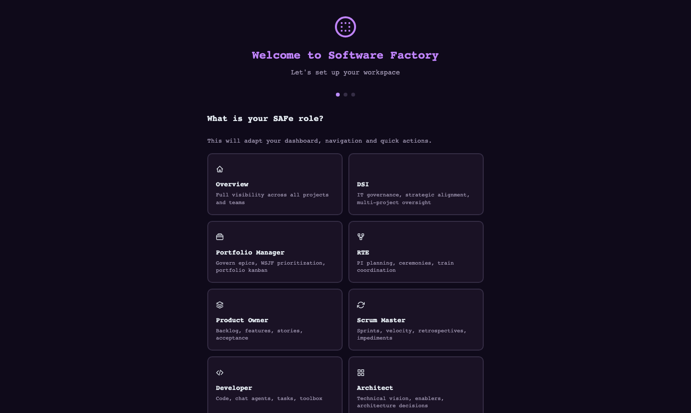

<p align="center">
  <a href="README.md">English</a> |
  <a href="README.fr.md">Français</a> |
  <a href="README.zh-CN.md">中文</a> |
  <a href="README.es.md">Español</a> |
  <a href="README.ja.md">日本語</a> |
  <a href="README.pt.md">Português</a> |
  <a href="README.de.md">Deutsch</a> |
  <a href="README.ko.md">한국어</a>
</p>

<div align="center">

# Software Factory

**Multi-Agenten-Softwarefabrik — Autonome KI-Agenten orchestrieren den vollständigen Produktlebenszyklus**

[](https://www.gnu.org/licenses/agpl-3.0)
[](https://www.python.org/downloads/)
[](https://fastapi.tiangolo.com/)

</div>

---

## Was ist das?

Software Factory ist eine **autonome Multi-Agenten-Plattform**, die den gesamten Software-Entwicklungszyklus orchestriert — von der Ideenfindung bis zur Bereitstellung — mithilfe spezialisierter KI-Agenten, die zusammenarbeiten.

Stellen Sie sich eine **virtuelle Softwarefabrik** vor, in der 161 KI-Agenten über strukturierte Workflows zusammenarbeiten, der SAFe-Methodik folgen, TDD-Praktiken anwenden und automatisierte Qualitätstorwerden nutzen.

### Hauptmerkmale

- **161 spezialisierte Agenten** — Architekten, Entwickler, Tester, SRE, Sicherheitsanalysten, Product Owner
- **10 Orchestrierungsmuster** — Solo, Sequentiell, Parallel, Hierarchisch, Netzwerk, Schleife, Router, Aggregator, Welle, Human-in-the-Loop
- **SAFe-ausgerichteter Lebenszyklus** — Portfolio → Epic → Feature → Story mit PI-Kadenz
- **Selbstheilung** — autonome Vorfallserkennung, Triage und Selbstreparatur
- **LLM-Resilienz** — Multi-Provider-Fallback, Jitter-Retry, Rate-Limit-Management
- **OpenTelemetry-Observabilität** — Distributed Tracing mit Jaeger, Pipeline-Analytics-Dashboard
- **Kontinuierlicher Watchdog** — Auto-Wiederaufnahme pausierter Runs, Sitzungswiederherstellung
- **Sicherheit zuerst** — Prompt-Injection-Guard, RBAC, Secret-Scrubbing
- **DORA-Metriken** — Bereitstellungshäufigkeit, Lead Time, MTTR, Change Failure Rate

## Screenshots

<table>
<tr>
<td width="33%"><strong>Dashboard</strong><br></td>
<td width="33%"><strong>Swagger API</strong><br></td>
<td width="33%"><strong>CLI</strong><br></td>
</tr>
</table>

## Schnellstart

### Option 1: Docker (Empfohlen)

Das Docker-Image enthält: **Node.js 20**, **Playwright + Chromium**, **bandit**, **semgrep**, **ripgrep**.

```bash
git clone https://github.com/macaron-software/software-factory.git
cd software-factory
make setup   # erstellt .env aus .env.example (bearbeiten Sie die LLM-Schlüssel)
make run     # baut und startet die Plattform
```

### Option 2: Lokale Installation

```bash
git clone https://github.com/macaron-software/software-factory.git
cd software-factory
cp .env.example .env                # Config erstellen (LLM-Schlüssel eintragen — siehe unten)
python3 -m venv .venv && source .venv/bin/activate
pip install -r platform/requirements.txt
make dev
```

Öffnen Sie http://localhost:8090 — beim ersten Start erscheint der **Onboarding-Assistent**.
Wählen Sie Ihre SAFe-Rolle oder klicken Sie auf **„Skip (Demo)"**.

### LLM-Anbieter konfigurieren

Ohne API-Key läuft die Plattform im **Demo-Modus** (simulierte Antworten — nützlich zum Erkunden der Oberfläche).

Bearbeiten Sie `.env` und fügen Sie **einen** API-Key hinzu:

```bash
# Option A: MiniMax (empfohlen zum Einstieg)
PLATFORM_LLM_PROVIDER=minimax
MINIMAX_API_KEY=sk-ihr-key-hier

# Option B: Azure OpenAI
PLATFORM_LLM_PROVIDER=azure-openai
AZURE_OPENAI_API_KEY=ihr-key
AZURE_OPENAI_ENDPOINT=https://ihre-resource.openai.azure.com

# Option C: NVIDIA NIM
PLATFORM_LLM_PROVIDER=nvidia
NVIDIA_API_KEY=nvapi-ihr-key-hier
```

Dann neu starten: `make run` (Docker) oder `make dev` (lokal)

| Anbieter | Umgebungsvariable | Modelle |
|----------|------------------|---------|
| **MiniMax** | `MINIMAX_API_KEY` | MiniMax-M2.5 |
| **Azure OpenAI** | `AZURE_OPENAI_API_KEY` + `AZURE_OPENAI_ENDPOINT` | GPT-5-mini |
| **Azure AI Foundry** | `AZURE_AI_API_KEY` + `AZURE_AI_ENDPOINT` | GPT-5.2 |
| **NVIDIA NIM** | `NVIDIA_API_KEY` | Kimi K2 |

Konfiguration auch über **Settings** (`/settings`).

## Funktionen

- **161 KI-Agenten** in Teams organisiert
- **Integrierte Tools**: `code_write`, `build`, `local_ci`, `sast_scan`, `playwright_test`, `create_ticket`, `git_commit`
- **Vollständiges CLI** — 40+ Befehle
- **REST API** — 94 dokumentierte Endpunkte
- **MCP Server** — 23 Tools
- **Lizenz AGPL v3**

## Qualitätsmetriken — Industrielles Monitoring

Deterministische Qualitätsscans (ohne LLM) mit 10 Dimensionen — wie eine Produktionslinie:

**Komplexität** · **Unit-Test-Abdeckung** · **E2E-Test-Abdeckung** · **Sicherheit** · **Barrierefreiheit** · **Performance** · **Dokumentation** · **Architektur** · **Wartbarkeit** · **Adversarial**

Qualitäts-Gates auf Workflow-Phasen (PASS/FAIL-Badges) · Dashboard unter `/quality` · Badges auf Missionen, Projekten und Workflows.

### 4 Auto-Provisionierte Missionen pro Projekt

| Mission | Frequenz | Beschreibung |
|---------|----------|-------------|
| **MCO/TMA** | Kontinuierlich | Gesundheitsmonitoring, Vorfall-Triage (P0-P4), TDD-Fix |
| **Sicherheit** | Wöchentlich | SAST-Scans, Abhängigkeitsaudit, CVE-Überwachung |
| **Technische Schuld** | Monatlich | Komplexitätsaudit, WSJF-Priorisierung, Refactoring-Sprints |
| **Self-Healing** | Kontinuierlich | 5xx-Erkennung → TMA-Mission → Agent-Diagnose → Code-Fix → Validierung |

### Kontinuierliche Verbesserung

3 integrierte Workflows: **quality-improvement** (Scan → Verbesserungsplan), **retrospective-quality** (Sprint-Retro mit Metriken), **skill-evolution** (Agent-Prompt-Optimierung).


## Architektur

```
                     ┌──────────────────────┐
                     │  CLI (sf) / Web UI   │
                     │  REST API :8090      │
                     └──────────┬───────────┘
                                │
                 ┌──────────────┴──────────────┐
                 │     FastAPI-Server            │
                 │  Auth (JWT + RBAC + OAuth)    │
                 └──┬──────────┬────────────┬───┘
                    │          │            │
       ┌────────────┴┐   ┌────┴─────┐   ┌──┴───────────┐
       │ Agenten-     │   │ Workflow-│   │  Missions-   │
       │  Engine      │   │  Engine  │   │   Schicht    │
       │ 161 Agenten  │   │ 39 Defs  │   │ SAFe-Zyklus  │
       │ Ausfuhrer    │   │ 10 Ptrns │   │ Portfolio    │
       └──────┬───────┘   │ Phasen   │   │ Epic/Feature │
              │           │ Retry    │   └──────────────┘
              │           └────┬─────┘
              │                │
  ┌───────────┴────────────────┴───────────────┐
  │  Dienste + Betrieb                          │
  │  LLM (Multi-Provider-Fallback)              │
  │  Werkzeuge (Code, Git, Deploy, Sicherheit)  │
  │  Watchdog (Auto-Wiederaufnahme, Erkennung)  │
  │  Qualitat (10 Dimensionen, Radar, Badge)    │
  │  OpenTelemetry (Tracing > Jaeger)           │
  └───────────────────┬────────────────────────┘
                      │
           ┌──────────┴──────────┐
           │  SQLite + Speicher  │
           │  4 Schichten + FTS5 │
           └─────────────────────┘
```

## Neuheiten v2.2.0 (Feb 2026)

### OpenTelemetry & Distributed Tracing
- **OTEL-Integration** — OpenTelemetry SDK mit OTLP/HTTP-Exporter zu Jaeger
- **ASGI-Tracing-Middleware** — jede HTTP-Anfrage mit Spans, Latenz, Status getrackt
- **Tracing-Dashboard** unter `/analytics` — Request-Statistiken, Latenz-Diagramme, Operationstabelle

### Pipeline-Fehleranalyse
- **Fehlerklassifizierung** — Python-basierte Kategorisierung (setup_failed, llm_provider, timeout, phase_error)
- **Phasen-Heatmap** — identifiziert welche Pipeline-Phasen am häufigsten fehlschlagen
- **Empfehlungs-Engine** — umsetzbare Vorschläge basierend auf Fehlermustern
- **Resume All Button** — Massen-Wiederaufnahme pausierter Runs vom Dashboard

### Kontinuierlicher Watchdog
- **Auto-Wiederaufnahme** — pausierte Runs batchweise fortsetzen (5/Batch, alle 5 Min, max 10 gleichzeitig)
- **Sitzungswiederherstellung** — erkennt inaktive Sitzungen >30 Min, markiert für Retry
- **Blockadeerkennung** — Missionen >60 Min in einer Phase werden automatisch neu gestartet

### Phasen-Resilienz
- **Retry pro Phase** — konfigurierbarer Retry (3x) mit exponentiellem Backoff
- **skip_on_failure** — optionale Phasen, Pipeline kann fortfahren
- **Checkpointing** — abgeschlossene Phasen gespeichert, intelligente Wiederaufnahme

### Sandbox Build-Validierung
- **Post-Code-Prüfung** — automatisches Build/Lint nach Code-Generierungsphasen
- **Auto-Erkennung** — npm, cargo, go, maven, python, docker
- **Fehlereinspeisung** — Build-Fehler in Agentenkontext injiziert

## Tests

```bash
# Unit-Tests
pytest tests/

# E2E-Tests (Playwright)
cd platform/tests/e2e
npm install
npx playwright install --with-deps chromium
npm test
```
