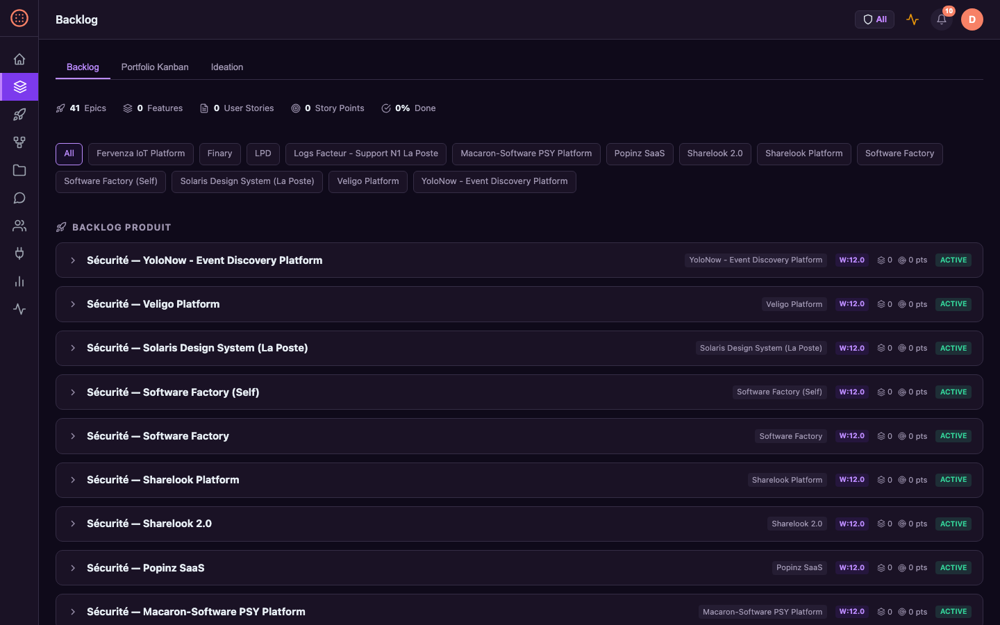
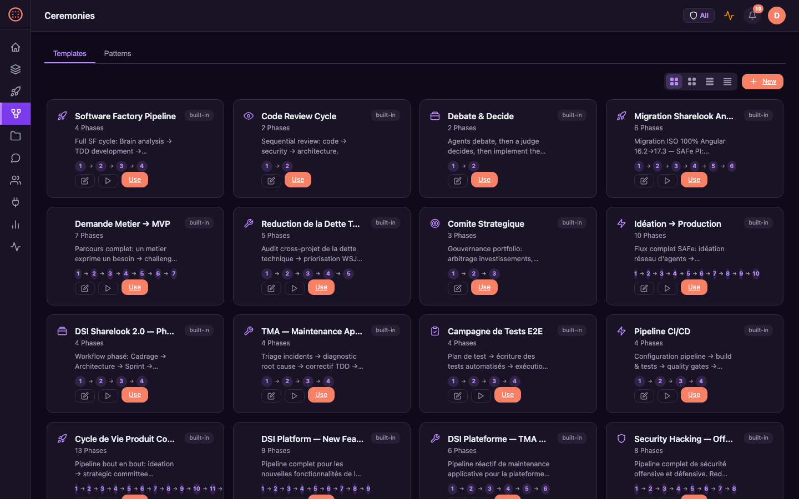

<p align="center">
  <a href="README.md">English</a> |
  <a href="README.fr.md">Français</a> |
  <a href="README.zh-CN.md">中文</a> |
  <a href="README.es.md">Español</a> |
  <a href="README.ja.md">日本語</a> |
  <a href="README.pt.md">Português</a> |
  <a href="README.de.md">Deutsch</a> |
  <a href="README.ko.md">한국어</a>
</p>

<div align="center">

# Software Factory

**Fabrica de Software Multi-Agente — Agentes IA autonomos orquestando el ciclo de vida completo del producto**

[](https://www.gnu.org/licenses/agpl-3.0)
[](https://www.python.org/downloads/)
[](https://fastapi.tiangolo.com/)

**[Demo en vivo: sf.macaron-software.com](https://sf.macaron-software.com)** — haz clic en "Skip (Demo)" para explorar

[Caracteristicas](#caracteristicas) · [Inicio rapido](#inicio-rapido) · [Capturas de pantalla](#capturas-de-pantalla) · [Arquitectura](#arquitectura) · [Contribuir](#contribuir)

</div>

---

## Que es esto?

Software Factory es una **plataforma multi-agente autonoma** que orquesta todo el ciclo de desarrollo de software — desde la ideacion hasta el despliegue — usando agentes IA especializados trabajando juntos.

Piensa en ello como una **fabrica de software virtual** donde 161 agentes IA colaboran a traves de flujos de trabajo estructurados, siguiendo la metodologia SAFe, practicas TDD y puertas de calidad automatizadas.

### Puntos clave

- **161 agentes especializados** — arquitectos, desarrolladores, testers, SREs, analistas de seguridad, product owners
- **10 patrones de orquestacion** — solo, secuencial, paralelo, jerarquico, red, bucle, enrutador, agregador, ola, human-in-the-loop
- **Ciclo de vida alineado con SAFe** — Portfolio → Epic → Feature → Story con cadencia PI
- **Auto-reparacion** — deteccion autonoma de incidentes, triaje y auto-reparacion
- **Resiliencia LLM** — fallback multi-proveedor, retry con jitter, gestion de rate-limit, configuracion de modelos por variables de entorno
- **Observabilidad OpenTelemetry** — tracing distribuido con Jaeger, dashboard de analitica del pipeline
- **Watchdog continuo** — auto-reanudacion de runs pausados, recuperacion de sesiones inactivas, limpieza de fallos
- **Seguridad prioritaria** — guardia contra inyeccion de prompt, RBAC, enmascaramiento de secretos, pool de conexiones
- **Metricas DORA** — frecuencia de despliegue, lead time, MTTR, tasa de fallo de cambios

## Capturas de pantalla

<table>
<tr>
<td width="50%">
<strong>Dashboard — Perspectiva SAFe Adaptativa</strong><br>

</td>
<td width="50%">
<strong>Portfolio — Backlog Estrategico y WSJF</strong><br>

</td>
</tr>
<tr>
<td width="50%">
<strong>PI Board — Planificacion de Incremento de Programa</strong><br>

</td>
<td width="50%">
<strong>Taller de Ideacion — Brainstorming con IA</strong><br>

</td>
</tr>
<tr>
<td width="50%">
<strong>ART — Agile Release Trains y Equipos de Agentes</strong><br>

</td>
<td width="50%">
<strong>Ceremonias — Plantillas de Workflow y Patrones</strong><br>

</td>
</tr>
<tr>
<td width="50%">
<strong>Monitorizacion — Metricas DORA y Salud del Sistema</strong><br>

</td>
<td width="50%">
<strong>Onboarding — Asistente de Seleccion de Rol SAFe</strong><br>

</td>
</tr>
</table>

## Inicio rapido

### Opcion 1: Docker (Recomendado)

La imagen Docker incluye: **Node.js 20**, **Playwright + Chromium**, **bandit**, **semgrep**, **ripgrep**.

```bash
git clone https://github.com/macaron-software/software-factory.git
cd software-factory
make setup   # copia .env.example → .env (editalo para agregar tu clave API LLM)
make run     # construye e inicia la plataforma
```

Abre http://localhost:8090 — haz clic en **"Skip (Demo)"** para explorar sin clave API.

### Opcion 2: Instalacion local

```bash
git clone https://github.com/macaron-software/software-factory.git
cd software-factory
cp .env.example .env                # crea tu configuracion (edita para agregar la clave LLM — ver Paso 3)
python3 -m venv .venv && source .venv/bin/activate
pip install -r platform/requirements.txt

# Iniciar la plataforma
make dev
# o manualmente: PYTHONPATH=$(pwd) python3 -m uvicorn platform.server:app --host 0.0.0.0 --port 8090 --ws none
```

Abre http://localhost:8090 — en el primer inicio veras el **asistente de onboarding**.
Elige tu rol SAFe o haz clic en **"Skip (Demo)"** para explorar inmediatamente.

### Paso 3: Configurar un proveedor LLM

Sin clave API, la plataforma funciona en **modo demo** — los agentes responden con respuestas simuladas.
Esto es util para explorar la interfaz, pero los agentes no generaran codigo ni analisis reales.

Para habilitar agentes IA reales, edita `.env` y agrega **una** clave API:

```bash
# Opcion A: MiniMax (recomendado para empezar)
PLATFORM_LLM_PROVIDER=minimax
MINIMAX_API_KEY=sk-your-key-here

# Opcion B: Azure OpenAI
PLATFORM_LLM_PROVIDER=azure-openai
AZURE_OPENAI_API_KEY=your-key
AZURE_OPENAI_ENDPOINT=https://your-resource.openai.azure.com

# Opcion C: NVIDIA NIM
PLATFORM_LLM_PROVIDER=nvidia
NVIDIA_API_KEY=nvapi-your-key-here
```

Luego reinicia: `make run` (Docker) o `make dev` (local)

| Proveedor | Variable de entorno | Modelos |
|-----------|---------------------|---------|
| **MiniMax** | `MINIMAX_API_KEY` | MiniMax-M2.5 |
| **Azure OpenAI** | `AZURE_OPENAI_API_KEY` + `AZURE_OPENAI_ENDPOINT` | GPT-5-mini |
| **Azure AI Foundry** | `AZURE_AI_API_KEY` + `AZURE_AI_ENDPOINT` | GPT-5.2 |
| **NVIDIA NIM** | `NVIDIA_API_KEY` | Kimi K2 |

La plataforma conmuta automaticamente a otros proveedores configurados si el principal falla.
Tambien puedes configurar proveedores desde la pagina **Settings** en el dashboard (`/settings`).

## Primeros pasos — Tu primer proyecto

Despues de la instalacion, asi es como pasar de una idea a un proyecto funcional:

### Ruta A: Comenzar desde una idea (Taller de Ideacion)

1. **Abre la pagina de Ideacion** — ve a `/ideation` (o haz clic en "Ideation" en la barra lateral)
2. **Describe tu idea** — ej. *"App de carpooling empresarial con matching en tiempo real"*
3. **Observa la discusion de los agentes** — 5 agentes especializados (Product Manager, Business Analyst, Arquitecto, UX Designer, Seguridad) analizan tu idea en tiempo real via streaming SSE
4. **Crea un proyecto a partir del resultado** — haz clic en **"Create an Epic from this idea"**. La plataforma:
   - Creara un nuevo **proyecto** con `VISION.md` generado y scaffolding CI/CD
   - Creara un **epic** con features y user stories desglosadas por el agente PO
   - Auto-provisionara misiones de **TMA** (mantenimiento), **Seguridad** y **Deuda Tecnica**

Ahora tienes un backlog SAFe completo listo para ejecutar.

### Ruta B: Crear un proyecto manualmente

1. Ve a `/projects` y haz clic en **"New Project"**
2. Completa: nombre, descripcion, stack tecnologico, ruta del repositorio
3. La plataforma crea automaticamente:
   - Un **agente Product Manager** asignado al proyecto
   - Una **mision TMA** (mantenimiento continuo — monitorea salud, crea incidentes)
   - Una **mision de Seguridad** (auditorias de seguridad semanales — SAST, chequeo de dependencias)
   - Una **mision de Deuda Tecnica** (reduccion mensual de deuda — planificada)

### Luego: Crea Epics y Features

- Desde la pagina **Portfolio** (`/portfolio`), crea epics con priorizacion WSJF
- Desde un epic, agrega **features** y desglosalas en **user stories**
- Usa el **PI Board** (`/pi-board`) para planificar incrementos de programa y asignar features a sprints

### Ejecutar misiones

- Haz clic en **"Start"** en cualquier mision para lanzar la ejecucion de agentes
- Elige un **patron de orquestacion** (jerarquico, red, paralelo...)
- Observa a los agentes trabajar en tiempo real desde **Mission Control**
- Los agentes usan sus herramientas (code_read, git, build, test, security scan) de forma autonoma

### TMA y Seguridad — Siempre activos

Estas se **habilitan automaticamente** para cada proyecto — no requieren configuracion:

| Mision | Tipo | Frecuencia | Que hace |
|--------|------|------------|----------|
| **TMA** | Programa | Continua | Monitorizacion de salud, deteccion de incidentes, auto-reparacion, creacion de tickets |
| **Seguridad** | Revision | Semanal | Escaneos SAST (bandit/semgrep), auditoria de dependencias, deteccion de secretos |
| **Deuda Tecnica** | Reduccion | Mensual | Analisis de calidad de codigo, recomendaciones de refactorizacion |
| **Self-Healing** | Programa | Continua | Auto-deteccion de 5xx/crashes → mision TMA → diagnostico de agente → correccion de codigo → validacion |

Las cuatro se crean con el proyecto. TMA, Seguridad y Self-Healing inician como **activas**, Deuda Tecnica inicia como **planificacion** (activar cuando estes listo).

## Caracteristicas

### 161 Agentes IA Especializados

Los agentes estan organizados en equipos que reflejan organizaciones de software reales:

| Equipo | Agentes | Rol |
|--------|---------|-----|
| **Producto** | Product Manager, Business Analyst, PO | Planificacion SAFe, priorizacion WSJF |
| **Arquitectura** | Solution Architect, Tech Lead, System Architect | Decisiones de arquitectura, patrones de diseno |
| **Desarrollo** | Backend/Frontend/Mobile/Data Engineers | Implementacion TDD por stack |
| **Calidad** | QA Engineers, Security Analysts, Test Automation | Testing, auditorias de seguridad, pruebas de penetracion |
| **Diseno** | UX Designer, UI Designer | Experiencia de usuario, diseno visual |
| **DevOps** | DevOps Engineer, SRE, Platform Engineer | CI/CD, monitorizacion, infraestructura |
| **Gestion** | Scrum Master, RTE, Agile Coach | Ceremonias, facilitacion, eliminacion de impedimentos |

### 10 Patrones de orquestacion

- **Solo** — un unico agente para tareas simples
- **Sequential** — pipeline de agentes ejecutando en orden
- **Parallel** — multiples agentes trabajando simultaneamente
- **Hierarchical** — manager delegando a sub-agentes
- **Network** — agentes colaborando peer-to-peer
- **Loop** — agente itera hasta cumplir una condicion
- **Router** — un agente enruta al especialista segun el input
- **Aggregator** — multiples entradas fusionadas por un unico agregador
- **Wave** — paralelo dentro de olas, secuencial entre olas
- **Human-in-the-loop** — el agente propone, el humano valida

### Ciclo de vida alineado con SAFe

Jerarquia completa Portfolio → Epic → Feature → Story con:

- **Portfolio Estrategico** — canvas de portfolio, temas estrategicos, flujos de valor
- **Incremento de Programa** — planificacion PI, objetivos, dependencias
- **Backlog de Equipo** — user stories, tareas, criterios de aceptacion
- **Ejecucion de Sprint** — daily standups, sprint reviews, retrospectivas

### Seguridad y Cumplimiento

- **Autenticacion** — auth basada en JWT con RBAC
- **Guardia contra inyeccion de prompt** — deteccion y bloqueo de prompts maliciosos
- **Enmascaramiento de secretos** — redaccion automatica de datos sensibles
- **CSP (Content Security Policy)** — headers reforzados
- **Limitacion de tasa** — cuotas de API por usuario
- **Registro de auditoria** — logs de actividad completos

### Metricas DORA y Monitorizacion

- **Frecuencia de despliegue** — con que frecuencia el codigo llega a produccion
- **Lead time** — duracion de commit a despliegue
- **MTTR** — tiempo medio de recuperacion de incidentes
- **Tasa de fallo de cambios** — porcentaje de despliegues fallidos
- **Dashboards en tiempo real** — visualizaciones Chart.js
- **Metricas Prometheus** — endpoint /metrics

### Metricas de calidad — Monitorizacion industrial

Escaneo de calidad deterministico (sin LLM) con 10 dimensiones, como una linea de produccion:

| Dimension | Herramientas | Que mide |
|-----------|-------------|----------|
| **Complexity** | radon, lizard | Complejidad ciclomatica, complejidad cognitiva |
| **Unit Test Coverage** | coverage.py, nyc | Porcentaje de cobertura de lineas/ramas |
| **E2E Test Coverage** | Playwright | Conteo de archivos de test, cobertura de specs |
| **Security** | bandit, semgrep | Hallazgos SAST por severidad (critico/alto/medio/bajo) |
| **Accessibility** | pa11y | Violaciones WCAG 2.1 AA |
| **Performance** | Lighthouse | Puntuaciones Core Web Vitals |
| **Documentation** | interrogate | README, changelog, docs API, cobertura de docstrings |
| **Architecture** | madge, jscpd, mypy | Dependencias circulares, duplicacion de codigo, errores de tipos |
| **Maintainability** | custom | Distribucion de tamano de archivos, ratio de archivos grandes |
| **Adversarial** | built-in | Tasa de incidentes, tasa de rechazo adversarial |

**Puertas de calidad en fases de workflow** — cada fase del workflow muestra un badge de calidad (PASS/FAIL/PENDING) basado en umbrales de dimension configurados por tipo de puerta:

| Tipo de puerta | Umbral | Usado en |
|----------------|--------|----------|
| `always` | 0% | Fases de analisis, planificacion |
| `no_veto` | 50% | Fases de implementacion, sprint |
| `all_approved` | 70% | Fases de revision, release |
| `quality_gate` | 80% | Fases de deploy, produccion |

**Dashboard de calidad** en `/quality` — scorecard global, puntuaciones por proyecto, snapshots de tendencias.
Badges de calidad visibles en detalle de mision, tablero de proyecto, fases de workflow y dashboard principal.

### Workflows de mejora continua

Tres workflows integrados para auto-mejora:

| Workflow | Proposito | Agentes |
|----------|-----------|---------|
| **quality-improvement** | Escanear metricas → identificar peores dimensiones → planificar y ejecutar mejoras | QA Lead, Dev, Architect |
| **retrospective-quality** | Retro de fin de sprint: recopilar ROTI, incidentes, datos de calidad → elementos de accion | Scrum Master, QA, Dev |
| **skill-evolution** | Analizar rendimiento de agentes → actualizar system prompts → evolucionar habilidades | Brain, Lead Dev, QA |

Estos workflows crean un **bucle de retroalimentacion**: metricas → analisis → mejora → re-escaneo → seguimiento del progreso.

### Herramientas integradas de agentes

La imagen Docker incluye todo lo que los agentes necesitan para trabajar de forma autonoma:

| Categoria | Herramientas | Descripcion |
|-----------|-------------|-------------|
| **Codigo** | `code_read`, `code_write`, `code_edit`, `code_search`, `list_files` | Leer, escribir y buscar archivos del proyecto |
| **Build** | `build`, `test`, `local_ci` | Ejecutar builds, tests y pipelines CI locales (npm/pip/cargo auto-detectado) |
| **Git** | `git_commit`, `git_diff`, `git_log`, `git_status` | Control de versiones con aislamiento de rama por agente |
| **Seguridad** | `sast_scan`, `dependency_audit`, `secrets_scan` | SAST via bandit/semgrep, auditoria CVE, deteccion de secretos |
| **QA** | `playwright_test`, `browser_screenshot`, `screenshot` | Tests E2E con Playwright y capturas de pantalla (Chromium incluido) |
| **Tickets** | `create_ticket`, `jira_search`, `jira_create` | Crear incidentes/tickets para seguimiento TMA |
| **Deploy** | `docker_deploy`, `docker_status`, `github_actions` | Despliegue de contenedores y estado CI/CD |
| **Memoria** | `memory_store`, `memory_search`, `deep_search` | Memoria persistente del proyecto entre sesiones |

### Auto-reparacion y Self-Repair (TMA)

Ciclo autonomo de deteccion, triaje y auto-reparacion de incidentes:

- **Monitorizacion de heartbeat** — chequeos de salud continuos en todas las misiones y servicios en ejecucion
- **Auto-deteccion de incidentes** — HTTP 5xx, timeout, crash de agente → creacion automatica de incidente
- **Triaje y clasificacion** — severidad (P0-P3), analisis de impacto, hipotesis de causa raiz
- **Auto-reparacion** — los agentes diagnostican y corrigen problemas de forma autonoma (parches de codigo, cambios de configuracion, reinicios)
- **Creacion de tickets** — los incidentes no resueltos crean automaticamente tickets rastreados para revision humana
- **Escalado** — incidentes P0/P1 disparan notificaciones Slack/Email al equipo de guardia
- **Bucle retrospectivo** — aprendizajes post-incidente almacenados en memoria, inyectados en futuros sprints

### Perspectivas SAFe y Onboarding

Interfaz adaptativa basada en roles que refleja una organizacion SAFe real:

- **9 perspectivas SAFe** — Portfolio Manager, RTE, Product Owner, Scrum Master, Developer, Architect, QA/Security, Business Owner, Admin
- **Dashboard adaptativo** — KPIs, acciones rapidas y enlaces de la barra lateral cambian segun el rol seleccionado
- **Asistente de onboarding** — flujo de 3 pasos para nuevos usuarios (elegir rol → elegir proyecto → comenzar)
- **Selector de perspectiva** — cambia de rol SAFe en cualquier momento desde el desplegable de la barra superior
- **Barra lateral dinamica** — solo muestra navegacion relevante para la perspectiva actual

### Memoria de 4 capas y RLM Deep Search

Conocimiento persistente entre sesiones con recuperacion inteligente:

- **Memoria de sesion** — contexto de conversacion dentro de una unica sesion
- **Memoria de patrones** — aprendizajes de la ejecucion de patrones de orquestacion
- **Memoria de proyecto** — conocimiento por proyecto (decisiones, convenciones, arquitectura)
- **Memoria global** — conocimiento organizacional transversal (busqueda full-text FTS5)
- **Archivos de proyecto auto-cargados** — CLAUDE.md, SPECS.md, VISION.md, README.md inyectados en cada prompt LLM (max 8K)
- **RLM Deep Search** — Recursive Language Model (arXiv:2512.24601) — bucle iterativo WRITE-EXECUTE-OBSERVE-DECIDE con hasta 10 iteraciones de exploracion

### Agent Mercato (Mercado de Transferencias)

Marketplace de agentes basado en tokens para composicion de equipos:

- **Listados de agentes** — listar agentes para transferencia con precio solicitado
- **Pool de agentes libres** — agentes no asignados disponibles para reclutamiento
- **Transferencias y prestamos** — comprar, vender o prestar agentes entre proyectos
- **Valoracion de mercado** — valoracion automatica de agentes basada en habilidades, experiencia y rendimiento
- **Sistema de wallet** — wallets de tokens por proyecto con historial de transacciones
- **Sistema de draft** — reclamar agentes libres para tu proyecto

### Guardia de Calidad Adversarial

Puerta de calidad de dos capas que bloquea codigo falso/placeholder:

- **L0 Deterministico** — deteccion instantanea de slop (lorem ipsum, TBD), mocks (NotImplementedError, TODO), builds falsos, alucinaciones, desajustes de stack
- **L1 Semantico LLM** — LLM separado revisa la calidad de salida para patrones de ejecucion
- **Puntuacion** — score < 5 aprueba, 5-6 aprobado con advertencia, 7+ rechazado
- **Rechazo forzado** — alucinacion, slop, desajuste de stack, builds falsos siempre rechazados independientemente de la puntuacion

### Auto-Documentacion y Wiki

Generacion automatica de documentacion a lo largo del ciclo de vida:

- **Retrospectivas de sprint** — notas de retro generadas por LLM almacenadas en BD y memoria, inyectadas en prompts del siguiente sprint (bucle de aprendizaje)
- **Resumenes de fase** — cada fase de mision produce un resumen generado por LLM de decisiones y resultados
- **Architecture Decision Records** — los patrones de arquitectura documentan automaticamente decisiones de diseno en la memoria del proyecto
- **Archivos de contexto del proyecto** — archivos de instrucciones auto-cargados (CLAUDE.md, SPECS.md, CONVENTIONS.md) sirven como documentacion viva
- **Sincronizacion Confluence** — sincronizacion bidireccional con paginas wiki de Confluence para documentacion empresarial
- **Swagger auto-docs** — 94 endpoints REST auto-documentados en `/docs` con esquema OpenAPI

## Cuatro interfaces

### 1. Dashboard Web (HTMX + SSE)

Interfaz principal en http://localhost:8090:

- **Conversaciones multi-agente en tiempo real** con streaming SSE
- **PI Board** — planificacion de incremento de programa
- **Mission Control** — monitorizacion de ejecucion
- **Gestion de Agentes** — ver, configurar, monitorizar agentes
- **Dashboard de Incidentes** — triaje de auto-reparacion
- **Responsive mobile** — funciona en tablets y telefonos

### 2. CLI (`sf`)

Interfaz de linea de comandos completa:

```bash
# Instalar (agregar al PATH)
ln -s $(pwd)/cli/sf.py ~/.local/bin/sf

# Explorar
sf status                              # Salud de la plataforma
sf projects list                       # Todos los proyectos
sf missions list                       # Misiones con puntuaciones WSJF
sf agents list                         # 145 agentes
sf features list <epic_id>             # Features del epic
sf stories list --feature <id>         # User stories

# Trabajar
sf ideation "e-commerce app in React"  # Ideacion multi-agente (streaming)
sf missions start <id>                 # Iniciar ejecucion de mision
sf metrics dora                        # Metricas DORA

# Monitorizar
sf incidents list                      # Incidentes
sf llm stats                           # Uso de LLM (tokens, coste)
sf chaos status                        # Ingenieria del caos
```

**22 grupos de comandos** · Modo dual: API (servidor activo) o DB (offline) · Salida JSON (`--json`) · Animaciones spinner · Renderizado de tablas Markdown

### 3. REST API + Swagger

94 endpoints API auto-documentados en `/docs` (Swagger UI):

```bash
# Ejemplos
curl http://localhost:8090/api/projects
curl http://localhost:8090/api/agents
curl http://localhost:8090/api/missions
curl -X POST http://localhost:8090/api/ideation \
  -H "Content-Type: application/json" \
  -d '{"prompt": "bike GPS tracker app"}'
```

Swagger UI: http://localhost:8090/docs

### 4. Servidor MCP (Model Context Protocol)

24 herramientas MCP para integracion con agentes IA (puerto 9501):

```bash
# Iniciar servidor MCP
python3 -m platform.mcp_platform.server

# Herramientas disponibles:
# platform_agents, platform_projects, platform_missions,
# platform_features, platform_sprints, platform_stories,
# platform_incidents, platform_llm, platform_search, ...
```

## Arquitectura

### Vista general de la plataforma

```
                        ┌──────────────────────┐
                        │   CLI (sf) / Web UI  │
                        │   REST API :8090     │
                        └──────────┬───────────┘
                                   │
                    ┌──────────────┴──────────────┐
                    │     FastAPI Server           │
                    │  Auth (JWT + RBAC + OAuth)   │
                    │  17 route modules            │
                    └──┬──────────┬────────────┬───┘
                       │          │            │
          ┌────────────┴┐   ┌────┴─────┐   ┌──┴───────────┐
          │ Agent Engine │   │ Workflow │   │   Mission    │
          │ 161 agents   │   │  Engine  │   │    Layer     │
          │ executor     │   │ 39 defs  │   │ SAFe cycle   │
          │ loop+retry   │   │ 10 ptrns │   │ Portfolio    │
          └──────┬───────┘   │ phases   │   │ Epic/Feature │
                 │           │ retry    │   │ Story/Sprint │
                 │           │ skip     │   └──────────────┘
                 │           │ ckpoint  │
                 │           └────┬─────┘
                 │                │
     ┌───────────┴────────────────┴───────────────┐
     │              Services                       │
     │  LLM Client (multi-provider fallback)       │
     │  Tools (code, git, deploy, memory, security)│
     │  MCP Bridge (fetch, memory, playwright)     │
     │  Quality Engine (10 dimensions)             │
     │  Notifications (Slack, Email, Webhook)      │
     └───────────────────┬─────────────────────────┘
                         │
     ┌───────────────────┴─────────────────────────┐
     │              Operations                      │
     │  Watchdog (auto-resume, stall detection)     │
     │  Auto-Heal (incident > triage > fix)         │
     │  OpenTelemetry (tracing + metrics > Jaeger)  │
     └───────────────────┬─────────────────────────┘
                         │
              ┌──────────┴──────────┐
              │   SQLite + Memory   │
              │   4-layer memory    │
              │   FTS5 search       │
              └─────────────────────┘
```

### Flujo del pipeline

```
Mission Created
     │
     ▼
┌─────────────┐     ┌──────────┐    ┌──────────┐    ┌──────────┐
│  Select     │────▶│sequential│    │ parallel │    │hierarchic│
│  Pattern    │────▶│          │    │          │    │          │
└─────────────┘────▶│ adversar.│    │          │    │          │
                    └────┬─────┘    └────┬─────┘    └────┬─────┘
                         └───────────────┴───────────────┘
                                         │
                    ┌────────────────────────────────────────┐
                    │         Phase Execution                 │
                    │                                        │
                    │  Agent ──▶ LLM Call ──▶ Result         │
                    │                          │             │
                    │              ┌───success──┴──failure──┐│
                    │              ▼                        ▼│
                    │         Code phase?            Retries? │
                    │           │ yes                  │ yes │
                    │           ▼                      ▼     │
                    │     Sandbox Build         Retry w/     │
                    │     Validation            backoff      │
                    │           │                      │ no  │
                    │           ▼                      ▼     │
                    │     Quality Gate          skip_on_fail?│
                    │      │        │            │yes  │no   │
                    │    pass     fail            │     │     │
                    │      │        │             │     ▼     │
                    │      ▼        ▼             │   PAUSED  │
                    │  Checkpoint  PAUSED ◀───────┘     │     │
                    └──────┬─────────────────────────────┘    │
                           │                                  │
                    More phases? ──yes──▶ next phase          │
                           │ no                               │
                           ▼                    watchdog      │
                    Mission Completed     auto-resume ◀───────┘
```

### Observabilidad

```
┌──────────────────────┐    ┌────────────────────────────────┐
│   OTEL Middleware     │    │     Continuous Watchdog         │
│   (every request)     │    │                                │
│   spans + metrics     │    │  health check    every 60s     │
│         │             │    │  stall detection  phases>60min │
│         ▼             │    │  auto-resume     5/batch 5min  │
│   OTLP/HTTP export    │    │  session recovery  >30min      │
│         │             │    │  failed cleanup   zombies      │
│         ▼             │    └────────────────────────────────┘
│   Jaeger :16686       │
└──────────────────────┘    ┌────────────────────────────────┐
                            │     Failure Analysis            │
┌──────────────────────┐    │                                │
│   Quality Engine      │    │  error classification          │
│   10 dimensions       │    │  phase heatmap                 │
│   quality gates       │    │  recommendations               │
│   radar chart         │    │  resume-all button             │
│   badge + scorecard   │    └────────────────────────────────┘
└──────────────────────┘
                            ┌────────────────────────────────┐
         All data ─────────▶│  Dashboard /analytics           │
                            │  tracing stats + latency chart  │
                            │  error doughnut + phase bars    │
                            │  quality radar + scorecard      │
                            └────────────────────────────────┘
```

### Despliegue

```
                          Internet
                     ┌───────┴────────┐
                     │                │
          ┌──────────▼─────┐  ┌───────▼────────┐
          │ Azure VM (Prod)│  │ OVH VPS (Demo) │
          │ sf.macaron-software.com   │  │ demo.macaron-software.com  │
          │                │  │                │
          │ Nginx :443     │  │ Nginx :443     │
          │   │            │  │   │            │
          │   ▼            │  │   ▼            │
          │ Platform :8090 │  │ Platform :8090 │
          │ GPT-5-mini     │  │ MiniMax-M2.5   │
          │   │            │  │   │            │
          │   ▼            │  │   ▼            │
          │ Jaeger :16686  │  │ Jaeger :16686  │
          │   │            │  │   │            │
          │   ▼            │  │   ▼            │
          │ SQLite DB      │  │ SQLite DB      │
          │ /patches (ro)  │  │                │
          └────────────────┘  └────────────────┘
                     │                │
                     └───────┬────────┘
                             │
                    ┌────────▼────────┐
                    │ GitHub          │
                    │ macaron-software│
                    │ /software-factory│
                    └─────────────────┘
```

## Configuracion de proyecto

Los proyectos se definen en `projects/*.yaml`:

```yaml
project:
  name: my-project
  root_path: /path/to/project
  vision_doc: CLAUDE.md

agents:
  - product_manager
  - solution_architect
  - backend_dev
  - qa_engineer

patterns:
  ideation: hierarchical
  development: parallel
  review: adversarial-pair

deployment:
  strategy: blue-green
  auto_prod: true
  health_check_url: /health

monitoring:
  prometheus: true
  grafana_dashboard: project-metrics
```

## Estructura de directorios

```
├── platform/                # Plataforma de Agentes (152 archivos Python)
│   ├── server.py            # App FastAPI, puerto 8090
│   ├── agents/              # Bucle de agentes, executor, store
│   ├── a2a/                 # Bus de mensajeria agente-a-agente
│   ├── patterns/            # 10 patrones de orquestacion
│   ├── missions/            # Ciclo de vida de misiones SAFe
│   ├── sessions/            # Runner de conversacion + SSE
│   ├── web/                 # Rutas + plantillas Jinja2
│   ├── mcp_platform/        # Servidor MCP (23 herramientas)
│   └── tools/               # Herramientas de agentes (codigo, git, deploy)
│
├── cli/                     # CLI 'sf' (6 archivos, 2100+ LOC)
│   ├── sf.py                # 22 grupos de comandos, 40+ subcomandos
│   ├── _api.py              # Cliente REST httpx
│   ├── _db.py               # Backend offline sqlite3
│   ├── _output.py           # Tablas ANSI, renderizado markdown
│   └── _stream.py           # Streaming SSE con spinner
│
├── dashboard/               # Frontend HTMX
├── deploy/                  # Charts Helm, Docker, K8s
├── tests/                   # Tests E2E Playwright
├── skills/                  # Biblioteca de habilidades de agentes
├── projects/                # Configuraciones YAML de proyectos
└── data/                    # Base de datos SQLite
```

## Pruebas

```bash
# Ejecutar todos los tests
make test

# Tests E2E (Playwright — requiere instalacion previa)
cd platform/tests/e2e
npm install
npx playwright install --with-deps chromium
npm test

# Tests unitarios
pytest tests/

# Ingenieria del caos
python3 tests/test_chaos.py

# Tests de resistencia
python3 tests/test_endurance.py
```

## Despliegue

### Docker

La imagen Docker incluye: **Node.js 20**, **Playwright + Chromium**, **bandit**, **semgrep**, **ripgrep**.
Los agentes pueden compilar proyectos, ejecutar tests E2E con capturas de pantalla y realizar escaneos de seguridad SAST de forma nativa.

```bash
docker-compose up -d
```

### Kubernetes (Helm)

```bash
helm install software-factory ./deploy/helm/
```

### Variables de entorno

Consulta [`.env.example`](.env.example) para la lista completa. Variables principales:

```bash
# Proveedor LLM (requerido para agentes reales)
PLATFORM_LLM_PROVIDER=minimax        # minimax | azure-openai | azure-ai | nvidia | demo
MINIMAX_API_KEY=sk-...               # Clave API MiniMax

# Autenticacion (opcional)
GITHUB_CLIENT_ID=...                 # GitHub OAuth
GITHUB_CLIENT_SECRET=...
AZURE_AD_CLIENT_ID=...               # Azure AD OAuth
AZURE_AD_CLIENT_SECRET=...
AZURE_AD_TENANT_ID=...

# Integraciones (opcional)
JIRA_URL=https://your-jira.atlassian.net
ATLASSIAN_TOKEN=your-token
SLACK_WEBHOOK_URL=https://hooks.slack.com/services/...
```

## Novedades en v2.1.0 (feb 2026)

### Metricas de calidad — Monitorizacion industrial
- **10 dimensiones deterministicas** — complejidad, cobertura (UT/E2E), seguridad, accesibilidad, rendimiento, documentacion, arquitectura, mantenibilidad, adversarial
- **Puertas de calidad en fases de workflow** — badges PASS/FAIL por fase con umbrales configurables (always/no_veto/all_approved/quality_gate)
- **Dashboard de calidad** en `/quality` — scorecard global, puntuaciones por proyecto, snapshots de tendencias
- **Badges de calidad en todas partes** — detalle de mision, tablero de proyecto, fases de workflow, dashboard principal
- **Sin LLM requerido** — todas las metricas calculadas deterministicamente usando herramientas open-source (radon, bandit, semgrep, coverage.py, pa11y, madge)

### 4 Misiones auto-provisionadas por proyecto
Cada proyecto obtiene automaticamente 4 misiones operativas:
- **MCO/TMA** — mantenimiento continuo: monitorizacion de salud, triaje de incidentes (P0-P4), correccion TDD, validacion de no-regresion
- **Seguridad** — escaneos SAST semanales, auditoria de dependencias, vigilancia CVE, revision de codigo
- **Deuda Tecnica** — reduccion mensual de deuda: auditoria de complejidad, priorizacion WSJF, sprints de refactorizacion
- **Self-Healing** — pipeline autonomo de incidentes: deteccion 5xx → creacion de mision TMA → diagnostico de agente → correccion de codigo → validacion

### Mejora continua
- **Workflow quality-improvement** — escanear → identificar peores dimensiones → planificar y ejecutar mejoras
- **Workflow retrospective-quality** — retro de sprint con ROTI, incidentes, metricas de calidad → elementos de accion
- **Workflow skill-evolution** — analizar rendimiento de agentes → actualizar prompts → evolucionar habilidades
- **Bucle de retroalimentacion** — metricas → analisis → mejora → re-escaneo → seguimiento del progreso

### Perspectivas SAFe y Onboarding
- **9 perspectivas de rol SAFe** — dashboard, barra lateral y KPIs adaptativos por rol
- **Asistente de onboarding** — flujo de 3 pasos para nuevos usuarios con seleccion de rol y proyecto
- **Selector de perspectiva** — cambia de rol SAFe desde la barra superior en cualquier momento

### Auto-reparacion y Self-Repair
- **Heartbeat TMA** — monitorizacion continua de salud con creacion automatica de incidentes
- **Agentes de auto-reparacion** — diagnostico y correccion autonoma de fallos comunes
- **Escalado de tickets** — incidentes no resueltos crean tickets rastreados con notificaciones

### Memoria de 4 capas y RLM
- **Conocimiento persistente** — capas de memoria de sesion, patron, proyecto y global con FTS5
- **RLM deep search** — bucle de exploracion recursiva (hasta 10 iteraciones) para analisis complejos de codigo
- **Contexto de proyecto auto-cargado** — CLAUDE.md, SPECS.md, VISION.md inyectados en cada prompt de agente

### Guardia de calidad adversarial
- **L0 deterministico** — deteccion instantanea de slop, mocks, builds falsos, alucinaciones
- **L1 semantico** — revision de calidad basada en LLM para salidas de ejecucion
- **Rechazo forzado** — alucinaciones y desajustes de stack siempre bloqueados

### Agent Mercato
- **Marketplace basado en tokens** con listados de agentes, transferencias, prestamos y draft de agentes libres
- **Valoracion de mercado** — precio automatico de agentes basado en habilidades y rendimiento
- **Sistema de wallet** — economia de tokens por proyecto con historial de transacciones

### Autenticacion y Seguridad
- **Auth basada en JWT** con login/registro/refresh/logout
- **RBAC** — roles admin, project_manager, developer, viewer
- **OAuth** — login SSO con GitHub y Azure AD
- **Panel de administracion** — interfaz de gestion de usuarios (`/admin/users`)
- **Modo demo** — boton "Skip" de un clic para acceso instantaneo

### Auto-documentacion
- **Retrospectivas de sprint** — notas de retro generadas por LLM con bucle de aprendizaje
- **Resumenes de fase** — documentacion automatica de resultados de fases de mision
- **Sincronizacion Confluence** — integracion wiki bidireccional

### Proveedores LLM
- **Multi-proveedor** con cadena de fallback automatica
- MiniMax M2.5, Azure OpenAI GPT-5-mini, Azure AI Foundry, NVIDIA NIM
- **Modo demo** para exploracion de la interfaz sin claves API

### Mejoras de la plataforma
- Dashboard de metricas DORA con seguimiento de costes LLM
- Sincronizacion bidireccional con Jira
- Suite de tests E2E Playwright (11 archivos spec)
- Internacionalizacion (EN/FR)
- Notificaciones en tiempo real (Slack, Email, Webhook)
- Pipeline de Design System en workflows (UX → dev → review)
- Visualizacion 3D Agent World

## Novedades en v2.2.0 (feb 2026)

### OpenTelemetry y Tracing Distribuido
- **Integracion OTEL** — SDK OpenTelemetry con exportador OTLP/HTTP a Jaeger
- **Middleware tracing ASGI** — cada peticion HTTP trazada con spans, latencia, estado
- **Dashboard de tracing** en `/analytics` — estadisticas de peticiones, graficos de latencia, tabla de operaciones
- **Jaeger UI** — exploracion completa de trazas distribuidas en puerto 16686

### Analisis de fallos del pipeline
- **Clasificacion de fallos** — categorizacion de errores basada en Python (setup_failed, llm_provider, timeout, phase_error, etc.)
- **Heatmap de fallo de fases** — identificar que fases del pipeline fallan con mas frecuencia
- **Motor de recomendaciones** — sugerencias accionables basadas en patrones de fallo
- **Boton Resume All** — reanudacion masiva con un clic de runs pausados desde el dashboard

### Watchdog continuo
- **Auto-reanudacion** — reanudar automaticamente runs pausados en lotes (5/lote, cada 5 min, max 10 concurrentes)
- **Recuperacion de sesiones inactivas** — detectar sesiones inactivas >30 min, marcar como interrumpidas para reintento
- **Limpieza de sesiones fallidas** — limpiar sesiones zombie que bloquean el progreso del pipeline
- **Deteccion de bloqueo** — misiones atascadas en una fase >60 min obtienen reintento automatico

### Resiliencia de fases
- **Retry por fase** — conteo de reintentos configurable (por defecto 3x) con backoff exponencial por fase
- **skip_on_failure** — las fases pueden marcarse como opcionales, permitiendo que el pipeline continue
- **Checkpointing** — fases completadas guardadas, reanudacion inteligente omite trabajo terminado
- **Timeout de fase** — limite de 10 minutos previene bloqueos infinitos

### Validacion de build en sandbox
- **Verificacion post-codigo** — despues de fases de generacion de codigo, ejecutar build/lint automaticamente
- **Auto-deteccion del sistema de build** — npm, cargo, go, maven, python, docker
- **Inyeccion de errores** — fallos de build inyectados en el contexto del agente para auto-correccion

### Mejoras de la interfaz de calidad
- **Grafico radar** — visualizacion radar Chart.js de dimensiones de calidad en `/quality`
- **Badge de calidad** — circulo de puntuacion coloreado para cabeceras de proyecto (`/api/dashboard/quality-badge`)
- **Scorecard de mision** — metricas de calidad en la barra lateral de detalle de mision (`/api/dashboard/quality-mission`)

## Contribuir

Las contribuciones son bienvenidas! Por favor lee [CONTRIBUTING.md](CONTRIBUTING.md) para las directrices.

## Licencia

Este proyecto esta licenciado bajo la Licencia AGPL v3 - consulta el archivo [LICENSE](LICENSE) para mas detalles.

## Soporte

- Demo en vivo: https://sf.macaron-software.com
- Issues: https://github.com/macaron-software/software-factory/issues
- Discusiones: https://github.com/macaron-software/software-factory/discussions
