<p align="center">
  <a href="README.md">English</a> |
  <a href="README.fr.md">Français</a> |
  <a href="README.zh-CN.md">中文</a> |
  <a href="README.es.md">Español</a> |
  <a href="README.ja.md">日本語</a> |
  <a href="README.pt.md">Português</a> |
  <a href="README.de.md">Deutsch</a> |
  <a href="README.ko.md">한국어</a>
</p>

<div align="center">

# Software Factory

**Fábrica de Software Multi-Agente — Agentes IA autónomos orquestando el ciclo de vida completo del producto**

[](https://www.gnu.org/licenses/agpl-3.0)
[](https://www.python.org/downloads/)
[](https://fastapi.tiangolo.com/)

</div>

---

## ¿Qué es esto?

Software Factory es una **plataforma multi-agente autónoma** que orquesta todo el ciclo de desarrollo de software — desde la ideación hasta el despliegue — usando agentes IA especializados trabajando juntos.

Piensa en ello como una **fábrica de software virtual** donde 161 agentes IA colaboran a través de flujos estructurados, siguiendo metodología SAFe, prácticas TDD y puertas de calidad automatizadas.

### Puntos clave

- **161 agentes especializados** — arquitectos, desarrolladores, testers, SRE, analistas de seguridad, product owners
- **12 patrones de orquestación** — solo, paralelo, jerárquico, red, adversarial-pair, human-in-the-loop
- **Ciclo de vida SAFe** — Portfolio → Epic → Feature → Story con cadencia PI
- **Auto-reparación** — detección autónoma de incidentes, triage y auto-reparación
- **Resiliencia LLM** — fallback multi-proveedor, retry con jitter, gestión rate-limit
- **Observabilidad OpenTelemetry** — tracing distribuido con Jaeger, dashboard analytics
- **Watchdog continuo** — auto-reanudación de runs pausados, recuperación de sesiones
- **Seguridad prioritaria** — guardia inyección de prompt, RBAC, enmascaramiento secretos
- **Métricas DORA** — frecuencia despliegue, lead time, MTTR, tasa fallo cambios

## Capturas de pantalla

<table>
<tr>
<td width="33%"><strong>Dashboard</strong><br></td>
<td width="33%"><strong>API Swagger</strong><br></td>
<td width="33%"><strong>CLI</strong><br></td>
</tr>
</table>

## Inicio rápido

### Opción 1: Docker (Recomendado)

La imagen Docker incluye: **Node.js 20**, **Playwright + Chromium**, **bandit**, **semgrep**, **ripgrep**.

```bash
git clone https://github.com/macaron-software/software-factory.git
cd software-factory
make setup   # crea .env desde .env.example (editar con tu clave LLM)
make run     # construye e inicia la plataforma
```

### Opción 2: Instalación local

```bash
git clone https://github.com/macaron-software/software-factory.git
cd software-factory
cp .env.example .env                # crear config (añadir clave LLM — ver abajo)
python3 -m venv .venv && source .venv/bin/activate
pip install -r platform/requirements.txt
make dev
```

Abrir http://localhost:8090 — en el primer inicio aparece el **asistente de onboarding**.
Elige tu rol SAFe o haz clic en **"Skip (Demo)"**.

### Configurar un proveedor LLM

Sin clave API, la plataforma funciona en **modo demo** (respuestas simuladas — útil para explorar la interfaz).

Edita `.env` y añade **una** clave API:

```bash
# Opción A: MiniMax (gratuito — recomendado para empezar)
PLATFORM_LLM_PROVIDER=minimax
MINIMAX_API_KEY=sk-tu-clave-aquí

# Opción B: Azure OpenAI
PLATFORM_LLM_PROVIDER=azure-openai
AZURE_OPENAI_API_KEY=tu-clave
AZURE_OPENAI_ENDPOINT=https://tu-recurso.openai.azure.com

# Opción C: NVIDIA NIM (gratuito)
PLATFORM_LLM_PROVIDER=nvidia
NVIDIA_API_KEY=nvapi-tu-clave-aquí
```

Luego reiniciar: `make run` (Docker) o `make dev` (local)

| Proveedor | Variable de entorno | Modelos | Gratuito |
|-----------|--------------------|---------|-----------|
| **MiniMax** | `MINIMAX_API_KEY` | MiniMax-M2.5 | ✅ |
| **Azure OpenAI** | `AZURE_OPENAI_API_KEY` + `AZURE_OPENAI_ENDPOINT` | GPT-5-mini | ❌ |
| **Azure AI Foundry** | `AZURE_AI_API_KEY` + `AZURE_AI_ENDPOINT` | GPT-5.2 | ❌ |
| **NVIDIA NIM** | `NVIDIA_API_KEY` | Kimi K2 | ✅ |

Configuración también disponible en **Settings** (`/settings`).

## Características

- **161 agentes IA** organizados en equipos
- **Herramientas integradas**: `code_write`, `build`, `local_ci`, `sast_scan`, `playwright_test`, `create_ticket`, `git_commit`
- **CLI completa** — 40+ comandos
- **API REST** — 94 endpoints documentados
- **Servidor MCP** — 23 herramientas
- **Licencia AGPL v3**

## Métricas de Calidad — Monitoreo Industrial

Escaneo de calidad determinístico (sin LLM) con 10 dimensiones — como una línea de producción:

**Complejidad** · **Cobertura UT** · **Cobertura E2E** · **Seguridad** · **Accesibilidad** · **Rendimiento** · **Documentación** · **Arquitectura** · **Mantenibilidad** · **Adversarial**

Puertas de calidad en fases de workflow (badges PASS/FAIL) · Dashboard en `/quality` · Badges en misiones, proyectos y workflows.

### 4 Misiones Auto-Provisionadas por Proyecto

| Misión | Frecuencia | Descripción |
|--------|-----------|-------------|
| **MCO/TMA** | Continua | Monitoreo de salud, triaje de incidentes (P0-P4), corrección TDD |
| **Seguridad** | Semanal | Escaneos SAST, auditoría de dependencias, vigilancia CVE |
| **Deuda Técnica** | Mensual | Auditoría de complejidad, priorización WSJF, sprints de refactorización |
| **Self-Healing** | Continua | Detección 5xx → misión TMA → diagnóstico agente → corrección código → validación |

### Mejora Continua

3 workflows integrados: **quality-improvement** (escaneo → plan de mejora), **retrospective-quality** (retro sprint con métricas), **skill-evolution** (optimización de prompts de agentes).


## Arquitectura

<p align="center">
  
</p>

<details>
<summary>Pipeline y Observabilidad</summary>

<p align="center">
  
</p>
<p align="center">
  
</p>
<p align="center">
  
</p>
</details>

## Novedades v2.2.0 (feb 2026)

### OpenTelemetry & Tracing Distribuido
- **Integración OTEL** — SDK OpenTelemetry con exportador OTLP/HTTP a Jaeger
- **Middleware tracing ASGI** — cada request HTTP trazada con spans, latencia, estado
- **Dashboard tracing** en `/analytics` — estadísticas, gráficos latencia, tabla operaciones

### Análisis de Fallos del Pipeline
- **Clasificación de errores** — categorización Python (setup_failed, llm_provider, timeout, phase_error)
- **Heatmap de fases** — identificar qué fases del pipeline fallan más
- **Motor de recomendaciones** — sugerencias accionables basadas en patrones de fallo
- **Botón Resume All** — reanudación masiva de runs pausados desde el dashboard

### Watchdog Continuo
- **Auto-reanudación** — reanuda runs pausados por lotes (5/lote, cada 5 min, max 10 concurrentes)
- **Recuperación sesiones** — detecta sesiones inactivas >30 min, marca para retry
- **Detección de bloqueo** — misiones atascadas >60 min relanzadas automáticamente

### Resiliencia de Fases
- **Retry por fase** — retry configurable (3x) con backoff exponencial
- **skip_on_failure** — fases opcionales, el pipeline puede continuar
- **Checkpointing** — fases completadas guardadas, reanudación inteligente

### Validación Build Sandbox
- **Verificación post-código** — build/lint automático tras generación de código
- **Detección auto** — npm, cargo, go, maven, python, docker
- **Inyección de error** — fallos de build inyectados en contexto del agente

## Pruebas

```bash
# Tests unitarios
pytest tests/

# Tests E2E (Playwright)
cd platform/tests/e2e
npm install
npx playwright install --with-deps chromium
npm test
```
