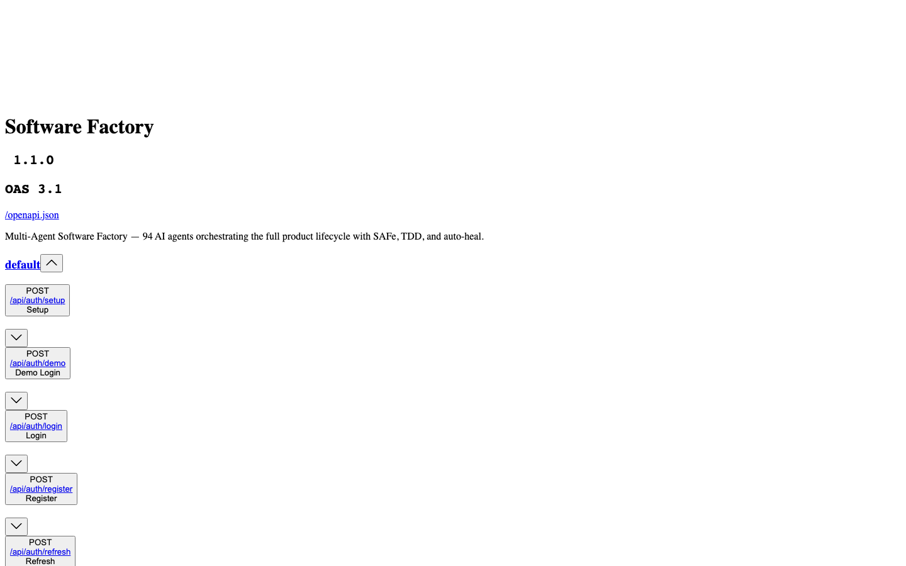

<p align="center">
  <a href="README.md">English</a> |
  <a href="README.fr.md">Français</a> |
  <a href="README.zh-CN.md">中文</a> |
  <a href="README.es.md">Español</a> |
  <a href="README.ja.md">日本語</a> |
  <a href="README.pt.md">Português</a> |
  <a href="README.de.md">Deutsch</a> |
  <a href="README.ko.md">한국어</a>
</p>

<div align="center">

# Software Factory

**Multi-Agent Software Factory — Autonomous AI agents orchestrating the full product lifecycle**

[](https://www.gnu.org/licenses/agpl-3.0)
[](https://www.python.org/downloads/)
[](https://fastapi.tiangolo.com/)

</div>

---

## Overview

Software Factory is an autonomous multi-agent platform that orchestrates the entire software development lifecycle using 145 specialized AI agents working together.

### Key Features

- **145 specialized agents** — architects, developers, testers, SRE, security analysts
- **12 orchestration patterns** — solo, parallel, hierarchical, network, adversarial-pair
- **SAFe-aligned lifecycle** — Portfolio → Epic → Feature → Story
- **Auto-heal** — autonomous incident detection and self-repair
- **DORA metrics** — deployment frequency, lead time, MTTR, change failure rate

## Screenshots

<table>
<tr>
<td width="33%"><strong>Dashboard</strong><br></td>
<td width="33%"><strong>Swagger API</strong><br></td>
<td width="33%"><strong>CLI</strong><br></td>
</tr>
</table>

## Quick Start

### 옵션 1: Docker (권장)

Docker 이미지 포함: **Node.js 20**, **Playwright + Chromium**, **bandit**, **semgrep**, **ripgrep**.

```bash
git clone https://github.com/macaron-software/software-factory.git
cd software-factory
make setup   # .env.example → .env 복사 (LLM 키 편집)
make run     # 빌드 및 시작
```

### 옵션 2: 로컬 설치

```bash
git clone https://github.com/macaron-software/software-factory.git
cd software-factory
cp .env.example .env                # 설정 파일 생성 (LLM 키 추가 — 아래 참조)
python3 -m venv .venv && source .venv/bin/activate
pip install -r platform/requirements.txt
make dev
```

http://localhost:8090 열기 — 첫 실행 시 **온보딩 마법사**가 나타납니다.
SAFe 역할을 선택하거나 **"Skip (Demo)"**를 클릭하세요.

### LLM 제공업체 설정

API 키 없이는 **데모 모드**로 작동합니다 (시뮬레이션 응답 — UI 탐색에 유용).

`.env`를 편집하고 **하나의** API 키를 추가:

```bash
# 옵션 A: MiniMax (무료 — 시작에 권장)
PLATFORM_LLM_PROVIDER=minimax
MINIMAX_API_KEY=sk-your-key-here

# 옵션 B: Azure OpenAI
PLATFORM_LLM_PROVIDER=azure-openai
AZURE_OPENAI_API_KEY=your-key
AZURE_OPENAI_ENDPOINT=https://your-resource.openai.azure.com

# 옵션 C: NVIDIA NIM (무료)
PLATFORM_LLM_PROVIDER=nvidia
NVIDIA_API_KEY=nvapi-your-key-here
```

재시작: `make run` (Docker) 또는 `make dev` (로컬)

| 제공업체 | 환경 변수 | 모델 | 무료 |
|---------|----------|------|------|
| **MiniMax** | `MINIMAX_API_KEY` | MiniMax-M2.5 | ✅ |
| **Azure OpenAI** | `AZURE_OPENAI_API_KEY` + `AZURE_OPENAI_ENDPOINT` | GPT-5-mini | ❌ |
| **Azure AI Foundry** | `AZURE_AI_API_KEY` + `AZURE_AI_ENDPOINT` | GPT-5.2 | ❌ |
| **NVIDIA NIM** | `NVIDIA_API_KEY` | Kimi K2 | ✅ |

대시보드 **Settings**(`/settings`)에서도 설정 가능.

## Features

- **161 AI agents** organized in teams
- **Built-in tools**: `code_write`, `build`, `local_ci`, `sast_scan`, `playwright_test`, `create_ticket`, `git_commit`
- **Complete CLI** — 40+ commands
- **REST API** — 94 documented endpoints
- **MCP Server** — 23 tools
- **License AGPL v3**

## 품질 메트릭 — 산업적 모니터링

결정론적 품질 스캔(LLM 불필요), 생산 라인처럼 10개 차원으로 관리:

**복잡도** · **UT 커버리지** · **E2E 커버리지** · **보안** · **접근성** · **성능** · **문서화** · **아키텍처** · **유지보수성** · **적대적 검증**

워크플로우 단계에 품질 게이트(PASS/FAIL 배지) · `/quality` 대시보드 · 미션, 프로젝트, 워크플로우에 배지 표시.

### 프로젝트당 4개의 자동 미션

| 미션 | 주기 | 설명 |
|------|------|------|
| **MCO/TMA** | 지속적 | 헬스 모니터링, 인시던트 분류(P0-P4), TDD 수정 |
| **보안** | 주간 | SAST 스캔, 의존성 감사, CVE 모니터링 |
| **기술 부채** | 월간 | 복잡도 감사, WSJF 우선순위, 리팩토링 스프린트 |
| **셀프 힐링** | 지속적 | 5xx 감지 → TMA 미션 → 에이전트 진단 → 코드 수정 → 검증 |

### 지속적 개선

3개 내장 워크플로우: **quality-improvement**(스캔 → 개선 계획), **retrospective-quality**(메트릭 포함 스프린트 레트로), **skill-evolution**(에이전트 프롬프트 최적화).


## 테스트

```bash
# 유닛 테스트
pytest tests/

# E2E 테스트 (Playwright)
cd platform/tests/e2e
npm install
npx playwright install --with-deps chromium
npm test
```
