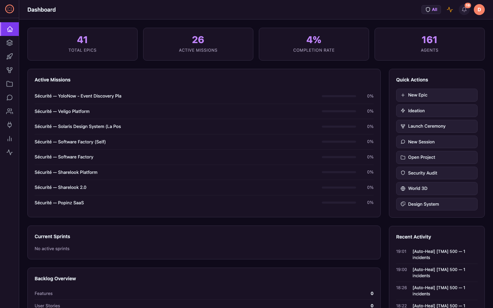

<p align="center">
  <a href="README.md">English</a> |
  <a href="README.fr.md">Français</a> |
  <a href="README.zh-CN.md">中文</a> |
  <a href="README.es.md">Español</a> |
  <a href="README.ja.md">日本語</a> |
  <a href="README.pt.md">Português</a> |
  <a href="README.de.md">Deutsch</a> |
  <a href="README.ko.md">한국어</a>
</p>

<div align="center">

# Software Factory

**Multi-Agent Software Factory — Autonomous AI agents orchestrating the full product lifecycle**

[](https://www.gnu.org/licenses/agpl-3.0)
[](https://www.python.org/downloads/)
[](https://fastapi.tiangolo.com/)

</div>

---

## Overview

Software Factory is an autonomous multi-agent platform that orchestrates the entire software development lifecycle using 161 specialized AI agents working together.

### Key Features

- **161 specialized agents** — architects, developers, testers, SRE, security analysts
- **12 orchestration patterns** — solo, parallel, hierarchical, network, adversarial-pair
- **SAFe-aligned lifecycle** — Portfolio → Epic → Feature → Story
- **Auto-heal** — autonomous incident detection and self-repair
- **LLM resilience** — multi-provider fallback, jittered retry, rate-limit aware
- **OpenTelemetry observability** — distributed tracing with Jaeger, pipeline analytics
- **Continuous watchdog** — auto-resume paused runs, stale session recovery
- **DORA metrics** — deployment frequency, lead time, MTTR, change failure rate

## Screenshots

<table>
<tr>
<td width="33%"><strong>Dashboard</strong><br></td>
<td width="33%"><strong>Swagger API</strong><br></td>
<td width="33%"><strong>CLI</strong><br></td>
</tr>
</table>

## Quick Start

### Opção 1: Docker (Recomendado)

A imagem Docker inclui: **Node.js 20**, **Playwright + Chromium**, **bandit**, **semgrep**, **ripgrep**.

```bash
git clone https://github.com/macaron-software/software-factory.git
cd software-factory
make setup   # copia .env.example → .env (edite com sua chave LLM)
make run     # constrói e inicia a plataforma
```

### Opção 2: Instalação local

```bash
git clone https://github.com/macaron-software/software-factory.git
cd software-factory
cp .env.example .env                # criar config (adicionar chave LLM — ver abaixo)
python3 -m venv .venv && source .venv/bin/activate
pip install -r platform/requirements.txt
make dev
```

Abrir http://localhost:8090 — no primeiro acesso, o **assistente de onboarding** aparece.
Escolha seu papel SAFe ou clique em **"Skip (Demo)"**.

### Configurar provedor LLM

Sem chave API, a plataforma funciona em **modo demo** (respostas simuladas — útil para explorar a interface).

Edite `.env` e adicione **uma** chave API:

```bash
# Opcao A: MiniMax (recomendado para comecar)
PLATFORM_LLM_PROVIDER=minimax
MINIMAX_API_KEY=sk-sua-chave-aqui

# Opção B: Azure OpenAI
PLATFORM_LLM_PROVIDER=azure-openai
AZURE_OPENAI_API_KEY=sua-chave
AZURE_OPENAI_ENDPOINT=https://seu-recurso.openai.azure.com

# Opcao C: NVIDIA NIM
PLATFORM_LLM_PROVIDER=nvidia
NVIDIA_API_KEY=nvapi-sua-chave-aqui
```

Reiniciar: `make run` (Docker) ou `make dev` (local)

| Provedor | Variavel de ambiente | Modelos |
|----------|---------------------|---------|
| **MiniMax** | `MINIMAX_API_KEY` | MiniMax-M2.5 |
| **Azure OpenAI** | `AZURE_OPENAI_API_KEY` + `AZURE_OPENAI_ENDPOINT` | GPT-5-mini |
| **Azure AI Foundry** | `AZURE_AI_API_KEY` + `AZURE_AI_ENDPOINT` | GPT-5.2 |
| **NVIDIA NIM** | `NVIDIA_API_KEY` | Kimi K2 |

Configuração também em **Settings** (`/settings`).

## Features

- **161 AI agents** organized in teams
- **Ferramentas integradas**: `code_write`, `build`, `local_ci`, `sast_scan`, `playwright_test`, `create_ticket`, `git_commit`
- **Complete CLI** — 40+ commands
- **REST API** — 94 documented endpoints
- **MCP Server** — 23 tools
- **License AGPL v3**

## Métricas de Qualidade — Monitoramento Industrial

Scan de qualidade determinístico (sem LLM) com 10 dimensões — como uma linha de produção:

**Complexidade** · **Cobertura UT** · **Cobertura E2E** · **Segurança** · **Acessibilidade** · **Performance** · **Documentação** · **Arquitetura** · **Manutenibilidade** · **Adversarial**

Portões de qualidade nas fases de workflow (badges PASS/FAIL) · Dashboard em `/quality` · Badges em missões, projetos e workflows.

### 4 Missões Auto-Provisionadas por Projeto

| Missão | Frequência | Descrição |
|--------|-----------|-----------|
| **MCO/TMA** | Contínua | Monitoramento de saúde, triagem de incidentes (P0-P4), correção TDD |
| **Segurança** | Semanal | Scans SAST, auditoria de dependências, monitoramento CVE |
| **Dívida Técnica** | Mensal | Auditoria de complexidade, priorização WSJF, sprints de refatoração |
| **Self-Healing** | Contínua | Detecção 5xx → missão TMA → diagnóstico agente → correção código → validação |

### Melhoria Contínua

3 workflows integrados: **quality-improvement** (scan → plano de melhoria), **retrospective-quality** (retro sprint com métricas), **skill-evolution** (otimização de prompts de agentes).


## Architecture

<p align="center">
  
</p>

<details>
<summary>Pipeline and Observability</summary>

<p align="center">
  
</p>
<p align="center">
  
</p>
<p align="center">
  
</p>
</details>

## What's New in v2.2.0 (Feb 2026)

### OpenTelemetry & Distributed Tracing
- **OTEL integration** — OpenTelemetry SDK with OTLP/HTTP exporter to Jaeger
- **Tracing dashboard** at `/analytics` — request stats, latency charts, operation table

### Pipeline Failure Analysis
- **Failure classification** — error categorization (setup_failed, llm_provider, timeout, phase_error)
- **Phase failure heatmap** — identify which phases fail most often
- **Resume All button** — one-click mass-resume of paused runs

### Continuous Watchdog
- **Auto-resume** — resume paused runs in batches (5/batch, every 5 min, max 10 concurrent)
- **Stale session recovery** — detect inactive sessions >30 min, mark for retry
- **Stall detection** — missions stuck >60 min in a phase get automatic retry

### Phase Resilience
- **Per-phase retry** — configurable retry (3x) with exponential backoff
- **skip_on_failure** — optional phases, pipeline continues on failure
- **Checkpointing** — completed phases saved, smart resume skips finished work

### Sandbox Build Validation
- **Post-code build check** — auto build/lint after code generation phases
- **Auto-detect build system** — npm, cargo, go, maven, python, docker

## Testes

```bash
# Testes unitários
pytest tests/

# Testes E2E (Playwright)
cd platform/tests/e2e
npm install
npx playwright install --with-deps chromium
npm test
```
