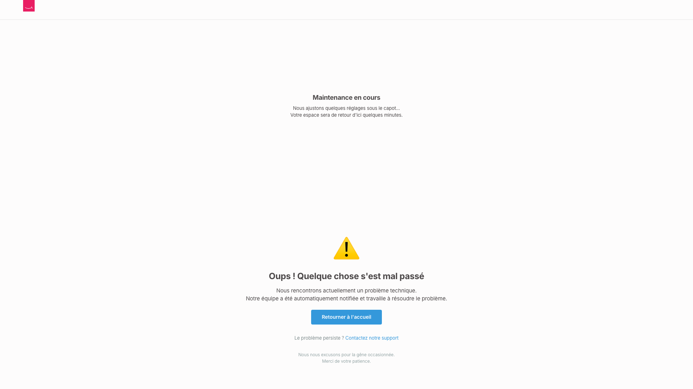
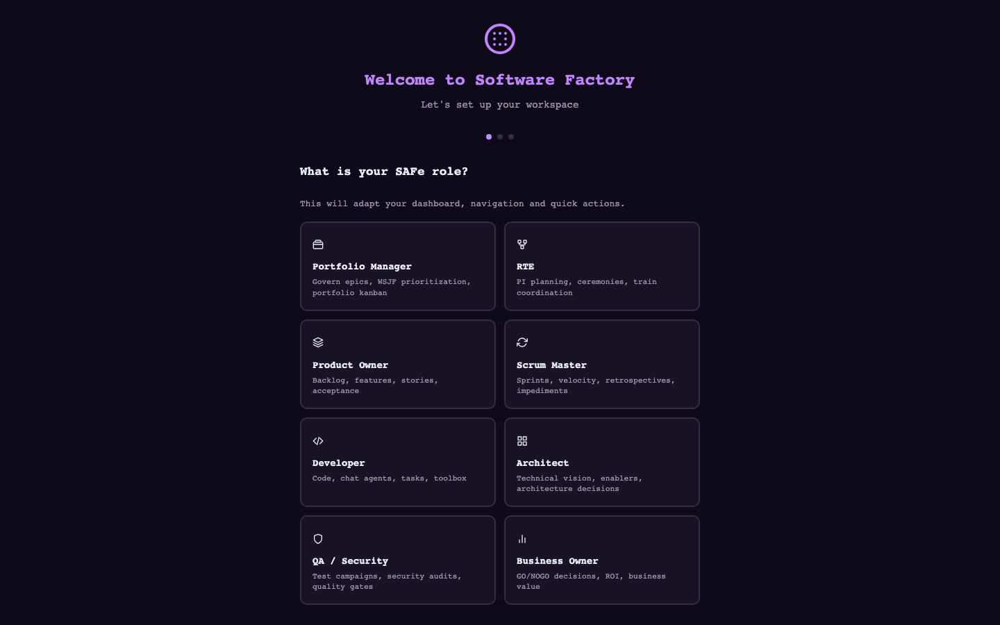
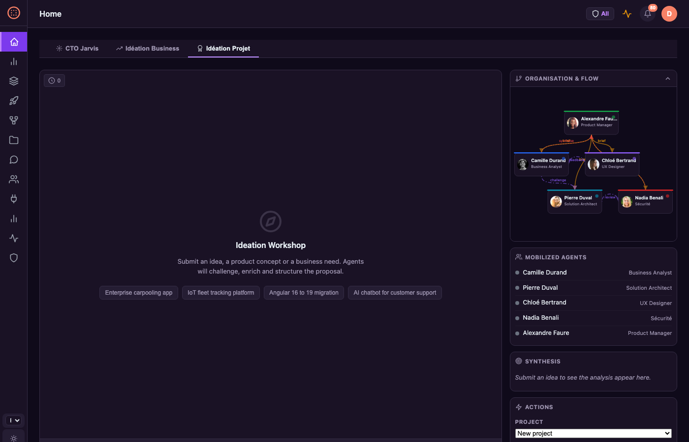

<p align="center">
  <a href="README.md">English</a> |
  <a href="README.fr.md">Français</a> |
  <a href="README.zh-CN.md">中文</a> |
  <a href="README.es.md">Español</a> |
  <a href="README.ja.md">日本語</a> |
  <a href="README.pt.md">Português</a> |
  <a href="README.de.md">Deutsch</a> |
  <a href="README.ko.md">한국어</a>
</p>

<div align="center">

# Software Factory

**Fábrica de Software Multi-Agente — Agentes de IA autônomos orquestrando todo o ciclo de vida do produto**

[](https://www.gnu.org/licenses/agpl-3.0)
[](https://www.python.org/downloads/)
[](https://fastapi.tiangolo.com/)

**[Demo ao Vivo: sf.macaron-software.com](https://sf.macaron-software.com)** — clique em "Skip (Demo)" para explorar

[Funcionalidades](#funcionalidades) · [Início Rápido](#início-rápido) · [Capturas de Tela](#capturas-de-tela) · [Arquitetura](#arquitetura) · [Contribuindo](#contribuindo)

</div>

---

## O que é isto?

Software Factory é uma **plataforma autônoma multi-agente** que orquestra todo o ciclo de vida de desenvolvimento de software — da ideação ao deploy — usando agentes de IA especializados trabalhando juntos.

Pense nela como uma **fábrica de software virtual** onde 161 agentes de IA colaboram por meio de fluxos de trabalho estruturados, seguindo a metodologia SAFe, práticas de TDD e quality gates automatizados.

### Destaques Principais

- **161 agentes especializados** — arquitetos, desenvolvedores, testadores, SREs, analistas de segurança, product owners
- **10 padrões de orquestração** — solo, sequencial, paralelo, hierárquico, rede, loop, roteador, agregador, onda, human-in-the-loop
- **Ciclo de vida alinhado ao SAFe** — Portfolio → Epic → Feature → Story com cadência de PI
- **Auto-correção** — detecção autônoma de incidentes, triagem e auto-reparo
- **Resiliência LLM** — fallback multi-provedor, retry com jitter, controle de rate-limit, configuração de modelo via variáveis de ambiente
- **Observabilidade OpenTelemetry** — rastreamento distribuído com Jaeger, dashboard de analytics do pipeline
- **Watchdog contínuo** — retomada automática de execuções pausadas, recuperação de sessões obsoletas, limpeza de falhas
- **Segurança em primeiro lugar** — proteção contra injeção de prompt, RBAC, sanitização de segredos, connection pooling
- **Métricas DORA** — frequência de deploy, lead time, MTTR, taxa de falha de mudanças

## Capturas de Tela

<table>
<tr>
<td width="50%">
<strong>Dashboard — Perspectiva SAFe Adaptativa</strong><br>

</td>
<td width="50%">
<strong>Portfolio — Backlog Estratégico & WSJF</strong><br>

</td>
</tr>
<tr>
<td width="50%">
<strong>PI Board — Planejamento de Program Increment</strong><br>

</td>
<td width="50%">
<strong>Workshop de Ideação — Brainstorming com IA</strong><br>

</td>
</tr>
<tr>
<td width="50%">
<strong>ART — Agile Release Trains & Equipes de Agentes</strong><br>

</td>
<td width="50%">
<strong>Cerimônias — Templates de Fluxo de Trabalho & Padrões</strong><br>

</td>
</tr>
<tr>
<td width="50%">
<strong>Monitoramento — Métricas DORA & Saúde do Sistema</strong><br>

</td>
<td width="50%">
<strong>Onboarding — Assistente de Seleção de Papel SAFe</strong><br>

</td>
</tr>
<tr>
<td width="50%">
<strong>Início — abas CTO Jarvis / Ideação de Negócios / Ideação de Projeto</strong><br>

</td>
<td width="50%">
<strong>CTO Jarvis — Consultor IA Estratégico</strong><br>

</td>
</tr>
<tr>
<td width="50%">
<strong>Ideação de Negócios — Equipe de Marketing 6 Agentes</strong><br>

</td>
<td width="50%">
<strong>Ideação de Projeto — Equipe Tech Multi-Agentes</strong><br>

</td>
</tr>
</table>

## Início Rápido

### Opção 1: Docker (Recomendado)

A imagem Docker inclui: **Node.js 20**, **Playwright + Chromium**, **bandit**, **semgrep**, **ripgrep**.

```bash
git clone https://github.com/macaron-software/software-factory.git
cd software-factory
make setup   # copies .env.example → .env (edit it to add your LLM API key)
make run     # builds & starts the platform
```

Abra http://localhost:8090 — clique em **"Skip (Demo)"** para explorar sem uma chave de API.

### Opção 2: Instalação Local

```bash
git clone https://github.com/macaron-software/software-factory.git
cd software-factory
cp .env.example .env                # create your config (edit to add LLM key — see Step 3)
python3 -m venv .venv && source .venv/bin/activate
pip install -r platform/requirements.txt

# Start platform
make dev
# or manually: PYTHONPATH=$(pwd) python3 -m uvicorn platform.server:app --host 0.0.0.0 --port 8090 --ws none
```

Abra http://localhost:8090 — no primeiro acesso você verá o **assistente de onboarding**.
Escolha seu papel SAFe ou clique em **"Skip (Demo)"** para explorar imediatamente.

### Etapa 3: Configurar um Provedor de LLM

Sem uma chave de API, a plataforma roda em **modo demo** — os agentes respondem com respostas simuladas.
Isso é útil para explorar a interface, mas os agentes não geram código ou análises reais.

Para habilitar agentes de IA reais, edite `.env` e adicione **uma** chave de API:

```bash
# Option A: MiniMax (recommended for getting started)
PLATFORM_LLM_PROVIDER=minimax
MINIMAX_API_KEY=sk-your-key-here

# Option B: Azure OpenAI
PLATFORM_LLM_PROVIDER=azure-openai
AZURE_OPENAI_API_KEY=your-key
AZURE_OPENAI_ENDPOINT=https://your-resource.openai.azure.com

# Option C: NVIDIA NIM
PLATFORM_LLM_PROVIDER=nvidia
NVIDIA_API_KEY=nvapi-your-key-here
```

Depois reinicie: `make run` (Docker) ou `make dev` (local)

| Provider | Env Variable | Models |
|----------|-------------|--------|
| **MiniMax** | `MINIMAX_API_KEY` | MiniMax-M2.5 |
| **Azure OpenAI** | `AZURE_OPENAI_API_KEY` + `AZURE_OPENAI_ENDPOINT` | GPT-5-mini |
| **Azure AI Foundry** | `AZURE_AI_API_KEY` + `AZURE_AI_ENDPOINT` | GPT-5.2 |
| **NVIDIA NIM** | `NVIDIA_API_KEY` | Kimi K2 |

A plataforma faz fallback automaticamente para outros provedores configurados se o principal falhar.
Você também pode configurar provedores pela página de **Configurações** no dashboard (`/settings`).

## Primeiros Passos — Seu Primeiro Projeto

Após a instalação, veja como ir de uma ideia a um projeto funcional:

### Caminho A: Começar a partir de uma Ideia (Workshop de Ideação)

1. **Abra a página de Ideação** — vá para `/ideation` (ou clique em "Ideation" na barra lateral)
2. **Descreva sua ideia** — ex: *"App de carona corporativa com matching em tempo real"*
3. **Veja os agentes discutindo** — 5 agentes especializados (Product Manager, Business Analyst, Arquiteto, UX Designer, Segurança) analisam sua ideia em tempo real via streaming SSE
4. **Crie um projeto a partir do resultado** — clique em **"Create an Epic from this idea"**. A plataforma irá:
   - Criar um novo **projeto** com `VISION.md` gerado e scaffolding de CI/CD
   - Criar um **epic** com features e user stories detalhadas pelo agente PO
   - Provisionar automaticamente missões de **TMA** (manutenção), **Segurança** e **Dívida Técnica**

Agora você tem um backlog SAFe completo pronto para execução.

### Caminho B: Criar um Projeto Manualmente

1. Vá para `/projects` e clique em **"New Project"**
2. Preencha: nome, descrição, stack tecnológica, caminho do repositório
3. A plataforma cria automaticamente:
   - Um **agente Product Manager** atribuído ao projeto
   - Uma **missão TMA** (manutenção contínua — monitora saúde, cria incidentes)
   - Uma **missão de Segurança** (auditorias semanais — SAST, verificação de dependências)
   - Uma **missão de Dívida Técnica** (redução mensal de débito — planejado)

### Depois: Criar Epics & Features

- Na página de **Portfolio** (`/portfolio`), crie epics com priorização WSJF
- A partir de um epic, adicione **features** e quebre-as em **user stories**
- Use o **PI Board** (`/pi-board`) para planejar program increments e atribuir features a sprints

### Executando Missões

- Clique em **"Start"** em qualquer missão para iniciar a execução dos agentes
- Escolha um **padrão de orquestração** (hierárquico, rede, paralelo...)
- Acompanhe os agentes trabalhando em tempo real pelo **Mission Control**
- Os agentes usam suas ferramentas (code_read, git, build, test, security scan) de forma autônoma

### TMA & Segurança — Sempre Ativos

Estes são **habilitados automaticamente** para cada projeto — nenhuma configuração necessária:

| Mission | Type | Schedule | What it does |
|---------|------|----------|-------------|
| **TMA** | Program | Continuous | Health monitoring, incident detection, auto-repair, ticket creation |
| **Security** | Review | Weekly | SAST scans (bandit/semgrep), dependency audit, secret detection |
| **Tech Debt** | Reduction | Monthly | Code quality analysis, refactoring recommendations |
| **Self-Healing** | Program | Continuous | Auto-detection of 5xx/crashes → TMA mission → agent diagnosis → code fix → validation |

Todas as quatro são criadas com o projeto. TMA, Segurança e Self-Healing começam como **ativas**, Dívida Técnica começa como **planejamento** (ative quando estiver pronto).

## Funcionalidades

### 161 Agentes de IA Especializados

Os agentes são organizados em equipes que espelham organizações de software reais:

| Team | Agents | Role |
|------|--------|------|
| **Product** | Product Manager, Business Analyst, PO | SAFe planning, WSJF prioritization |
| **Architecture** | Solution Architect, Tech Lead, System Architect | Architecture decisions, design patterns |
| **Development** | Backend/Frontend/Mobile/Data Engineers | TDD implementation per stack |
| **Quality** | QA Engineers, Security Analysts, Test Automation | Testing, security audits, penetration testing |
| **Design** | UX Designer, UI Designer | User experience, visual design |
| **DevOps** | DevOps Engineer, SRE, Platform Engineer | CI/CD, monitoring, infrastructure |
| **Management** | Scrum Master, RTE, Agile Coach | Ceremonies, facilitation, impediment removal |

### 10 Padrões de Orquestração

- **Solo** — agente único para tarefas simples
- **Sequential** — pipeline de agentes executando em ordem
- **Parallel** — múltiplos agentes trabalhando simultaneamente
- **Hierarchical** — gerente delegando para sub-agentes
- **Network** — agentes colaborando peer-to-peer
- **Loop** — agente itera até que a condição seja atendida
- **Router** — agente único roteia para especialista com base na entrada
- **Aggregator** — múltiplas entradas mescladas por um único agregador
- **Wave** — paralelo dentro de ondas, sequencial entre ondas
- **Human-in-the-loop** — agente propõe, humano valida

### Ciclo de Vida Alinhado ao SAFe

Hierarquia completa Portfolio → Epic → Feature → Story com:

- **Portfolio Estratégico** — canvas de portfolio, temas estratégicos, fluxos de valor
- **Program Increment** — planejamento de PI, objetivos, dependências
- **Team Backlog** — user stories, tarefas, critérios de aceitação
- **Execução de Sprint** — daily standups, sprint reviews, retrospectivas

### Segurança & Conformidade

- **Autenticação** — autenticação baseada em JWT com RBAC
- **Proteção contra injeção de prompt** — detecção e bloqueio de prompts maliciosos
- **Sanitização de segredos** — redação automática de dados sensíveis
- **CSP (Content Security Policy)** — headers reforçados
- **Rate limiting** — cotas de API por usuário
- **Log de auditoria** — logs abrangentes de atividade

### Métricas DORA & Monitoramento

- **Frequência de deploy** — com que frequência o código chega à produção
- **Lead time** — duração do commit ao deploy
- **MTTR** — tempo médio de recuperação de incidentes
- **Taxa de falha de mudanças** — porcentagem de deploys com falha
- **Dashboards em tempo real** — visualizações Chart.js
- **Métricas Prometheus** — endpoint /metrics

### Métricas de Qualidade — Monitoramento Industrial

Varredura de qualidade determinística (sem LLM) com 10 dimensões, como uma linha de produção:

| Dimension | Tools | What it measures |
|-----------|-------|-----------------|
| **Complexity** | radon, lizard | Cyclomatic complexity, cognitive complexity |
| **Unit Test Coverage** | coverage.py, nyc | Line/branch coverage percentage |
| **E2E Test Coverage** | Playwright | Test file count, spec coverage |
| **Security** | bandit, semgrep | SAST findings by severity (critical/high/medium/low) |
| **Accessibility** | pa11y | WCAG 2.1 AA violations |
| **Performance** | Lighthouse | Core Web Vitals scores |
| **Documentation** | interrogate | README, changelog, API docs, docstring coverage |
| **Architecture** | madge, jscpd, mypy | Circular deps, code duplication, type errors |
| **Maintainability** | custom | File size distribution, large file ratio |
| **Adversarial** | built-in | Incident rate, adversarial rejection rate |

**Quality gates nas fases do workflow** — cada fase do workflow exibe um badge de qualidade (PASS/FAIL/PENDING) baseado em limites de dimensões configurados por tipo de gate:

| Gate Type | Threshold | Used in |
|-----------|-----------|---------|
| `always` | 0% | Analysis, planning phases |
| `no_veto` | 50% | Implementation, sprint phases |
| `all_approved` | 70% | Review, release phases |
| `quality_gate` | 80% | Deploy, production phases |

**Dashboard de qualidade** em `/quality` — scorecard global, pontuações por projeto, snapshots de tendência.
Badges de qualidade visíveis no detalhe da missão, quadro de projeto, fases do workflow e no dashboard principal.

### Workflows de Melhoria Contínua

Três workflows integrados para auto-aprimoramento:

| Workflow | Purpose | Agents |
|----------|---------|--------|
| **quality-improvement** | Scan metrics → identify worst dimensions → plan & execute improvements | QA Lead, Dev, Architect |
| **retrospective-quality** | End-of-sprint retro: collect ROTI, incidents, quality data → action items | Scrum Master, QA, Dev |
| **skill-evolution** | Analyze agent performance → update system prompts → evolve skills | Brain, Lead Dev, QA |

Esses workflows criam um **ciclo de feedback**: métricas → análise → melhoria → nova varredura → acompanhar progresso.

### Ferramentas Integradas dos Agentes

A imagem Docker inclui tudo que os agentes precisam para trabalhar de forma autônoma:

| Category | Tools | Description |
|----------|-------|-------------|
| **Code** | `code_read`, `code_write`, `code_edit`, `code_search`, `list_files` | Read, write, and search project files |
| **Build** | `build`, `test`, `local_ci` | Run builds, tests, and local CI pipelines (npm/pip/cargo auto-detected) |
| **Git** | `git_commit`, `git_diff`, `git_log`, `git_status` | Version control with agent branch isolation |
| **Security** | `sast_scan`, `dependency_audit`, `secrets_scan` | SAST via bandit/semgrep, CVE audit, secret detection |
| **QA** | `playwright_test`, `browser_screenshot`, `screenshot` | Playwright E2E tests and screenshots (Chromium included) |
| **Tickets** | `create_ticket`, `jira_search`, `jira_create` | Create incidents/tickets for TMA tracking |
| **Deploy** | `docker_deploy`, `docker_status`, `github_actions` | Container deployment and CI/CD status |
| **Memory** | `memory_store`, `memory_search`, `deep_search` | Persistent project memory across sessions |

### Auto-Correção & Auto-Reparo (TMA)

Ciclo autônomo de detecção, triagem e auto-reparo de incidentes:

- **Monitoramento de heartbeat** — verificações contínuas de saúde em todas as missões e serviços em execução
- **Auto-detecção de incidentes** — HTTP 5xx, timeout, crash de agente → criação automática de incidente
- **Triagem & classificação** — severidade (P0-P3), análise de impacto, hipótese de causa raiz
- **Auto-reparo** — agentes diagnosticam e corrigem problemas de forma autônoma (patches de código, mudanças de config, reinícios)
- **Criação de tickets** — incidentes não resolvidos criam automaticamente tickets rastreados para revisão humana
- **Escalonamento** — incidentes P0/P1 disparam notificações Slack/Email para a equipe de plantão
- **Loop de retrospectiva** — aprendizados pós-incidente armazenados na memória, injetados em sprints futuros

### Perspectivas SAFe & Onboarding

Interface adaptativa baseada em papéis que espelha uma organização SAFe real:

- **9 perspectivas SAFe** — Portfolio Manager, RTE, Product Owner, Scrum Master, Desenvolvedor, Arquiteto, QA/Segurança, Business Owner, Admin
- **Dashboard adaptativo** — KPIs, ações rápidas e links da barra lateral mudam conforme o papel selecionado
- **Assistente de onboarding** — fluxo de 3 etapas para novos usuários (escolher papel → escolher projeto → começar)
- **Seletor de perspectiva** — troque de papel SAFe a qualquer momento pelo dropdown da barra superior
- **Barra lateral dinâmica** — mostra apenas a navegação relevante para a perspectiva atual

### Memória em 4 Camadas & RLM Deep Search

Conhecimento persistente entre sessões com recuperação inteligente:

- **Memória de sessão** — contexto da conversa dentro de uma única sessão
- **Memória de padrões** — aprendizados da execução de padrões de orquestração
- **Memória de projeto** — conhecimento por projeto (decisões, convenções, arquitetura)
- **Memória global** — conhecimento organizacional entre projetos (busca full-text FTS5)
- **Arquivos de projeto auto-carregados** — CLAUDE.md, SPECS.md, VISION.md, README.md injetados em cada prompt LLM (máx 8K)
- **RLM Deep Search** — Recursive Language Model (arXiv:2512.24601) — loop iterativo WRITE-EXECUTE-OBSERVE-DECIDE com até 10 iterações de exploração

### Agent Mercato (Mercado de Transferências)

Marketplace de agentes baseado em tokens para composição de equipes:

- **Listagem de agentes** — liste agentes para transferência com preço pedido
- **Pool de agentes livres** — agentes não atribuídos disponíveis para recrutamento
- **Transferências & empréstimos** — compre, venda ou empreste agentes entre projetos
- **Valoração de mercado** — valoração automática de agentes com base em habilidades, experiência e desempenho
- **Sistema de carteira** — carteiras de tokens por projeto com histórico de transações
- **Sistema de draft** — recrute agentes livres para seu projeto

### Guarda de Qualidade Adversarial

Quality gate de duas camadas que bloqueia código falso/placeholder:

- **L0 Determinístico** — detecção instantânea de slop (lorem ipsum, TBD), mocks (NotImplementedError, TODO), builds falsos, alucinações, incompatibilidades de stack
- **L1 LLM Semântico** — LLM separado revisa a qualidade da saída para padrões de execução
- **Pontuação** — score < 5 aprovado, 5-6 aprovação parcial com aviso, 7+ rejeitado
- **Rejeição forçada** — alucinação, slop, incompatibilidade de stack, builds falsos sempre rejeitados independentemente da pontuação

### Auto-Documentação & Wiki

Geração automática de documentação ao longo de todo o ciclo de vida:

- **Retrospectivas de sprint** — notas de retrospectiva geradas por LLM armazenadas no banco e na memória, injetadas nos prompts do próximo sprint (loop de aprendizado)
- **Resumos de fase** — cada fase da missão produz um resumo gerado por LLM das decisões e resultados
- **Architecture Decision Records** — padrões de arquitetura documentam automaticamente decisões de design na memória do projeto
- **Arquivos de contexto do projeto** — arquivos de instrução auto-carregados (CLAUDE.md, SPECS.md, CONVENTIONS.md) servem como documentação viva
- **Sync com Confluence** — sincronização bidirecional com páginas wiki do Confluence para documentação corporativa
- **Swagger auto-docs** — 94 endpoints REST auto-documentados em `/docs` com schema OpenAPI

## Quatro Interfaces

### 1. Dashboard Web (HTMX + SSE)

Interface principal em http://localhost:8090:

- **Conversas multi-agente em tempo real** com streaming SSE
- **PI Board** — planejamento de program increment
- **Mission Control** — monitoramento de execução
- **Gerenciamento de Agentes** — visualizar, configurar, monitorar agentes
- **Dashboard de Incidentes** — triagem de auto-correção
- **Responsivo para mobile** — funciona em tablets e celulares

### 2. CLI (`sf`)

Interface de linha de comando completa:

```bash
# Install (add to PATH)
ln -s $(pwd)/cli/sf.py ~/.local/bin/sf

# Browse
sf status                              # Platform health
sf projects list                       # All projects
sf missions list                       # Missions with WSJF scores
sf agents list                         # 145 agents
sf features list <epic_id>             # Epic features
sf stories list --feature <id>         # User stories

# Work
sf ideation "e-commerce app in React"  # Multi-agent ideation (streamed)
sf missions start <id>                 # Start mission run
sf metrics dora                        # DORA metrics

# Monitor
sf incidents list                      # Incidents
sf llm stats                           # LLM usage (tokens, cost)
sf chaos status                        # Chaos engineering
```

**22 grupos de comandos** · Modo duplo: API (servidor ao vivo) ou DB (offline) · Saída JSON (`--json`) · Animações com spinner · Renderização de tabelas Markdown

### 3. REST API + Swagger

94 endpoints de API auto-documentados em `/docs` (Swagger UI):

```bash
# Examples
curl http://localhost:8090/api/projects
curl http://localhost:8090/api/agents
curl http://localhost:8090/api/missions
curl -X POST http://localhost:8090/api/ideation \
  -H "Content-Type: application/json" \
  -d '{"prompt": "bike GPS tracker app"}'
```

Swagger UI: http://localhost:8090/docs

### 4. Servidor MCP (Model Context Protocol)

24 ferramentas MCP para integração com agentes de IA (porta 9501):

```bash
# Start MCP server
python3 -m platform.mcp_platform.server

# Tools available:
# platform_agents, platform_projects, platform_missions,
# platform_features, platform_sprints, platform_stories,
# platform_incidents, platform_llm, platform_search, ...
```

## Arquitetura

### Visão Geral da Plataforma

```
                        ┌──────────────────────┐
                        │   CLI (sf) / Web UI  │
                        │   REST API :8090     │
                        └──────────┬───────────┘
                                   │
                    ┌──────────────┴──────────────┐
                    │     FastAPI Server           │
                    │  Auth (JWT + RBAC + OAuth)   │
                    │  17 route modules            │
                    └──┬──────────┬────────────┬───┘
                       │          │            │
          ┌────────────┴┐   ┌────┴─────┐   ┌──┴───────────┐
          │ Agent Engine │   │ Workflow │   │   Mission    │
          │ 161 agents   │   │  Engine  │   │    Layer     │
          │ executor     │   │ 39 defs  │   │ SAFe cycle   │
          │ loop+retry   │   │ 10 ptrns │   │ Portfolio    │
          └──────┬───────┘   │ phases   │   │ Epic/Feature │
                 │           │ retry    │   │ Story/Sprint │
                 │           │ skip     │   └──────────────┘
                 │           │ ckpoint  │
                 │           └────┬─────┘
                 │                │
     ┌───────────┴────────────────┴───────────────┐
     │              Services                       │
     │  LLM Client (multi-provider fallback)       │
     │  Tools (code, git, deploy, memory, security)│
     │  MCP Bridge (fetch, memory, playwright)     │
     │  Quality Engine (10 dimensions)             │
     │  Notifications (Slack, Email, Webhook)      │
     └───────────────────┬─────────────────────────┘
                         │
     ┌───────────────────┴─────────────────────────┐
     │              Operations                      │
     │  Watchdog (auto-resume, stall detection)     │
     │  Auto-Heal (incident > triage > fix)         │
     │  OpenTelemetry (tracing + metrics > Jaeger)  │
     └───────────────────┬─────────────────────────┘
                         │
              ┌──────────┴──────────┐
              │   SQLite + Memory   │
              │   4-layer memory    │
              │   FTS5 search       │
              └─────────────────────┘
```

### Fluxo do Pipeline

```
Mission Created
     │
     ▼
┌─────────────┐     ┌──────────┐    ┌──────────┐    ┌──────────┐
│  Select     │────▶│sequential│    │ parallel │    │hierarchic│
│  Pattern    │────▶│          │    │          │    │          │
└─────────────┘────▶│ adversar.│    │          │    │          │
                    └────┬─────┘    └────┬─────┘    └────┬─────┘
                         └───────────────┴───────────────┘
                                         │
                    ┌────────────────────────────────────────┐
                    │         Phase Execution                 │
                    │                                        │
                    │  Agent ──▶ LLM Call ──▶ Result         │
                    │                          │             │
                    │              ┌───success──┴──failure──┐│
                    │              ▼                        ▼│
                    │         Code phase?            Retries? │
                    │           │ yes                  │ yes │
                    │           ▼                      ▼     │
                    │     Sandbox Build         Retry w/     │
                    │     Validation            backoff      │
                    │           │                      │ no  │
                    │           ▼                      ▼     │
                    │     Quality Gate          skip_on_fail?│
                    │      │        │            │yes  │no   │
                    │    pass     fail            │     │     │
                    │      │        │             │     ▼     │
                    │      ▼        ▼             │   PAUSED  │
                    │  Checkpoint  PAUSED ◀───────┘     │     │
                    └──────┬─────────────────────────────┘    │
                           │                                  │
                    More phases? ──yes──▶ next phase          │
                           │ no                               │
                           ▼                    watchdog      │
                    Mission Completed     auto-resume ◀───────┘
```

### Observabilidade

```
┌──────────────────────┐    ┌────────────────────────────────┐
│   OTEL Middleware     │    │     Continuous Watchdog         │
│   (every request)     │    │                                │
│   spans + metrics     │    │  health check    every 60s     │
│         │             │    │  stall detection  phases>60min │
│         ▼             │    │  auto-resume     5/batch 5min  │
│   OTLP/HTTP export    │    │  session recovery  >30min      │
│         │             │    │  failed cleanup   zombies      │
│         ▼             │    └────────────────────────────────┘
│   Jaeger :16686       │
└──────────────────────┘    ┌────────────────────────────────┐
                            │     Failure Analysis            │
┌──────────────────────┐    │                                │
│   Quality Engine      │    │  error classification          │
│   10 dimensions       │    │  phase heatmap                 │
│   quality gates       │    │  recommendations               │
│   radar chart         │    │  resume-all button             │
│   badge + scorecard   │    └────────────────────────────────┘
└──────────────────────┘
                            ┌────────────────────────────────┐
         All data ─────────▶│  Dashboard /analytics           │
                            │  tracing stats + latency chart  │
                            │  error doughnut + phase bars    │
                            │  quality radar + scorecard      │
                            └────────────────────────────────┘
```

### Deploy

```
                          Internet
                     ┌───────┴────────┐
                     │                │
          ┌──────────▼─────┐  ┌───────▼────────┐
          │ Azure VM (Prod)│  │ OVH VPS (Demo) │
          │ sf.macaron-software.com   │  │ demo.macaron-software.com  │
          │                │  │                │
          │ Nginx :443     │  │ Nginx :443     │
          │   │            │  │   │            │
          │   ▼            │  │   ▼            │
          │ Platform :8090 │  │ Platform :8090 │
          │ GPT-5-mini     │  │ MiniMax-M2.5   │
          │   │            │  │   │            │
          │   ▼            │  │   ▼            │
          │ Jaeger :16686  │  │ Jaeger :16686  │
          │   │            │  │   │            │
          │   ▼            │  │   ▼            │
          │ SQLite DB      │  │ SQLite DB      │
          │ /patches (ro)  │  │                │
          └────────────────┘  └────────────────┘
                     │                │
                     └───────┬────────┘
                             │
                    ┌────────▼────────┐
                    │ GitHub          │
                    │ macaron-software│
                    │ /software-factory│
                    └─────────────────┘
```

## Configuração do Projeto

Os projetos são definidos em `projects/*.yaml`:

```yaml
project:
  name: my-project
  root_path: /path/to/project
  vision_doc: CLAUDE.md

agents:
  - product_manager
  - solution_architect
  - backend_dev
  - qa_engineer

patterns:
  ideation: hierarchical
  development: parallel
  review: adversarial-pair

deployment:
  strategy: blue-green
  auto_prod: true
  health_check_url: /health

monitoring:
  prometheus: true
  grafana_dashboard: project-metrics
```

## Estrutura de Diretórios

```
├── platform/                # Agent Platform (152 Python files)
│   ├── server.py            # FastAPI app, port 8090
│   ├── agents/              # Agent loop, executor, store
│   ├── a2a/                 # Agent-to-agent messaging bus
│   ├── patterns/            # 10 orchestration patterns
│   ├── missions/            # SAFe mission lifecycle
│   ├── sessions/            # Conversation runner + SSE
│   ├── web/                 # Routes + Jinja2 templates
│   ├── mcp_platform/        # MCP server (23 tools)
│   └── tools/               # Agent tools (code, git, deploy)
│
├── cli/                     # CLI 'sf' (6 files, 2100+ LOC)
│   ├── sf.py                # 22 command groups, 40+ subcommands
│   ├── _api.py              # httpx REST client
│   ├── _db.py               # sqlite3 offline backend
│   ├── _output.py           # ANSI tables, markdown rendering
│   └── _stream.py           # SSE streaming with spinner
│
├── dashboard/               # Frontend HTMX
├── deploy/                  # Helm charts, Docker, K8s
├── tests/                   # E2E Playwright tests
├── skills/                  # Agent skills library
├── projects/                # Project YAML configurations
└── data/                    # SQLite database
```

## Testes

```bash
# Run all tests
make test

# E2E tests (Playwright — requires install first)
cd platform/tests/e2e
npm install
npx playwright install --with-deps chromium
npm test

# Unit tests
pytest tests/

# Chaos engineering
python3 tests/test_chaos.py

# Endurance tests
python3 tests/test_endurance.py
```

## Deploy

### Docker

A imagem Docker inclui: **Node.js 20**, **Playwright + Chromium**, **bandit**, **semgrep**, **ripgrep**.
Os agentes podem compilar projetos, executar testes E2E com capturas de tela e realizar varreduras de segurança SAST prontos para uso.

```bash
docker-compose up -d
```

### Kubernetes (Helm)

```bash
helm install software-factory ./deploy/helm/
```

### Variáveis de Ambiente

Veja [`.env.example`](.env.example) para a lista completa. Variáveis principais:

```bash
# LLM Provider (required for real agents)
PLATFORM_LLM_PROVIDER=minimax        # minimax | azure-openai | azure-ai | nvidia | demo
MINIMAX_API_KEY=sk-...               # MiniMax API key

# Authentication (optional)
GITHUB_CLIENT_ID=...                 # GitHub OAuth
GITHUB_CLIENT_SECRET=...
AZURE_AD_CLIENT_ID=...               # Azure AD OAuth
AZURE_AD_CLIENT_SECRET=...
AZURE_AD_TENANT_ID=...

# Integrations (optional)
JIRA_URL=https://your-jira.atlassian.net
ATLASSIAN_TOKEN=your-token
SLACK_WEBHOOK_URL=https://hooks.slack.com/services/...
```

## Inteligência Adaptativa — AG · AR · Thompson Sampling · OKR

A plataforma se auto-otimiza por meio de três motores de IA complementares.

### Thompson Sampling — Seleção Probabilística de Equipes
- `Beta(wins+1, losses+1)` por contexto `(agent_id, pattern_id, technology, phase_type)`
- Pontuação de aptidão granular — score separado por contexto, sem contaminação entre contextos
- Fallback de arranque a frio via cadeia de prefixos tech (`angular_19` → `angular_*` → `generic`)
- Aposentadoria suave: `weight_multiplier=0.1` para equipes fracas, recuperável
- Execuções A/B shadow automáticas; avaliador neutro escolhe o vencedor
- **Darwin LLM**: estende Thompson Sampling à seleção de modelo LLM por contexto

### Algoritmo Genético — Evolução de Fluxos de Trabalho
- Genoma = lista ordenada de PhaseSpec (pattern, agents, gate)
- População: 40 genomas, máx. 30 gerações, elitismo=2, taxa de mutação=15%, torneio k=3
- Aptidão: taxa de sucesso de fase × aptidão do agente × (1 − taxa de veto) × bônus de lead time
- As 3 melhores propostas são salvas em `evolution_proposals` para revisão humana antes de aplicar
- Gatilho manual: `POST /api/evolution/run/{wf_id}` — ver em Workflows → aba Evolution
- Agendador noturno; ignorado se < 5 missões

### Aprendizado por Reforço — Adaptação de Padrões mid-Missão
- Política Q-learning (`platform/agents/rl_policy.py`)
- Ações: keep, switch_parallel, switch_sequential, switch_hierarchical, switch_debate, add_agent, remove_agent
- Estado: `(wf_id, phase_position, rejection_pct, quality_score)` em buckets
- Atualização Q: α=0.1, γ=0.9, ε=0.1 — batch offline na tabela `rl_experience`
- Ativado apenas com confiança ≥ 70% e ≥ 3 visitas ao estado; degradação graciosa

### Sistema OKR / KPI
- 8 sementes padrão: code/migration, security/audit, architecture/design, testing, docs
- O cumprimento de OKR alimenta diretamente a aptidão do AG e o sinal de recompensa do AR
- Edição inline em `/teams` com status verde/âmbar/vermelho
- Substituições de OKR por projeto via Configurações

---

## Novidades na v2.1.0 (Fev 2026)

### Métricas de Qualidade — Monitoramento Industrial
- **10 dimensões determinísticas** — complexidade, cobertura (UT/E2E), segurança, acessibilidade, performance, documentação, arquitetura, manutenibilidade, adversarial
- **Quality gates nas fases do workflow** — badges PASS/FAIL por fase com limites configuráveis (always/no_veto/all_approved/quality_gate)
- **Dashboard de qualidade** em `/quality` — scorecard global, pontuações por projeto, snapshots de tendência
- **Badges de qualidade em toda parte** — detalhe de missão, quadro de projeto, fases do workflow, dashboard principal
- **Sem LLM necessário** — todas as métricas computadas deterministicamente usando ferramentas open-source (radon, bandit, semgrep, coverage.py, pa11y, madge)

### 4 Missões Auto-Provisionadas por Projeto
Cada projeto recebe automaticamente 4 missões operacionais:
- **MCO/TMA** — manutenção contínua: monitoramento de saúde, triagem de incidentes (P0-P4), correção TDD, validação de não-regressão
- **Segurança** — varreduras SAST semanais, auditoria de dependências, monitoramento de CVEs, code review
- **Dívida Técnica** — redução mensal de débito: auditoria de complexidade, priorização WSJF, sprints de refatoração
- **Self-Healing** — pipeline autônomo de incidentes: detecção de 5xx → criação de missão TMA → diagnóstico por agente → correção de código → validação

### Melhoria Contínua
- **Workflow quality-improvement** — varredura → identificar piores dimensões → planejar e executar melhorias
- **Workflow retrospective-quality** — retro de sprint com ROTI, incidentes, métricas de qualidade → itens de ação
- **Workflow skill-evolution** — analisar desempenho dos agentes → atualizar prompts → evoluir habilidades
- **Loop de feedback** — métricas → análise → melhoria → nova varredura → acompanhar progresso

### Perspectivas SAFe & Onboarding
- **9 perspectivas de papel SAFe** — dashboard adaptativo, barra lateral e KPIs por papel
- **Assistente de onboarding** — fluxo de 3 etapas para novos usuários com seleção de papel e projeto
- **Seletor de perspectiva** — troque de papel SAFe pela barra superior a qualquer momento

### Auto-Correção & Auto-Reparo
- **Heartbeat TMA** — monitoramento contínuo de saúde com criação automática de incidentes
- **Agentes de auto-reparo** — diagnóstico e correção autônomos para falhas comuns
- **Escalonamento de tickets** — incidentes não resolvidos criam tickets rastreados com notificações

### Memória em 4 Camadas & RLM
- **Conhecimento persistente** — camadas de memória de sessão, padrão, projeto e global com FTS5
- **RLM deep search** — loop de exploração recursivo (até 10 iterações) para análise complexa de codebase
- **Contexto de projeto auto-carregado** — CLAUDE.md, SPECS.md, VISION.md injetados em cada prompt de agente

### Guarda de Qualidade Adversarial
- **L0 determinístico** — detecção instantânea de slop, mocks, builds falsos, alucinações
- **L1 semântico** — revisão de qualidade baseada em LLM para saídas de execução
- **Rejeição forçada** — alucinação e incompatibilidade de stack sempre bloqueados

### Agent Mercato
- **Marketplace baseado em tokens** com listagens de agentes, transferências, empréstimos e draft de agentes livres
- **Valoração de mercado** — precificação automática de agentes com base em habilidades e desempenho
- **Sistema de carteira** — economia de tokens por projeto com histórico de transações

### Autenticação & Segurança
- **Autenticação baseada em JWT** com login/registro/refresh/logout
- **RBAC** — papéis admin, project_manager, developer, viewer
- **OAuth** — login SSO via GitHub e Azure AD
- **Painel administrativo** — interface de gerenciamento de usuários (`/admin/users`)
- **Modo demo** — botão "Skip" com um clique para acesso instantâneo

### Auto-Documentação
- **Retrospectivas de sprint** — notas de retro geradas por LLM com loop de aprendizado
- **Resumos de fase** — documentação automática dos resultados de cada fase da missão
- **Sync com Confluence** — integração bidirecional com wiki

### Provedores de LLM
- **Multi-provedor** com cadeia de fallback automática
- MiniMax M2.5, Azure OpenAI GPT-5-mini, Azure AI Foundry, NVIDIA NIM
- **Modo demo** para exploração da interface sem chaves de API

### Melhorias da Plataforma
- Dashboard de métricas DORA com rastreamento de custo de LLM
- Sincronização bidirecional com Jira
- Suíte de testes E2E Playwright (11 arquivos de spec)
- Internacionalização (EN/FR)
- Notificações em tempo real (Slack, Email, Webhook)
- Pipeline de Design System em workflows (UX → dev → review)
- Visualização 3D Agent World

### Darwin — Selecao Evolutiva de Equipas
- **Selecao Thompson Sampling** — selecao probabilistica equipa agente+padrao via `Beta(wins+1, losses+1)` por `(agent_id, pattern_id, tecnologia, tipo_fase)`
- **Fitness granular** — pontuacao separada por contexto: uma equipa especializada em migracao Angular pode ser fraca em novas funcionalidades Angular
- **Fallback similaridade** — arranque a frio gerido por prefixo tech (`angular_19` → `angular_*` → `generic`)
- **Reforma suave** — equipas fracas recebem `weight_multiplier=0.1`, despriorizadas mas recuperaveis
- **Sistema OKR / KPI** — objetivos e indicadores por dominio e tipo de fase; 8 seeds por defeito
- **Testes A/B em shadow** — execucoes paralelas automaticas quando dois equipas tem pontuacoes proximas (delta < 10) ou a 10% de probabilidade
- **Dashboard Teams** em `/teams` — classificacao com badges, edicao OKR inline, graficos de evolucao, historico selecoes, resultados A/B
- **Non-breaking opt-in** — `agent_id: "skill:developer"` ativa Darwin; IDs explicitos sem alteracao

## Novidades na v2.2.0 (Fev 2026)

### OpenTelemetry & Rastreamento Distribuído
- **Integração OTEL** — SDK OpenTelemetry com exportador OTLP/HTTP para Jaeger
- **Middleware de tracing ASGI** — cada requisição HTTP rastreada com spans, latência, status
- **Dashboard de tracing** em `/analytics` — estatísticas de requisições, gráficos de latência, tabela de operações
- **Jaeger UI** — exploração completa de traces distribuídos na porta 16686

### Análise de Falhas do Pipeline
- **Classificação de falhas** — categorização de erros baseada em Python (setup_failed, llm_provider, timeout, phase_error, etc.)
- **Heatmap de falhas por fase** — identifique quais fases do pipeline falham com mais frequência
- **Motor de recomendações** — sugestões acionáveis baseadas em padrões de falha
- **Botão Resume All** — retomada em massa de execuções pausadas com um clique no dashboard

### Watchdog Contínuo
- **Auto-resume** — retomada automática de execuções pausadas em lotes (5/lote, a cada 5 min, máx 10 concorrentes)
- **Recuperação de sessões obsoletas** — detecta sessões inativas >30 min, marca como interrompidas para retry
- **Limpeza de sessões com falha** — limpa sessões zumbi bloqueando progresso do pipeline
- **Detecção de travamento** — missões presas em uma fase >60 min recebem retry automático

### Resiliência de Fase
- **Retry por fase** — contagem de retry configurável (padrão 3x) com backoff exponencial por fase
- **skip_on_failure** — fases podem ser marcadas como opcionais, permitindo que o pipeline continue
- **Checkpointing** — fases concluídas são salvas, retomada inteligente pula trabalho já finalizado
- **Timeout de fase** — limite de 10 minutos previne travamentos infinitos

### Validação de Build em Sandbox
- **Verificação de build pós-código** — após fases de geração de código, executa automaticamente build/lint
- **Auto-detecção do sistema de build** — npm, cargo, go, maven, python, docker
- **Injeção de erros** — falhas de build injetadas no contexto do agente para auto-correção

### Melhorias na Interface de Qualidade
- **Gráfico radar** — visualização Chart.js radar das dimensões de qualidade em `/quality`
- **Badge de qualidade** — círculo colorido de pontuação para headers de projeto (`/api/dashboard/quality-badge`)
- **Scorecard de missão** — métricas de qualidade na barra lateral do detalhe da missão (`/api/dashboard/quality-mission`)

### Roteamento LLM Multi-Modelo
- **3 modelos especializados** — `gpt-5.2` para raciocínio pesado, `gpt-5.1-codex` para código/testes, `gpt-5-mini` para tarefas leves
- **Roteamento por função** — os agentes recebem automaticamente o modelo correto com base em suas tags (`reasoner`, `architect`, `developer`, `tester`, `doc_writer`…)
- **Configurável em tempo real** — matriz de roteamento editável em Configurações → LLM sem reinicialização

### Darwin LLM — Thompson Sampling em Modelos
- **Testes A/B de modelos** — o mesmo time (agente + padrão) compete com diferentes LLMs; o melhor modelo vence automaticamente por contexto
- **Distribuição Beta** — `Beta(wins+1, losses+1)` por `(agent_id, pattern_id, technology, phase_type, llm_model)`
- **Aba LLM A/B** em `/teams` — ranking de fitness por modelo e histórico de testes
- **Cadeia de prioridade** — Darwin LLM → configuração BD → padrões (degradação graciosa)

### Configurações — Aba LLM
- **Grade de provedores** — status ativo/inativo com dicas sobre chaves API ausentes
- **Matriz de roteamento** — pesado/leve por categoria (Raciocínio, Produção/Código, Tarefas, Redação)
- **Seção Darwin LLM A/B** — visualização em tempo real de experimentos de modelos em andamento

## Novidades na v2.3.0 (Fev 2026)

### Navegação Reestruturada — Home + Dashboard
- **Página inicial** (`/`) — três abas: CTO Jarvis · Ideação de Negócios · Ideação de Projeto
- **Dashboard** (`/portfolio`) — três abas: Visão geral · CTO · Business
- **Sidebar simplificada** — apenas duas entradas: Home e Dashboard
- **Ícones SVG Feather** — emojis substituídos por ícones vetoriais consistentes

### CTO Jarvis — Consultor IA Estratégico


- **Painel de chat persistente** — aba dedicada na página inicial
- **Memória persistente** — decisões técnicas e contexto de sessão preservados entre conversas
- **Consultor de nível CTO** — auxílio em decisões de arquitetura, escolha de tecnologia
- **Consciência da plataforma** — conhece o estado atual do portfólio, projetos e equipes de agentes

**Ferramentas**: Código (ler/buscar/editar/escrever/listar) · Git (commit, diff, log, status, issues/PRs/search) · Build/Deploy (build, lint, test, deploy, Docker, run_command, infra) · Segurança (SAST, scan de segredos, dependências) · MCPs (Web fetch, Knowledge graph, Playwright, GitHub) · Projeto (Jira, Confluence, fases SAFe, contexto LRM) · Memória (leitura + escrita Knowledge graph)

**Chips de acesso rápido**: `Stats do portfolio` · `Missões em andamento` · `Montar equipe` · `GitHub` · `AO Veligo` · `Migração Angular 16→17` · `Dívida técnica · segurança · a11y · LGPD` · `Git commit & PR` · `E2E + Screenshots` · `Sync Jira` · `Atualizar Wiki`

**Exemplos de perguntas**

> *«Qual é o estado geral do portfólio? Quais projetos estão atrasados?»*

> *«Execute uma auditoria SAST no projeto Veligo e diga-me os 3 CVEs críticos a tratar primeiro.»*

> *«Precisamos migrar a API de REST para GraphQL — qual equipe de agentes você recomenda?»*

> *«Mostre-me o diff dos últimos 5 commits na branch feature/auth e resuma as mudanças.»*

> *«Crie uma missão de refactoring para reduzir a complexidade ciclomática em arquivos acima de 15.»*

> *«Qual é a nossa dívida técnica atual? Priorize os itens por impacto/esforço.»*

> *«Escreva user stories para a funcionalidade de login SSO Azure AD e abra os tickets no Jira.»*

> *«Execute os testes E2E do Playwright e capture screenshots das páginas críticas.»*

> *«Compare nossas métricas DORA deste mês com o mês anterior — onde estamos regredindo?»*

> *«Atualize o wiki de arquitetura com as últimas decisões sobre a migração para PostgreSQL.»*


### Ideação de Negócios — Equipe de Marketing 6 Agentes


- **Rota** `/mkt-ideation` — acessível pela aba Ideação de Negócios na página inicial
- **CMO Sophie Laurent** — líder de equipe com 5 especialistas de marketing
- **Plano de marketing JSON completo** — SWOT, TAM/SAM/SOM, estratégia de marca, go-to-market, KPIs, orçamento
- **Grafo de agentes** — visualização ig-node com fotos de avatar, arestas de colaboração, popovers de detalhe

### Migração PostgreSQL + 40 Índices
- **Migração SQLite → PostgreSQL** — scripts completos de migração de esquema e dados
- **FTS nativo PostgreSQL** — `tsvector/tsquery` substitui FTS5, mais eficiente e escalável
- **40+ índices PG** — cobertura abrangente de todos os caminhos de consulta frequentes
- **Darwin Teams** — Thompson Sampling para seleção de equipes de agentes por contexto (tecnologia + fase)

## Contribuindo

Contribuições são bem-vindas! Por favor, leia [CONTRIBUTING.md](CONTRIBUTING.md) para as diretrizes.

## Licença

Este projeto é licenciado sob a Licença AGPL v3 - veja o arquivo [LICENSE](LICENSE) para detalhes.

## Suporte

- Demo ao Vivo: https://sf.macaron-software.com
- Issues: https://github.com/macaron-software/software-factory/issues
- Discussões: https://github.com/macaron-software/software-factory/discussions
