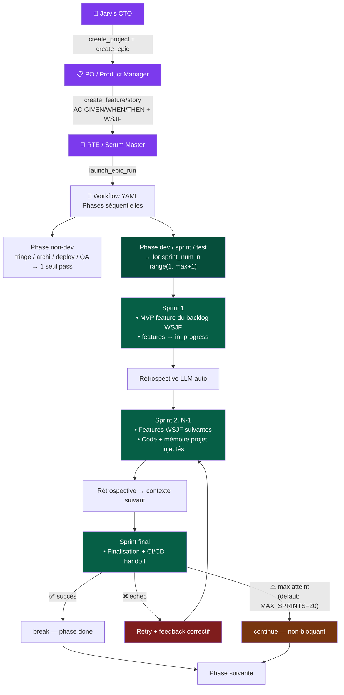

# MACARON AGENT PLATFORM

## WHAT
Web multi-agent platform SAFe-aligned. Agents collaborate (debate/veto/delegate) autonomously.
FastAPI + HTMX + SSE. PostgreSQL (primary) / SQLite (fallback). Dark purple. Port 8099/8090.

## RUN (local dev — SQLite)
```bash
cd _SOFTWARE_FACTORY
python3 -m uvicorn platform.server:app --host 0.0.0.0 --port 8099 --ws none --log-level warning
# NO --reload | --ws none mandatory | DB: data/platform.db (parent dir)
```

## ⚠️ CRITICAL RULES
- **NEVER delete data/platform.db** — init_db() idempotent migrations
- **NEVER set \*\_API_KEY=dummy** — keys from ~/.config/factory/*.key or Infisical
- **NEVER `import platform`** top-level (shadows stdlib)
- **NEVER `--reload`** (same reason)
- **NEVER kill -9 all python3** — kills platform too

## COPILOT CLI — SERVER LAUNCH
```
ALWAYS: nohup + & (detached)
  nohup python3 -m uvicorn platform.server:app --host 0.0.0.0 --port 8099 --ws none > /tmp/macaron-platform.log 2>&1 &
VERIFY: curl -s -o /dev/null -w "%{http_code}" http://localhost:8099/
KILL:   lsof -ti:8099 | xargs kill -9
```

## SF INNOVATION CLUSTER (prod — Azure RG-SOFTWARE-FACTORY)
```
Public IP: 52.143.158.19  → Azure LB (sf-lb, loadDistribution=SourceIP)
node-1 (10.0.1.4): sfadmin@... SSH_KEY=~/.ssh/sf_azure_deploy_ed25519   ⚠️ restarts fréquents (AC deploy)
node-2 (10.0.1.5): sfadmin@40.89.174.75  → stable, cible de déploiement privilégiée
Platform path:  /home/sfadmin/slots/blue/     (IS the platform dir — pas de subdir platform/)
Tools path:     /home/sfadmin/slots/blue/tools/
Bench YAMLs:    /home/sfadmin/slots/blue/agents/benchmarks/
CLI:            /home/sfadmin/slots/blue/cli/

Deploy (SCP):
  scp -i ~/.ssh/sf_azure_deploy_ed25519 files sfadmin@40.89.174.75:/home/sfadmin/slots/blue/<subdir>/
Restart: sudo systemctl restart sf-platform   (sf-platform-green si blue indisponible)
Verify:  curl http://localhost:8090/api/health
LB rule: az network lb rule update -g RG-SOFTWARE-FACTORY --lb-name sf-lb --name sf-lb-rule-http
         --load-distribution SourceIP  (session affinity — empêche poll job sur mauvais node)
LLM prod: minimax MiniMax-M2.5 (clé dans ~/.config/factory/*.key)
```

## DISTRIBUTED PATTERNS (LIVE)
```
PG advisory lock   auto_resume.py   pg_run_lock() → pg_try_advisory_lock(int64)
                   prevents double-execution across nodes (connection-scoped, non-blocking)
                   falls back to no-op if not postgresql

Redis rate limiter rate_limit.py    slowapi storage_uri=REDIS_URL → shared limits multi-node
                   fallback: in-memory if REDIS_URL not set or Redis down

Leader election    evolution_scheduler.py  Redis SET NX EX ttl → first node wins
                   key=leader:{task_name} val=SF_NODE_ID ttl=3600s (evolution), 300s (simulator)
                   server.py: leader election for simulator seed
                   fallback: returns True if Redis unavailable

Graceful drain     server.py        _drain_flag + asyncio.wait(tasks, timeout=SF_DRAIN_TIMEOUT_S)
                   /api/ready returns 503 while draining → nginx proxy_next_upstream removes node

Health probes      /api/health      DB+Redis checks, returns checks:{db, redis}
                   /api/ready       503 on drain or DB fail — public (auth bypass)
                   nginx: max_fails=2 fail_timeout=10s + proxy_next_upstream http_503
```

## DOCKER BUBBLE (platform/projects/container.py · sandbox.py · docker-compose.dev.yml)
```
Pattern: platform bubble (Debian 13) → docker.sock (via proxy) → docker exec sf-{id} cmd
NO DinD. Platform parle au daemon HOST. Agents exec dans le container PROJET persistant.

Container projet:  sf-{project_id}          (long-running, sleep infinity)
Volume projet:     sf-workspace-{project_id} (persiste entre appels — node_modules, venv, cargo)
Image:             sf-{id}:latest si Dockerfile, sinon auto-detect (node/python/rust/go/java)
Landlock:          dans le container projet (Debian bookworm/trixie) — double isolation

Flux agent:
  ensure_running() → docker exec sf-{id} sh -c cmd → ContainerResult(stdout/stderr/exit_code)
  Fallback: direct subprocess si docker exec échoue

Cycle de vie complet (ProjectContainer):
  DEV:    pc.ensure_running() + pc.exec("pytest tests/")
  BUILD:  pc.build() → image sf-{id}:latest
  PUSH:   pc.push(registry="registry.example.com")
  DEPLOY: image → docker run VPS / kubectl

run_in_project_docker() dans sandbox.py utilise ProjectContainer.exec() (était docker run --rm)

Socket proxy (docker-compose.dev.yml):
  tecnativa/docker-socket-proxy → whitelist: CONTAINERS+EXEC+IMAGES+BUILD+POST
  Interdit: DELETE·VOLUMES·NETWORKS·SWARM·SECRETS
  Réseau sf-internal (platform+DB) / sf-projects (platform+containers projet)

Dockerfiles:
  Dockerfile.platform      → python:3.13-slim, docker-cli only, rtk, Node 22
  Dockerfile.project.node  → node:lts-bookworm-slim, user agent, sleep infinity
  Dockerfile.project.python → python:3.12-slim-bookworm, idem
  Dockerfile.project.rust  → rust:1-slim-bookworm, idem

Commit: 4bed041c3 (feat(bubble))
```

## AC HIERARCHY — 8 layers × (infra + exhaustive)

```
SURFACE BENCH (prompt→check 60% + LLM judge 40%):
  AC Agents    201/203 surface (avg .94)    agent_bench_tools.py + 207 YAML
  AC Teams     42/42 surface (avg .94)      team_bench_tools.py + 42 YAML
  AC Skills    99/100 sampled (1082 total)   agent_bench_tools.py
  AC LLM       4 models × 8 = 32/32        llm_bench_tools.py
  AC Memory    7/7 deterministic            memory_bench_tools.py
  AC Workflows 83/83 (50wf+27pat+6struct)   workflow_bench_tools.py
  AC SF        8/8 E2E                      sf_bench_tools.py

DEEP BENCH INFRA (infrastructure validation — det tools + LLM judge):
  53 cases across 8 layers                  deep_bench_tools.py
  45 deterministic + 8 LLM judge
  run_deep_bench(layer?) → DeepBenchResult

DEEP BENCH EXHAUSTIVE (every entity × det + LLM judge):
  agents-exhaustive     207 agents × (5 det + 3 judge criteria)
  teams-exhaustive       33 teams × (4 det + 3 judge criteria)
  skills-exhaustive    1082 skills × (3 det + 2 judge criteria)
  workflows-exhaustive   51 workflows × (3 det + 3 judge criteria)
  patterns-exhaustive    24 patterns × (4 det + 2 judge criteria)
  TOTAL:              1397 per-entity cases — det + raw httpx LLM judge (no PG)
  _batch_judge() uses raw httpx → MINIMAX_API_KEY (bypasses LLMClient/PG pool)
  run_deep_bench(layer?, exhaustive=True) → DeepBenchResult
```

### DEEP AC — Layer by Layer

#### L1 LLM Deep — 7 cases (6 det + 1 judge)
```
DET  llm-streaming           stream() returns chunks, content non-empty
DET  llm-tool-calls-format   tool_calls have id+name+arguments, JSON parseable
DET  llm-json-output         response_format json_object → valid JSON
DET  llm-no-think-leak       no <think></think> tags in output
DET  llm-circuit-breaker     CB state machine: CB_OPEN_DURATION, _record_failure,
                              _is_circuit_open exist, CB closed for active provider
DET  llm-model-routing       MODEL_PROFILES dict loaded, each profile has model key
JDG  llm-judge-instruction   Send "list 3 French cities numbered" → judge format adherence

Tools: LLMClient.chat(), circuit breaker attrs, MODEL_PROFILES import
Judge: _llm_judge() with 3 criteria (count, format, per-line)
```

#### L2 Skills Deep — 7 cases (6 det + 1 judge)
```
DET  skills-files-exist       agent.skills[] refs → .md files exist (147 unique skills)
DET  skills-prompt-injection  _build_system_prompt injects skill content into prompt
DET  skills-tag-coverage      major tags (product,qa,security...) have skilled agents
DET  skills-tdd-behavior      TDD skill changes agent output (adds test functions)
DET  skills-agent-mapping     cross-ref agents.skills[] ↔ .md files, ≤5% missing
DET  skills-template-clean    no unresolved {{VARIABLE}} in .md files
JDG  skills-judge-clarity     5 sampled skills → judge clear/specific/imperative

Tools: AgentStore, skills dir rglob, _build_system_prompt, regex scan
Judge: _llm_judge() — "clear instructions", "specific guidance", "imperative language"
```

#### L3 Agents Deep — 8 cases (7 det + 1 judge)
```
DET  agents-tools-registered   every agent.tools[] exists in tool registry
DET  agents-tool-code-write    code_write tool executes (creates file in sandbox)
DET  agents-tool-code-read     code_read tool executes (reads file from sandbox)
DET  agents-full-turn-with-tools  full AgentExecutor turn with real tool calls
DET  agents-bench-coverage     all store agents have bench YAML (≥200)
DET  agents-prompt-builder     _build_system_prompt succeeds for 20 sampled agents
DET  agents-hierarchy-ranks    rank distribution valid (0=CEO rare, 30+=junior exists)
JDG  agents-judge-persona      3 agents (security/architect/qa) introduce themselves
                               → judge persona consistency & distinct voices

Tools: AgentStore, ToolRegistry, AgentExecutor, _build_system_prompt, bench dir
Judge: _llm_judge() — "role consistency", "security mentions vulns", "distinct voices"
```

#### L4 Teams Deep — 7 cases (6 det + 1 judge)
```
DET  teams-a2a-bus             A2A publish() + get_session_messages() roundtrip
DET  teams-veto-system         submit_veto() → has_blocking_veto() → get_active_vetoes()
DET  teams-bench-coverage      all 33 org teams have bench YAML
DET  teams-pattern-coverage    all workflow pattern_ids exist in pattern store
DET  teams-darwin-fitness      team_fitness PG table has entries, ≥5 distinct agents
DET  teams-org-members         every org team has ≥2 member agents
JDG  teams-judge-veto          3 security veto reasons → judge technical validity,
                               actionability, severity appropriateness

Tools: A2A bus, VetoManager, OrgStore, PG team_fitness, bench dir
Judge: _llm_judge() — "specific vulnerability", "actionable", "appropriate severity"
```

#### L5 Memory Deep — 8 cases (7 det + 1 judge)
```
DET  memory-cross-layer        project_store → project_search roundtrip
DET  memory-role-isolation     agent-a data invisible to agent-b (same project)
DET  memory-compaction          10 entries stored → prune executes
DET  memory-pattern-store       pattern_store/pattern_search roundtrip
DET  memory-stats               stats() returns dict with expected keys
DET  memory-confidence-ranking  store at 0.2 vs 0.95 → project_retrieve preserves values
DET  memory-project-scoping     project A data invisible in project B search
JDG  memory-judge-retrieval     store 3 items (db/frontend/deploy) → search "PostgreSQL"
                                → judge top result relevance

Tools: MemoryManager (project_store, project_retrieve, project_search, stats, prune)
Judge: _llm_judge() — "result about database", "relevant to query"
```

#### L6 Workflows Deep — 6 cases (5 det + 1 judge)
```
DET  workflows-phase-transitions  feature-sprint has ≥3 phases, all have id+gate+pattern
DET  workflows-all-parseable      51 workflows load, all have phases
DET  workflows-agent-mapping      phase config agent refs exist in store (10 wf sampled)
DET  workflows-gate-types         262 gates: standard (always/no_veto/...) + custom AC
DET  workflows-complexity-levels  min_complexity filtering attribute checked
JDG  workflows-judge-coherence    feature-sprint phases → judge logical dev sequence,
                                  gate-phase alignment

Tools: WorkflowStore (get, list_all), phase iteration, gate parsing
Judge: _llm_judge() — "logical sequence", "planning→deploy order", "gate matches purpose"
```

#### L7 Patterns Deep — 5 cases (4 det + 1 judge)
```
DET  patterns-engine-dispatch   24 patterns, 17 types, all dispatch to engine handler
DET  patterns-impl-files        18 impl files, required types (seq/par/hier/wave/...) present
DET  patterns-node-graph        pattern.agents resolve (store + dynamic roles), edges valid
DET  patterns-composite-steps   composite pattern sub-steps ref valid pattern_ids
JDG  patterns-judge-topology    3 patterns (hierarchical/parallel/sequential) → judge
                                leader/worker, concurrency, ordered chain topology

Tools: PatternStore, impls dir glob, AgentStore, engine dispatch types
Judge: _llm_judge() — "leader delegates", "concurrent nodes", "logical chain"
```

#### L8 SF Deep — 5 cases (4 det + 1 judge)
```
DET  sf-mission-with-workflow   MissionDef create → sprint create → lifecycle
DET  sf-org-hierarchy           portfolios ≥1, ARTs ≥10, teams ≥33, agents ≥200
DET  sf-platform-health         agent_store, workflow_store, epic_store, memory, org healthy
DET  sf-tool-registry           all agent.tools[] exist in ToolRegistry.list_names()
JDG  sf-judge-mission           3 missions → judge meaningful names, type matches purpose,
                                workflow attachment appropriate

Tools: EpicStore, OrgStore, AgentStore, WorkflowStore, ToolRegistry, MemoryManager
Judge: _llm_judge() — "meaningful names", "type matches purpose", "workflow appropriate"
```

## AC BENCH — SANDBOX ISOLATION (tools/agent_bench_tools.py + team_bench_tools.py)
```
Deux couches de protection pour que rm -rf d'un agent NE touche PAS la prod :

1. BENCH_SAFE_TOOLS allowlist (agent_bench_tools.py)
   Passé à ExecutionContext(allowed_tools=BENCH_SAFE_TOOLS) → le LLM ne voit JAMAIS
   bash, deploy_*, git_push, docker_*, build_*, android_* dans ses tool schemas.
   Liste: code_write/read/edit/search, file_read/write/list, memory_read/write

2. _bench_sandbox_ctx(workspace) context manager
   Monkey-patche sandbox.SANDBOX_ENABLED=True avant executor.run()
   → BashTool.execute() route via SandboxExecutor (docker run --rm --network none -m 512m)
   → Restaure l'état original après (compatible asyncio)

3. BashTool (tools/code_tools.py)
   Vérifie sandbox._sb.SANDBOX_ENABLED dynamiquement (pas à l'import)
   → import sandbox as _sb  (late import pour que le monkey-patch fonctionne)
   → project_path = agent.project_path ou SANDBOX_WORKSPACE_VOLUME

llm_provider_override dans bench YAML:
  brain.yaml / code-reviewer.yaml / secops-engineer.yaml → llm_provider_override: minimax
  → dataclasses.replace(agent, provider="minimax", model="MiniMax-M2.5")
  → contourne Azure OpenAI content policy qui bloque security analysis
```

## AC BENCH CLI (cli/sf.py + cli/_api.py)
```bash
# Agent bench
sf bench list [--teams]              # résultats récents (vert ≥0.6 / rouge <0.6)
sf bench run <agent_id> [--trials N] # lance + poll auto jusqu'à done
sf bench run --team <team_id>        # idem team bench
sf bench show <id> [--team]          # dernier résultat détaillé (cases + judge)
sf bench status <job_id> [--team]    # poll manuel par job_id

# Skill eval
sf skill list                        # tous les résultats d'éval de skills
sf skill eval <skill> [--trials N]   # lance + poll
sf skill eval --all                  # toutes les skills séquentiellement
sf skill show <skill>                # dernier résultat

# API methods ajoutées (cli/_api.py)
# agent_bench_list/run/job/show  ← /api/agent-bench/*
# team_bench_list/run/job/show   ← /api/team-bench/*
# skill_eval_list/run/job/show   ← /api/skills/eval/*
```

## DEPLOY (Azure VM $AZURE_VM_IP — Docker)
```bash
SSH_KEY="$HOME/.ssh/az_ssh_config/RG-MACARON-vm-macaron/id_rsa"
rsync -azP --delete --exclude='__pycache__' --exclude='*.pyc' --exclude='data/' --exclude='.git' \
  platform/ -e "ssh -i $SSH_KEY" azureadmin@$AZURE_VM_IP:/opt/macaron/platform/
ssh -i "$SSH_KEY" azureadmin@$AZURE_VM_IP "cd /opt/macaron && docker compose --env-file .env \
  -f platform/deploy/docker-compose-vm.yml up -d --build --no-deps platform"
# Hotpatch: tar + docker cp + docker restart (lost on --build → rsync BEFORE rebuild)
# Container path: /app/macaron_platform/ | Auth: admin@macaron-software.com/macaron2026
# Prod LLM: azure-openai gpt-5-mini (AZURE_DEPLOY=1 → no fallback)
```

## GIT (2 repos)
```
~/_MACARON-SOFTWARE/   .git → GitHub macaron-software/software-factory  (tracké)
  _SOFTWARE_FACTORY/  runtime local NON tracké (.gitignore)

```

## STACK
FastAPI + Jinja2 + HTMX + SSE (no WS) · Zero build step · Zero emoji (SVG Feather only)
PostgreSQL 16 WAL + FTS5 (~35 tables) — SQLite fallback for local dev
Infisical REST API for secrets (INFISICAL_TOKEN) — .env fallback
192 agents (DB) · 330 SAFe portfolio · 114 YAML defs · 10 patterns · 46 workflows · 1286 skills

---

## SAFe VOCABULARY
Epic=MissionDef · Feature=FeatureDef · Story=UserStoryDef · Task=TaskDef
PI=MissionRun · Iteration=SprintDef · ART=agent teams · Ceremony=SessionDef
```
Portfolio → Epic (WSJF) → Feature → Story → Task
ART → PI → Iteration → Ceremony → Pattern
```

---

## MISSION ORCHESTRATION
```
POST /api/missions/start → pg_run_lock(run_id) [PG advisory] → _safe_run()
  → _mission_semaphore(N) → MissionOrchestrator.run_phases()
    → sprint loop(max_sprints) → run_pattern() → adversarial guard
    → gate (all_approved|no_veto|always) → next phase
```
- `_mission_semaphore`: configurable (default 1) — settings/orchestrator
- `MAX_LLM_RETRIES=2` · non-dev phases: max_sprints=1 · gate `always` → DONE_WITH_ISSUES
- Auto-resume on restart: ALL paused missions re-launched with stagger
- WSJF: (BV + TC + RR) / JD · sliders in creation form

---

## BOUCLE SPRINT — Jarvis → Epic → Sprint → Feature



**Feature pull :** `product_backlog.list_features(epic_id)` trié WSJF → injecté en tête de prompt chaque sprint.  
**Limits :** `MAX_SPRINTS_GATED=20` (TDD) · `MAX_SPRINTS_DEV=20` (autres dev) · override YAML `config.max_iterations: N`

---

## ADVERSARIAL GUARD (agents/adversarial.py)
**L0 deterministic (0ms):** SLOP · MOCK · FAKE_BUILD(+7) · HALLUCINATION · LIE · STACK_MISMATCH(+7) · TOO_SHORT · ECHO · REPETITION
**L1 LLM semantic:** skipped for network/debate/aggregator/HITL
**Scoring:** <5=pass · 5-6=soft-pass · ≥7=reject · HALLUCINATION/SLOP/STACK_MISMATCH/FAKE_BUILD → force reject
`MAX_ADVERSARIAL_RETRIES=1` (2 attempts total) — exhausted retries → **ESCALATE to higher team** (NodeStatus.FAILED), NEVER pass through rejected output

---

## AGENT PROTOCOLS (patterns/engine.py)
**DECOMPOSE (Lead):** list_files → deep_search("build tools, SDK") → subtasks. No lang mixing.
**EXEC (Dev):** list_files → deep_search → memory_search → THEN code_write. Never fake builds.
**QA:** build/test tool mandatory. Android: android_build→test→lint. Web: browser_screenshot ≥1.
**RESEARCH (Discussion):** deep_search + memory_search. Read only, no code_write.

---

## LLM ENVIRONMENTS
```
SF Innovation (prod) │ azure-openai │ gpt-5-mini  │ no fallback (AZURE_DEPLOY=1)
OVH Demo             │ minimax      │ MiniMax-M2.5│ mock fallback
Local dev            │ minimax      │ MiniMax-M2.5│ → azure-openai
```
Provider: PLATFORM_LLM_PROVIDER + PLATFORM_LLM_MODEL env vars
**NEVER use gpt-4.x** — all prod must be GPT-5.x models.
Rate limit: 15 rpm (in-memory) or Redis-backed (REDIS_URL set)
Keys: ~/.config/factory/*.key (local) | Infisical | .factory-keys/ volume (docker)

### MODEL_PROFILES (llm/client.py)
Centralized per-model config dict. Every model has a profile; `_get_profile(model)` does
prefix-matching so dated variants (e.g. `gpt-5-mini-2025-08-07`) resolve automatically.

```
Model           │ reasoning │ temperature │ max_tokens_param       │ min_budget │ API
────────────────┼───────────┼─────────────┼────────────────────────┼────────────┼──────────
gpt-5-mini      │ ✅        │ ❌          │ max_completion_tokens   │ 16000      │ Chat
gpt-5           │ ✅        │ ❌          │ max_completion_tokens   │ 16000      │ Chat
gpt-5.1         │ ✅        │ ❌          │ max_completion_tokens   │ 16000      │ Chat
gpt-5.2         │ ✅        │ ❌          │ max_completion_tokens   │ 16000      │ Chat
gpt-5.1-codex   │ ✅        │ ❌          │ max_output_tokens       │ 16000      │ Responses
gpt-4.1         │ ❌        │ ✅          │ max_completion_tokens   │ 4096       │ Chat
MiniMax-M2.5    │ ❌ *      │ ✅          │ max_tokens              │ 16000      │ Chat
```
*MiniMax emits `<think>…</think>` blocks → `strip_thinking()` removes them automatically.

**Reasoning model behavior:**
- GPT-5.x models consume `reasoning_tokens` from `max_completion_tokens` budget BEFORE
  producing visible output (128–6000 reasoning tokens typical).
- With budget 8000 → reasoning can consume everything → empty output → was misdiagnosed
  as content policy block. Fix: budget 16000 + retry with doubled budget on exhaustion.
- `gpt-5.1` / `gpt-5.2` use 0 reasoning tokens on simple prompts (smart reasoning).
- `finish_reason=length` when budget exhausted (NOT `content_filter`).

**Azure content policy (HTTP 400):**
- Azure rejects the INPUT (system prompt + messages) with HTTP 400 "content management policy".
- The executor's massive system prompt (tools, memory, security, CTO role) triggers this
  even on benign user prompts → bench uses direct LLMClient.chat() with minimal system prompt.
- Content filter: `Microsoft.DefaultV2` on `opanai-flamme` resource (francecentral).

**Azure deployment mapping:**
- Code defaults in `azure_deployment_map` are correct (gpt-5-mini→gpt-5-mini, etc.).
- Do NOT set `AZURE_DEPLOY_*` env vars unless deployment names differ from model names.

### AC BENCH RESULTS (cycle 12 — exhaustive 1397 entities × det + LLM judge + retry)
```
Surface: Agents 201/203, Teams 42/42, Skills 99/100, LLM 32/32, Memory 7/7
         Workflows 83/83, SF 8/8
Deep Infra: 53 cases — Memory 8/8, Workflows 6/6, Patterns 5/5 green
Deep Exhaustive (per-entity, det + LLM judge, raw httpx, retry=2):
  agents-exhaustive      71/207  (34%) — 57 tools miss + 79 judge fail (tools≠specialization)
  teams-exhaustive       22/33   (67%) — 8 agents-exist fail + 3 judge fail
  workflows-exhaustive   22/51   (43%) — 0 det fail + 29 judge fail (gates=free-text AC)
  patterns-exhaustive    19/24   (79%) — 0 det fail + 5 judge fail (topology/roles)
  skills-exhaustive     857/1082 (79%) — 148 not-actionable + 77 too-generic + 0 parse-err
  TOTAL:                991/1397 (71%)
Retry logic: 2 retries with exponential backoff (2^attempt seconds)
  → eliminated all llm-available flakes (was 91 on skills, ~20 on agents)
Known judge strictness:
  - workflows: judges "Gates provide meaningful quality checks" FAIL on free-text AC gates
  - agents: judges "Tools match specialization" FAIL when agent has 0 tools
  - patterns: judges "Agent roles are complementary" FAIL on generic placeholder agents
```

---

## DB ADAPTER (db/adapter.py)
`is_postgresql()` → gates PG-specific features (advisory lock, NOTIFY/LISTEN)
`get_connection()` → PgConnectionWrapper from pool
`get_db()` → sqlite3 or psycopg3 cursor (same API via adapter)
SQLite fallback: `PG_DSN` not set → uses data/platform.db

---

## KEY FILES
```
server.py              lifespan, _drain_flag, _is_draining(), auth middleware (/api/ready bypass)
rate_limit.py          slowapi limiter, Redis storage_uri when REDIS_URL set
services/auto_resume.py  _launch_run(), _safe_run(), pg_run_lock() ctx manager
agents/evolution_scheduler.py  _try_become_leader(), _run_evolution_cycle()
agents/selection.py    Thompson Sampling Beta bandit
agents/executor.py     LLM tool-calling loop (max 15 rounds)
agents/tool_runner.py  all tools dispatch + android redirect
patterns/engine.py     run_pattern() 8 topologies, adversarial guard, RL hook
web/routes/api/health.py  /api/health (DB+Redis) + /api/ready (drain probe)
web/routes/pages.py    /settings (infra={db_type,redis_url,node_id,drain_timeout})
db/adapter.py          is_postgresql(), get_connection(), PgConnectionWrapper
```

## FILE TREE
```
platform/
├── server.py, config.py, models.py, rate_limit.py
├── agents/    executor.py, loop.py, store.py, rlm.py, adversarial.py,
│              tool_runner.py, tool_schemas.py, selection.py,
│              evolution.py, evolution_scheduler.py, simulator.py, rl_policy.py
├── patterns/  engine.py, store.py
├── services/  mission_orchestrator.py, auto_resume.py
├── workflows/ store.py
├── sessions/  store.py, runner.py
├── a2a/       bus.py, protocol.py, veto.py, negotiation.py
├── llm/       client.py, observability.py
├── memory/    manager.py, project_files.py
├── db/        schema.sql, migrations.py, adapter.py
├── tools/     android_*, build, code, git, web, security, deploy,
│              chaos, phase, platform, compose, azure, memory, mcp_bridge
├── web/routes/ missions.py, pages.py, sessions.py, workflows.py,
│               projects.py, agents.py, api/{health,settings,analytics}.py
│   ws.py · templates/(64) · static/css(3) js(4+) avatars/
└── data/ → ../data/platform.db (SQLite local) or PostgreSQL via PG_DSN
```

---

## JARVIS — A2A/ACP SERVER
```
Jarvis = strat-cto agent, executive CTO, délègue à RTE/PO/SM/teams
RULE: NEVER insert DB records manually — toujours passer par Jarvis (/api/cto/message)

A2A spec: Linux Foundation A2A v1.0 (ex-ACP BeeAI/IBM, merged Q3 2025)
Endpoints (public, no auth):
  GET  /.well-known/agent.json    → Agent Card (discovery)
  POST /a2a/tasks                 → Submit task {"input":{"parts":[{"kind":"text","text":"..."}]}}
  GET  /a2a/tasks/{id}            → Status + result
  GET  /a2a/events?task_id={id}   → SSE streaming
  POST /a2a/tasks/{id}/cancel     → Cancel

Code: platform/web/routes/a2a_server.py
Auth bypass: /.well-known/* + /a2a/* via auth/middleware.py PUBLIC_PATHS

MCP Jarvis (stdio bridge → A2A): mcp_lrm/mcp_jarvis.py
  Registered in: ~/.claude/settings.json · ~/.config/opencode/opencode.json
                 ~/.config/github-copilot/copilot-cli/mcp.json
  Tools: jarvis_ask(message) · jarvis_status(task_id) · jarvis_task_list() · jarvis_agent_card()

LLM ROUTING (Azure, AZURE_DEPLOY=1):
  PLATFORM_LLM_PROVIDER=azure-openai  PLATFORM_LLM_MODEL=gpt-5-mini  AZURE_DEPLOY=1
  reasoning/leadership (CTO,PO,SM,arch) → gpt-5.2
  code/tests/QA/devops                  → gpt-5.1-codex
  tasks/generic                         → gpt-5-mini
  Settings UI → LLM tab: DB routing config (session_state key=llm_routing)
  routing.py _select_model_for_agent(): AZURE_DEPLOY=1 → use Settings DB routing
                                        AZURE_DEPLOY unset → local dev hardcoded path

ROLE_TOOL_MAP["cto"] = delegation tools only (NO developer tools)
  create_project, create_mission(workflow_id REQUIRED+enum), launch_epic_run,
  check_run_status, resume_run, create_sprint, create_feature, create_story,
  web_search, web_fetch, memory_*, get_project_context, platform_*
  YAML: skills/definitions/strat-cto.yaml (source of truth → overwrites DB on restart)
  POST-RESTART: must re-run /tmp/fix_agent5.sql (tools_json+system_prompt update)
```

---

## PATTERNS CATALOGUE — platform/patterns/impls/ + cross-cutting

### 1. ORCHESTRATION PATTERNS (engine.py + impls/)
```
Pattern           File                  Mecanique
solo              solo.py               1 agent, direct — entry point for all chat
sequential        sequential.py         A→B→C, context rot mitigation (compress at 70%)
parallel          parallel.py           dispatcher → N workers asyncio.gather → aggregator
hierarchical      hierarchical.py       manager decomposes [SUBTASK N] → workers → QA loop → manager re-integrates
loop              loop.py               writer ↔ reviewer, veto edge triggers retry, max_iterations (default 5)
network/debate    network.py            N debaters in rounds → judge decides, max_rounds (default 5)
router            router.py             router reads input → picks 1 specialist from N candidates
aggregator        aggregator.py         N workers start independently (NO dispatcher) → 1 aggregator consolidates
wave              wave.py               dependency graph → waves of parallel nodes, sequential across waves
fractal_worktree  fractal_worktree.py   LLM classify gate (atomic/composite) → recurse, git worktree per leaf
                                        Source: TinyAGI/fractals (MIT)
fractal_qa        fractal_qa.py         recursive → atomic BDD/Gherkin scenarios (acceptance criteria)
fractal_stories   fractal_stories.py    LLM-driven story decomposition for product planning
fractal_tests     fractal_tests.py      AC → test cases (fractal variant)
backprop_merge    backprop_merge.py     post-fractal: merge agent runs bottom-up after leaf completion
                                        Source: TinyAGI/fractals roadmap "merge agent" concept
human_in_the_loop human_in_the_loop.py checkpoints raise WorkflowPaused → resume via /api/sessions/{id}/resume
adversarial-pair  (loop type)           writer + code-critic, veto→retry, swiss cheese L1
adversarial-cascade (sequential type)  4 layers: code → code-critic → security-critic → arch-critic

NodeStatus: PENDING | RUNNING | COMPLETED | VETOED | FAILED  (no DONE)
Protocols: _DECOMPOSE_PROTOCOL, _EXEC_PROTOCOL, _QA_PROTOCOL, _REVIEW_PROTOCOL, _CICD_PROTOCOL
```

### 2. LEARNING PATTERNS (platform/hooks/ + platform/agents/)
```
InstinctObserver  hooks/instinct.py     SESSION_END → analyze tool call bigrams/dominant/rw-pairs
                                        → upsert instincts(trigger, action, confidence 0.3-0.9)
                                        → promote project→global when seen 2+ projects
                                        Source: ECC continuous-learning-v2
                                        github.com/affaan-m/everything-claude-code

ConsolidateAgent  hooks/consolidate.py  timer 30min → load all instincts → deterministic convergence
                                        (same trigger, 2+ agents = convergence) + LLM cross-reference
                                        → instinct_insights (type: connection|insight|convergence)
                                        Source: GoogleCloudPlatform/generative-ai always-on-memory-agent

EvolutionScheduler agents/evolution.py  nightly 02:00 UTC → GA on agent_scores + mission outcomes
                                        → evolves workflow genomes → top-3 proposals → human review
                                        Leader election via Redis SET NX to avoid duplicate runs

RLPolicy          agents/rl_policy.py   Q-learning offline batch on rl_experience table
                                        called at phase start → recommend keep|switch_parallel|...
                                        confidence 0.0-1.0, q_value

evolve_instincts  hooks/instinct.py     cluster high-conf instincts (≥0.6) by domain
                                        → skill YAML written to platform/skills/definitions/
                                        Source: ECC /evolve command
```

### 3. QUALITY / SAFETY PATTERNS (platform/agents/)
```
AdversarialGuard  agents/adversarial.py  2-layer Swiss Cheese:
                                         L0: deterministic regex (0ms) — SLOP/MOCK/FAKE_BUILD/HALLUCINATION/LIE
                                         L1: semantic LLM check (different model than producer, ~5s)
                                         Scores: <5=pass 5-6=soft-pass ≥7=reject
                                         force-reject: HALLUCINATION/SLOP/STACK_MISMATCH/FAKE_BUILD

Guardrails        agents/guardrails.py   critical action interception before tool exec:
                                         DESTRUCTIVE_FS/GIT/INFRA → block (if settings enabled)
                                         SENSITIVE_DATA → warn only
                                         logs to admin_audit_log

HookSystem        hooks/__init__.py      6 builtin hooks wired into executor._execute_tool():
                                         pre_compact — save key decisions before context shrink (ECC)
                                         session_start — fire at agent session start
                                         session_end — save digest + trigger instinct_observer (ECC)
                                         quality_gate — async lint after code_write/code_edit (ECC)
                                         cost_tracker — emit cost telemetry event
                                         instinct_observer — pattern extraction (ECC CL-v2 core)
                                         RBAC: blocking PRE_TOOL → security/architecture scope only

SkillStocktake    web/routes/api/instincts.py  GET /api/skills/stocktake
                                         audit all skill YAMLs: actionability/scope/uniqueness
                                         verdicts: Keep|Improve|Update|Retire|Merge
                                         Source: ECC skill-stocktake SKILL.md
```

### 4. MEMORY PATTERNS (platform/memory/)
```
MemoryManager     memory/manager.py      project (per-project FTS5) + global (shared FTS5) + vector
                                         short-term: per-agent sliding window 50 msgs (agents/memory.py)

VectorMemory      memory/vectors.py      embeddings via OpenAI-compat endpoint + cosine sim Python/numpy
                                         fallback: FTS5 keyword search

MemoryCompactor   memory/compactor.py    nightly 03:00 UTC (after GA at 02:00):
                                         prune stale (>7d pattern, >60d low-conf project)
                                         compress oversized values, re-score global, deduplicate

InboxWatcher      memory/inbox.py        poll ./inbox/ every 10s (INBOX_POLL_INTERVAL)
                                         LLM extracts {summary, entities, topics, importance}
                                         → memory_global(category='inbox'), processed/ after ingest
                                         POST /api/memory/ingest for direct HTTP ingestion
                                         Source: GoogleCloudPlatform/generative-ai always-on-memory-agent

QueryAgent        web/routes/api/memory.py  GET /api/memory/query?q=
                                         LLM reads memory_global + instincts + instinct_insights
                                         → synthesized answer with [MEM-N]/[INST-N]/[INSIGHT-N] citations
                                         Source: GoogleCloudPlatform/generative-ai always-on-memory-agent
```

### 5. OPS PATTERNS (platform/ops/)
```
AutoHeal          ops/auto_heal.py       scan platform_incidents every 60s → group by error_type
                                         → create epic → launch TMA workflow → close on success

ChaosEndurance    ops/chaos_endurance.py random chaos scenario every 2-6h
                                         measure MTTR → log chaos_runs → platform resilience signal

EnduranceWatchdog ops/endurance_watchdog.py every 60s:
                                         phase stalls >15min → auto-retry
                                         zombie missions (running but no asyncio task)
                                         disk >90% → cleanup, LLM health, daily report

A2A Bus           a2a/bus.py             pub/sub per-agent queues + DB persistence
                                         Redis pub/sub optional (REDIS_URL) → cross-process SSE
                                         PG NOTIFY/LISTEN for cross-node SSE fan-out (no Redis needed)
```

## KNOWN ISSUES / GOTCHAS
- `NodeStatus`: PENDING/RUNNING/COMPLETED/VETOED/FAILED — **NO `DONE`**
- HTTP 400 tool message ordering `role 'tool' must follow 'tool_calls'` — non-fatal
- `_mission_semaphore` configurable now (settings → Orchestrator) — was hardcoded 1
- Container path: `/app/macaron_platform/` (NOT `/app/platform/`)
- UID mismatch Azure: /opt/macaron owned 501, azureadmin=1001 → docker cp
- SF Innovation node restart: must kill stale PID on 8090 before systemctl start
- `/api/ready` must be in auth bypass list (server.py middleware phase 2)
- PG advisory lock: connection-scoped → dedicated conn kept open for mission duration
- Leader election fallback=True if Redis down (GA/seeder are idempotent → safe)
- `agent_scores` PG table missing `session_id` column → bench insert fails (non-blocking)
- Azure content policy blocks executor system prompt (massive, includes security vocab)
  → bench bypasses executor, calls LLMClient.chat() directly with minimal prompt

---

## ADAPTIVE INTELLIGENCE
```
Thompson Sampling  agents/selection.py      per-agent-slot Beta bandit · wins/losses per skill variant
Darwin Teams       agents/darwin.py         teams/patterns/orgs mis en concurrence → élimine le plus mauvais
Evolution (GA)     agents/evolution.py      workflows évoluent par GA (genome=PhaseSpec[]) → garde les + perf
RL                 agents/rl_policy.py      points +/- sur workflows/teams/agents/skills → Q-learning adapt
Skills Health      agents/skill_health.py   challenge skills: outils déterministes + juge LLM → améliore
Amélioration Continue  web/routes/pages.py  projets pilotes bout-en-bout en cycles · team agents améliore
                       via métriques + tools + adversarial + GA + RL + SkillHealth
```
**Thompson:** Beta(accepted+1, rejected+1) · cold-start <5 iter → uniform [0.4,0.6]
**Darwin:** tournoi inter-équipes · élimine bottom-N · remplace par mutation du top · intervalle configurable
**Evolution:** genome=PhaseSpec[] · fitness=success_rate×quality · population=40 · nightly 02:00
  leader election: only one node runs GA (Redis SETNX)
**RL:** Q-learning · state=(wf_hash, phase_idx, reject_pct, quality) · ε=0.1
**Skills Health:** Lighthouse · axe · lint · tests · adversarial 14D · traçabilité
**AC king:** 8 projets pilotes (simple→enterprise+games+migration) · 20 cycles max · metrics agrégées
**DB:** agent_scores · evolution_proposals · evolution_runs · rl_experience · ac_cycles · ac_project_state


---

## SECURITY — arXiv:2602.20021 Mitigations

**Reference:** "Red-Teaming Autonomous LLM Agents in Live Labs" (arXiv:2602.20021, Feb 2026)
11 case studies of red-teaming autonomous LLM agents. Full coverage (11/11 CS addressed):

### Case Study → Mitigation Map

| CS | Threat | Mitigation | File |
|---|---|---|---|
| CS1 Disproportionate response | Destructive self-action via social engineering | `RESOURCE_ABUSE` L0 + `MAX_TOOL_CALLS` | `adversarial.py`, `executor.py` |
| CS2 Non-owner compliance (SBD-01) | Agents comply with non-owner instructions | A2A `_check_delegation_scope()` + owner_id | `a2a/bus.py` |
| CS3 PII disclosure | Sensitive data embedded in output/code | `PII_LEAK` L0 (+7) + sensitive file blocklist | `adversarial.py`, `code_tools.py` |
| CS4 Resource looping (SBD-04) | Induced infinite loops consuming resources | `RESOURCE_ABUSE` L0 (+7) — busy-loops, fork bombs | `adversarial.py` |
| CS5 DoS storage (SBD-05) | Mass storage creation without bound | `MAX_TOOL_CALLS_PER_RUN=50` hard budget | `executor.py` |
| CS6 Provider values | LLM provider biases silently alter behavior | **Intentionally not mitigated** — inherent to LLM | N/A |
| CS7 Agent harm (SBD-08) | Destructive file ops under manipulation | Sensitive file blocklist + audit trail | `code_tools.py`, `security/audit.py` |
| CS8 Identity spoofing (SBD-06) | Cross-channel display-name spoofing | A2A `from_agent` validation + `IDENTITY_CLAIM` L0 | `a2a/bus.py`, `adversarial.py` |
| CS9 Cross-agent capability transfer | Unsafe skill propagation between agents | Memory sanitization limits poisoned knowledge | `memory/manager.py` |
| CS10 Agent corruption via external resource | Gist/Pastebin URL in memory → remote injection | `EXTERNAL_RESOURCE` L0 (+6) + WARNING log on write | `adversarial.py`, `memory/manager.py` |
| CS11 Libelous broadcast | Mass email/post after impersonation | `IDENTITY_CLAIM` L0 + `MAX_TOOL_CALLS` (no outbound tools) | `adversarial.py`, `executor.py` |

### SBD Code → Implementation

| SBD | Description | Mitigation | Score |
|---|---|---|---|
| SBD-02/03 | Info disclosure | `_SENSITIVE_FILE_RE` blocklist on read/write | block |
| SBD-04 | DoS / resource abuse | `RESOURCE_ABUSE` L0 | +7 |
| SBD-05 | Resource consumption | `MAX_TOOL_CALLS_PER_RUN=50` | hard stop |
| SBD-06 | Identity spoofing | `from_agent` + `IDENTITY_CLAIM` L0 | +7 |
| SBD-07/10 | Cross-agent propagation | `sanitize_agent_output` on all memory writes | strip |
| SBD-08 | Destructive actions | Blocklist + `audit_log` | block+log |
| SBD-09 | Prompt injection | `PROMPT_INJECTION` L0 in output + tool results | +8/+6 |
| SBD-11 | Fake completion | `FAKE_BUILD`/`MOCK`/`HALLUCINATION` (pre-existing) | +4/+7 |
| SBD-01 | Unauthorized compliance | A2A `_check_delegation_scope()` (log-only) | log |

### Swiss Cheese Defense Model
```
L0 adversarial (deterministic, 0ms)  → PROMPT_INJECTION · IDENTITY_CLAIM · RESOURCE_ABUSE
                                        EXTERNAL_RESOURCE · PII_LEAK · HARDCODED_SECRET
L1 adversarial (LLM semantic, ~5s)   → semi-formal review (arXiv:2603.01896)
Tool guards (sync, before execution) → path/file blocklist, tool budget
Memory sanitization (on write)       → sanitize_agent_output + URL warning (CS10)
A2A validation (on publish)          → from_agent identity + scope logging
Audit trail                          → admin_audit_log on destructive actions
```

### Intentional Non-Mitigations
- **CS6 — Provider values**: LLM provider biases/refusals are intrinsic to the model, not observable at platform level. No mitigation possible; monitor via L1 adversarial reviews.
- **No hard-block on A2A from_agent mismatch** — would break legitimate cross-session delegation (log+flag instead)
- **No Landlock/Docker per agent** — Phase 3+ (scope hierarchy plan)
- **No RBAC at runtime tool dispatch** — separate initiative (scope hierarchy plan)
- **No PII scrubbing on output text** — only code_write scanned; full NLP PII detection is Phase 3+

---

## AGENTIC CODE REASONING — arXiv:2603.01896

**Reference:** "Semi-formal Reasoning for Agentic Code Analysis" (arXiv:2603.01896, Mar 2026)
Patch equivalence 78%→93% · fault localization +5pp · code QA 87%. Certificate-style reasoning.

### What: Semi-formal Reasoning
Forces agent to structure output: **Premises** (tool evidence) → **Trace** (claim↔evidence map) → **Verdict**.
Unlike chain-of-thought: cannot skip cases, cannot make unsupported claims — acts as a proof certificate.

### Where applied

| Component | File | How |
|---|---|---|
| L1 adversarial reviewer | `agents/adversarial.py` | Prompt requires `premises[]` + `trace[]` before score/verdict. UNVERIFIED trace items → surfaced as hallucination signal. |
| QA protocol | `patterns/engine.py` | `_QA_PROTOCOL` step 5: Premises/Trace/Conclusion before [APPROVE]/[VETO] |
| Review protocol | `patterns/engine.py` | `_REVIEW_PROTOCOL`: semi-formal before APPROVE/REQUEST_CHANGES |
| RLM final answer | `agents/rlm.py` | `final` action requires `premises[]` field; every claim must cite a finding |

### Why these four and not others
- **L1 reviewer** = direct match for "patch equivalence verification" (paper's primary task, +15pp).
- **QA/review protocols** = fault localization + code QA tasks from paper (+5pp, 87% accuracy).
- **RLM** = execution-free code reasoning — paper shows 93% accuracy without running code.
- **NOT in executor tool-call loop** — semi-formal overhead (~300 tokens) too costly per tool call; reserved for synthesis steps.
- **NOT in L0 checks** — L0 is deterministic regex, no LLM involved.
- **Backward-compatible** — `premises`/`trace` fields optional in JSON; older LLMs return just score/verdict (no breakage).
