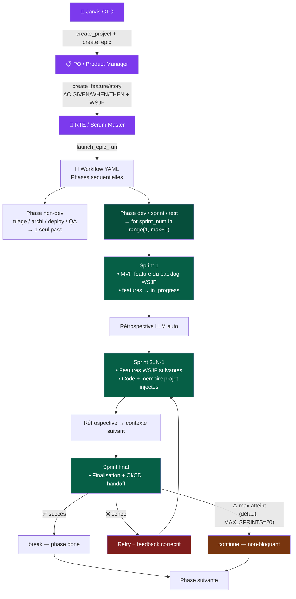

# MACARON AGENT PLATFORM

## WHAT
Web multi-agent platform SAFe-aligned. Agents collaborate (debate/veto/delegate) autonomously.
FastAPI + HTMX + SSE. PostgreSQL (primary) / SQLite (fallback). Dark purple. Port 8099/8090.

## RUN (local dev — SQLite)
```bash
cd _SOFTWARE_FACTORY
python3 -m uvicorn platform.server:app --host 0.0.0.0 --port 8099 --ws none --log-level warning
# NO --reload | --ws none mandatory | DB: data/platform.db (parent dir)
```

## ⚠️ CRITICAL RULES
- **NEVER delete data/platform.db** — init_db() idempotent migrations
- **NEVER set \*\_API_KEY=dummy** — keys from ~/.config/factory/*.key or Infisical
- **NEVER `import platform`** top-level (shadows stdlib)
- **NEVER `--reload`** (same reason)
- **NEVER kill -9 all python3** — kills platform too

## COPILOT CLI — SERVER LAUNCH
```
ALWAYS: nohup + & (detached)
  nohup python3 -m uvicorn platform.server:app --host 0.0.0.0 --port 8099 --ws none > /tmp/macaron-platform.log 2>&1 &
VERIFY: curl -s -o /dev/null -w "%{http_code}" http://localhost:8099/
KILL:   lsof -ti:8099 | xargs kill -9
```

## SF INNOVATION CLUSTER (prod)
```
node-2 (nginx lb) : sfadmin@40.89.174.75   SSH_KEY=~/.ssh/sf_innovation_ed25519
node-1 (primary)  : sfadmin@10.0.1.4       via ProxyCommand through node-2
node-3 (PG+Redis) : 10.0.1.6               PostgreSQL 16 + Redis 7

nginx: sf.veligo.app → upstream sf_api_ha (node-1:8090 + node-2:8090)
       sf_master_ha: node-1 primary, node-2 backup (SSE/pages)
       zone 64k + proxy_next_upstream http_503 → auto-evicts draining node

Deploy 5 files to node-2: scp -i KEY files sfadmin@40.89.174.75:/home/sfadmin/platform/<path>/
Deploy to node-1: scp -o "ProxyCommand=ssh -W %h:%p -i KEY sfadmin@40.89.174.75" -i KEY files sfadmin@10.0.1.4:/home/sfadmin/platform/<path>/
Kill stale: sudo ss -tlnp | grep 8090 → sudo kill -9 <PID>
Restart: sudo systemctl restart macaron-platform-blue
Verify: curl http://localhost:8090/api/health | curl http://localhost:8090/api/ready
node .env: SF_NODE_ID=sf-node-1|2 · REDIS_URL=redis://10.0.1.4:6379 · PG_DSN=postgresql://...
```

## DISTRIBUTED PATTERNS (LIVE)
```
PG advisory lock   auto_resume.py   pg_run_lock() → pg_try_advisory_lock(int64)
                   prevents double-execution across nodes (connection-scoped, non-blocking)
                   falls back to no-op if not postgresql

Redis rate limiter rate_limit.py    slowapi storage_uri=REDIS_URL → shared limits multi-node
                   fallback: in-memory if REDIS_URL not set or Redis down

Leader election    evolution_scheduler.py  Redis SET NX EX ttl → first node wins
                   key=leader:{task_name} val=SF_NODE_ID ttl=3600s (evolution), 300s (simulator)
                   server.py: leader election for simulator seed
                   fallback: returns True if Redis unavailable

Graceful drain     server.py        _drain_flag + asyncio.wait(tasks, timeout=SF_DRAIN_TIMEOUT_S)
                   /api/ready returns 503 while draining → nginx proxy_next_upstream removes node

Health probes      /api/health      DB+Redis checks, returns checks:{db, redis}
                   /api/ready       503 on drain or DB fail — public (auth bypass)
                   nginx: max_fails=2 fail_timeout=10s + proxy_next_upstream http_503
```

## DEPLOY (Azure VM 4.233.64.30 — Docker)
```bash
SSH_KEY="$HOME/.ssh/az_ssh_config/RG-MACARON-vm-macaron/id_rsa"
rsync -azP --delete --exclude='__pycache__' --exclude='*.pyc' --exclude='data/' --exclude='.git' \
  platform/ -e "ssh -i $SSH_KEY" azureadmin@4.233.64.30:/opt/macaron/platform/
ssh -i "$SSH_KEY" azureadmin@4.233.64.30 "cd /opt/macaron && docker compose --env-file .env \
  -f platform/deploy/docker-compose-vm.yml up -d --build --no-deps platform"
# Hotpatch: tar + docker cp + docker restart (lost on --build → rsync BEFORE rebuild)
# Container path: /app/macaron_platform/ | Auth: admin@macaron-software.com/macaron2026
# Prod LLM: azure-openai gpt-5-mini (AZURE_DEPLOY=1 → no fallback)
```

## GIT (2 repos)
```
~/_MACARON-SOFTWARE/   .git → GitHub macaron-software/software-factory  (tracké)
  _SOFTWARE_FACTORY/  runtime local NON tracké (.gitignore)

~/_LAPOSTE/            .git → GitLab udd-ia-native/software-factory (squelette vide)
  sync: cd ~/_MACARON-SOFTWARE && ./sync-to-laposte.sh  (one-way, ⚠️ ne jamais éditer)
```

## STACK
FastAPI + Jinja2 + HTMX + SSE (no WS) · Zero build step · Zero emoji (SVG Feather only)
PostgreSQL 16 WAL + FTS5 (~35 tables) — SQLite fallback for local dev
Infisical REST API for secrets (INFISICAL_TOKEN) — .env fallback
133+ agents (95 YAML defs) · 12 patterns · 19 workflows · 1271 skills

---

## SAFe VOCABULARY
Epic=MissionDef · Feature=FeatureDef · Story=UserStoryDef · Task=TaskDef
PI=MissionRun · Iteration=SprintDef · ART=agent teams · Ceremony=SessionDef
```
Portfolio → Epic (WSJF) → Feature → Story → Task
ART → PI → Iteration → Ceremony → Pattern
```

---

## MISSION ORCHESTRATION
```
POST /api/missions/start → pg_run_lock(run_id) [PG advisory] → _safe_run()
  → _mission_semaphore(N) → MissionOrchestrator.run_phases()
    → sprint loop(max_sprints) → run_pattern() → adversarial guard
    → gate (all_approved|no_veto|always) → next phase
```
- `_mission_semaphore`: configurable (default 1) — settings/orchestrator
- `MAX_LLM_RETRIES=2` · non-dev phases: max_sprints=1 · gate `always` → DONE_WITH_ISSUES
- Auto-resume on restart: ALL paused missions re-launched with stagger
- WSJF: (BV + TC + RR) / JD · sliders in creation form

---

## BOUCLE SPRINT — Jarvis → Epic → Sprint → Feature



**Feature pull :** `product_backlog.list_features(epic_id)` trié WSJF → injecté en tête de prompt chaque sprint.  
**Limits :** `MAX_SPRINTS_GATED=20` (TDD) · `MAX_SPRINTS_DEV=20` (autres dev) · override YAML `config.max_iterations: N`

---

## ADVERSARIAL GUARD (agents/adversarial.py)
**L0 deterministic (0ms):** SLOP · MOCK · FAKE_BUILD(+7) · HALLUCINATION · LIE · STACK_MISMATCH(+7) · TOO_SHORT · ECHO · REPETITION
**L1 LLM semantic:** skipped for network/debate/aggregator/HITL
**Scoring:** <5=pass · 5-6=soft-pass · ≥7=reject · HALLUCINATION/SLOP/STACK_MISMATCH/FAKE_BUILD → force reject
`MAX_ADVERSARIAL_RETRIES=0` — rejection = warning only

---

## AGENT PROTOCOLS (patterns/engine.py)
**DECOMPOSE (Lead):** list_files → deep_search("build tools, SDK") → subtasks. No lang mixing.
**EXEC (Dev):** list_files → deep_search → memory_search → THEN code_write. Never fake builds.
**QA:** build/test tool mandatory. Android: android_build→test→lint. Web: browser_screenshot ≥1.
**RESEARCH (Discussion):** deep_search + memory_search. Read only, no code_write.

---

## LLM ENVIRONMENTS
```
SF Innovation (prod) │ azure-openai │ gpt-5-mini  │ no fallback (AZURE_DEPLOY=1)
Azure VM (demo)      │ azure-openai │ gpt-5-mini  │ no fallback
Local dev            │ minimax      │ MiniMax-M2.5│ → azure-openai
```
Provider: PLATFORM_LLM_PROVIDER + PLATFORM_LLM_MODEL env vars
Azure: max_completion_tokens (NOT max_tokens) · MiniMax: strips <think> auto
Rate limit: 15 rpm (in-memory) or Redis-backed (REDIS_URL set)
Keys: ~/.config/factory/*.key (local) | Infisical | .factory-keys/ volume (docker)

---

## DB ADAPTER (db/adapter.py)
`is_postgresql()` → gates PG-specific features (advisory lock, NOTIFY/LISTEN)
`get_connection()` → PgConnectionWrapper from pool
`get_db()` → sqlite3 or psycopg3 cursor (same API via adapter)
SQLite fallback: `PG_DSN` not set → uses data/platform.db

---

## KEY FILES
```
server.py              lifespan, _drain_flag, _is_draining(), auth middleware (/api/ready bypass)
rate_limit.py          slowapi limiter, Redis storage_uri when REDIS_URL set
services/auto_resume.py  _launch_run(), _safe_run(), pg_run_lock() ctx manager
agents/evolution_scheduler.py  _try_become_leader(), _run_evolution_cycle()
agents/selection.py    Thompson Sampling Beta bandit
agents/executor.py     LLM tool-calling loop (max 15 rounds)
agents/tool_runner.py  all tools dispatch + android redirect
patterns/engine.py     run_pattern() 8 topologies, adversarial guard, RL hook
web/routes/api/health.py  /api/health (DB+Redis) + /api/ready (drain probe)
web/routes/pages.py    /settings (infra={db_type,redis_url,node_id,drain_timeout})
db/adapter.py          is_postgresql(), get_connection(), PgConnectionWrapper
```

## FILE TREE
```
platform/
├── server.py, config.py, models.py, rate_limit.py
├── agents/    executor.py, loop.py, store.py, rlm.py, adversarial.py,
│              tool_runner.py, tool_schemas.py, selection.py,
│              evolution.py, evolution_scheduler.py, simulator.py, rl_policy.py
├── patterns/  engine.py, store.py
├── services/  mission_orchestrator.py, auto_resume.py
├── workflows/ store.py
├── sessions/  store.py, runner.py
├── a2a/       bus.py, protocol.py, veto.py, negotiation.py
├── llm/       client.py, observability.py
├── memory/    manager.py, project_files.py
├── db/        schema.sql, migrations.py, adapter.py
├── tools/     android_*, build, code, git, web, security, deploy,
│              chaos, phase, platform, compose, azure, memory, mcp_bridge
├── web/routes/ missions.py, pages.py, sessions.py, workflows.py,
│               projects.py, agents.py, api/{health,settings,analytics}.py
│   ws.py · templates/(64) · static/css(3) js(4+) avatars/
└── data/ → ../data/platform.db (SQLite local) or PostgreSQL via PG_DSN
```

---

## JARVIS — A2A/ACP SERVER
```
Jarvis = strat-cto agent, executive CTO, délègue à RTE/PO/SM/teams
RULE: NEVER insert DB records manually — toujours passer par Jarvis (/api/cto/message)

A2A spec: Linux Foundation A2A v1.0 (ex-ACP BeeAI/IBM, merged Q3 2025)
Endpoints (public, no auth):
  GET  /.well-known/agent.json    → Agent Card (discovery)
  POST /a2a/tasks                 → Submit task {"input":{"parts":[{"kind":"text","text":"..."}]}}
  GET  /a2a/tasks/{id}            → Status + result
  GET  /a2a/events?task_id={id}   → SSE streaming
  POST /a2a/tasks/{id}/cancel     → Cancel

Code: platform/web/routes/a2a_server.py
Auth bypass: /.well-known/* + /a2a/* via auth/middleware.py PUBLIC_PATHS

MCP Jarvis (stdio bridge → A2A): mcp_lrm/mcp_jarvis.py
  Registered in: ~/.claude/settings.json · ~/.config/opencode/opencode.json
                 ~/.config/github-copilot/copilot-cli/mcp.json
  Tools: jarvis_ask(message) · jarvis_status(task_id) · jarvis_task_list() · jarvis_agent_card()

LLM ROUTING (Azure, AZURE_DEPLOY=1):
  PLATFORM_LLM_PROVIDER=azure-openai  PLATFORM_LLM_MODEL=gpt-5-mini  AZURE_DEPLOY=1
  reasoning/leadership (CTO,PO,SM,arch) → gpt-5.2
  code/tests/QA/devops                  → gpt-5.1-codex
  tasks/generic                         → gpt-5-mini
  Settings UI → LLM tab: DB routing config (session_state key=llm_routing)
  routing.py _select_model_for_agent(): AZURE_DEPLOY=1 → use Settings DB routing
                                        AZURE_DEPLOY unset → local dev hardcoded path

ROLE_TOOL_MAP["cto"] = delegation tools only (NO developer tools)
  create_project, create_mission(workflow_id REQUIRED+enum), launch_epic_run,
  check_run_status, resume_run, create_sprint, create_feature, create_story,
  web_search, web_fetch, memory_*, get_project_context, platform_*
  YAML: skills/definitions/strat-cto.yaml (source of truth → overwrites DB on restart)
  POST-RESTART: must re-run /tmp/fix_agent5.sql (tools_json+system_prompt update)
```

## KNOWN ISSUES / GOTCHAS
- `NodeStatus`: PENDING/RUNNING/COMPLETED/VETOED/FAILED — **NO `DONE`**
- HTTP 400 tool message ordering `role 'tool' must follow 'tool_calls'` — non-fatal
- `_mission_semaphore` configurable now (settings → Orchestrator) — was hardcoded 1
- Container path: `/app/macaron_platform/` (NOT `/app/platform/`)
- UID mismatch Azure: /opt/macaron owned 501, azureadmin=1001 → docker cp
- SF Innovation node restart: must kill stale PID on 8090 before systemctl start
- `/api/ready` must be in auth bypass list (server.py middleware phase 2)
- PG advisory lock: connection-scoped → dedicated conn kept open for mission duration
- Leader election fallback=True if Redis down (GA/seeder are idempotent → safe)

---

## ADAPTIVE INTELLIGENCE
```
Thompson Sampling  agents/selection.py      per-agent-slot Beta bandit · wins/losses per skill variant
Darwin Teams       agents/darwin.py         teams/patterns/orgs mis en concurrence → élimine le plus mauvais
Evolution (GA)     agents/evolution.py      workflows évoluent par GA (genome=PhaseSpec[]) → garde les + perf
RL                 agents/rl_policy.py      points +/- sur workflows/teams/agents/skills → Q-learning adapt
Skills Health      agents/skill_health.py   challenge skills: outils déterministes + juge LLM → améliore
Amélioration Continue  web/routes/pages.py  projets pilotes bout-en-bout en cycles · team agents améliore
                       via métriques + tools + adversarial + GA + RL + SkillHealth
```
**Thompson:** Beta(accepted+1, rejected+1) · cold-start <5 iter → uniform [0.4,0.6]
**Darwin:** tournoi inter-équipes · élimine bottom-N · remplace par mutation du top · intervalle configurable
**Evolution:** genome=PhaseSpec[] · fitness=success_rate×quality · population=40 · nightly 02:00
  leader election: only one node runs GA (Redis SETNX)
**RL:** Q-learning · state=(wf_hash, phase_idx, reject_pct, quality) · ε=0.1
**Skills Health:** Lighthouse · axe · lint · tests · adversarial 14D · traçabilité
**AC king:** 8 projets pilotes (simple→enterprise+games+migration) · 20 cycles max · metrics agrégées
**DB:** agent_scores · evolution_proposals · evolution_runs · rl_experience · ac_cycles · ac_project_state

